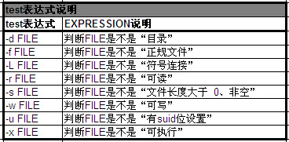
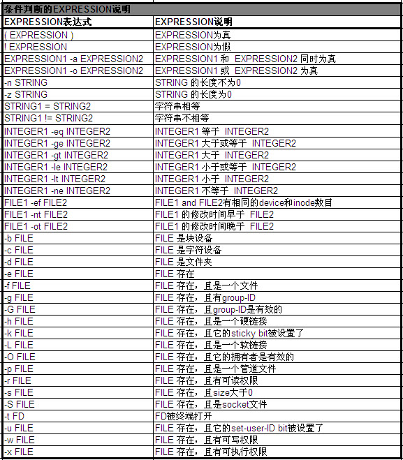

# bash 基本语法

## 1 条件判断

test EXPRESSION



## 2 [] 判断



判断变量num是否等于数字100

```
$ [ "$num" -eq "100" ]
```

## 3 测试逻辑表达式

一、判断文件123.txt是不是可读写

```
$ [ -r 123.txt -a -w 123.txt ]
```

等价于

```
$ [ -r 123.txt ] && [ -w 123.txt ]
```

二、判断变量num是不是等于数字101或102

```
$ [ "$num" -eq "101" -o "$num" -eq "102" ]
```

等价于

```
$ [ -r 123.txt ] || [ -w 123.txt ]
```

三、判断文件123.txt是不是不可读

```
$ [ ! -r 123.txt ]
```

## 4 if then else语句

```bash
#!/bin/bash 
# 提示用户输入一个值 
echo -n "please input a number:"
# 保存用户输入的值到num中 
read num 

if [ "$num" -lt "0" ];then 
# 小于0,则输出“negtive number” 
echo "negtive number" 
elif [ "$num" -gt "0" ];then 
# 大于0,则输出“positive number” 
echo "positive number" 
else
# 大于0,则输出"number zero" 
echo "number zero"
fi

exit 0
```

# **数值运算**

```bash
#!/bin/bash

# 数值i=3*(5+2) (方法一:$(())实现)
val=$((3*(5+2)))
echo "val=$val"

# 数值i=3*(5+2) (方法二:let实现)
let "val=3*(5+2)"
echo "val=$val"

# 数值i=3*(5+2) (方法三:expr实现)
val=`expr 3 \* \( 5 + 2 \)`
echo "val=$val"

# 数值i=3*(5+2) (方法四:bc实现)
val=`echo "3*(5+2)"|bc`
echo "val=$val"

exit 0
```


批量改名，删除文件名中多余字符

**目录下文件名为如下，要求去掉_finished。**

stu_102999_1_finished.jpg

```
[baby@localhost ~]$ for file in `ls *.jpg`;do mv $file ${file%_finished*}.jpg;done;
```