# 20180812 头条机试

惨惨惨，前天开始用CPP写机试的我被头条不定长输入坑。0.9/5 

### 1. 球迷

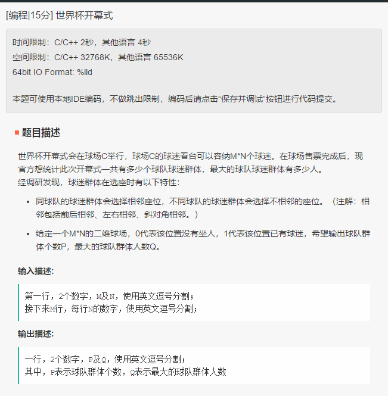

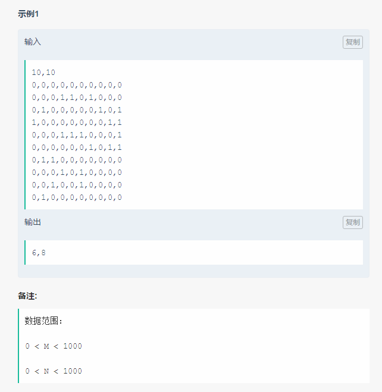

> ```
> #include <set>
> #include <iostream>
> #include <vector>
> using namespace std;
> typedef pair<int,int> PAIR;
> int main() {
>     int m=10, n=10;
>     char tmp;
>     cin>>m>>tmp>>n;
>     vector<vector<int>> matrix(m, vector<int>(n,0));
>     set<long> close;
>     vector<PAIR> stack;
>     for(int i=0; i<m; i++){
>         for(int j=0; j<n-1; j++){
>             cin>>matrix[i][j]>>tmp;
>         }
>         cin>>matrix[i][n-1];
>     }
>     test_input(matrix);
>     int p=0, q=0;
>     long key;
>     for(int i=0; i<m; i++){
>         for(int j=0; j<n; j++){
>             key = i*m+j;
>             if(close.find(key) != close.end() or matrix[i][j] == 0)
>                 continue;
>             p += 1;
>             stack.clear();
>             PAIR t = PAIR(i,j);
>             stack.emplace_back(t);
>             int cnt=0;
>             while(!stack.empty()){
>                 PAIR cur = *(stack.end()-1);
>                 stack.pop_back();
>                 key = cur.first*m + cur.second;
>                 if(close.find(key) == close.end()){
>                     close.insert(key);
>                     cnt += 1;
>                     for(int a=cur.first-1;a<cur.first+2;a++){
>                         if(a<0 or a>=n) continue;
>                         for(int b=cur.second-1; b< cur.second+2; b++){
>                             key = a*m+b;
>                             if(b>=0 && b<m && close.find(key) == close.end()){
>                                 if(matrix[a][b] == 1) {
>                                     stack.emplace_back(PAIR(a, b));
>                                 }
>                             }
>                         }
>                     }
>                 }
>             }
>             q = cnt > q ? cnt: q;
>         }
>     }
>     cout<<p<<','<<q<<endl;
> }
> ```

### 2. 文章病句标识（合并区间）

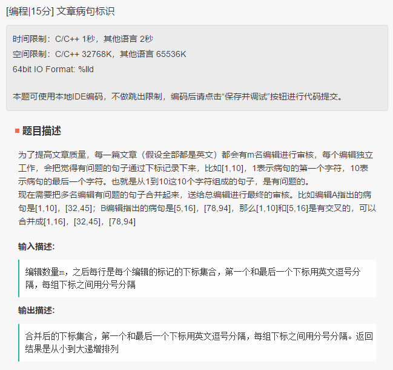

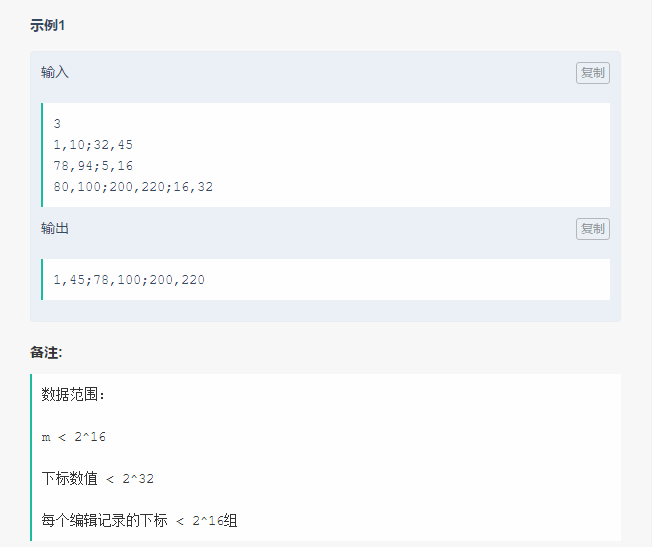

> ```
> #include<sstream>
> #include <iostream>
> #include <vector>
> #include <string>
> using namespace std;
> 
> typedef pair<int,int> PAIR;
> typedef vector<PAIR>::iterator iter;
> 
> ostream& operator << (ostream& out, const PAIR& src){
>     out<<src.first<<','<<src.second;
> }
> 
> bool less_pair ( PAIR& src,  PAIR& dst) {
>     return src.first <= dst.first;
> }
> 
> void mergeIntervals() {
>     vector <PAIR> intervals;
>     int m;
>     stringstream stream;
>     string s;
>     for(int i=0; i<m; i++){
>         stream.clear();
>         cin>>s;
>         stream.str(s);
>         int a,b;
>         char c;
>         while(stream>>a>>c>>b){
>             intervals.emplace_back(PAIR(a,b));
>             if(stream.peek()==';')
>                 stream.ignore();
>         }
>     }
>     
>     sort(intervals.begin(), intervals.end(), less_pair);
> 
>     PAIR tmp = PAIR(-1,-1);
>     PAIR* last = &tmp;
> 
>     vector<iter> output;
>     for(auto it=intervals.begin();it!=intervals.end();it++){
>         if( (*it).first > (*last).second){
>             output.emplace_back(it);
>             last = &(*it);
>         }
>         else if((*it).second > (*last).second){
>             (*last).second = (*it).second;
>         }
>     }
>     for(auto it = output.begin(); it!=output.end(); it++){
>         cout<<intervals[(*it) - intervals.begin()]<<';';
>     }
>     cout<<endl;
>     return 0;
> }
> ```


### 3.4.5没有看


 ### 3. 积分卡牌游戏

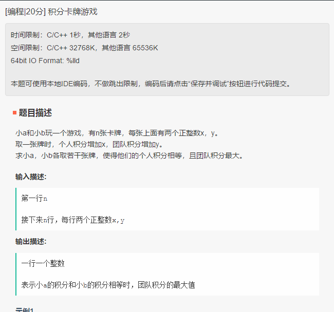

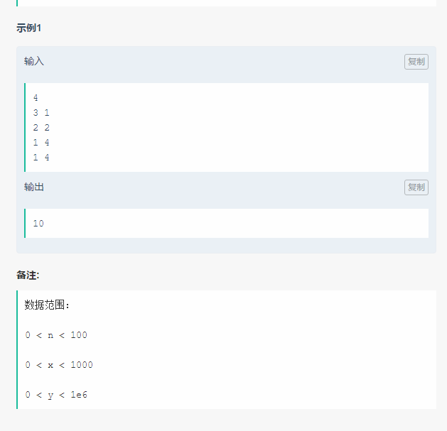

> 未填写
>
> 


###  4.区间最大最小值 

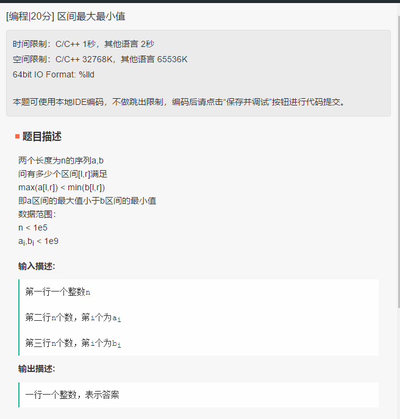

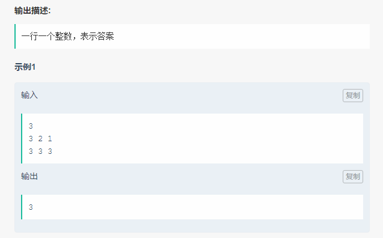

> 待填写
>
> 

### 5.直播间

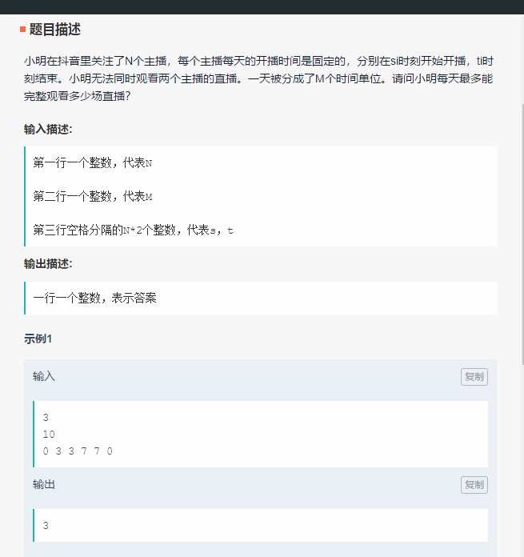

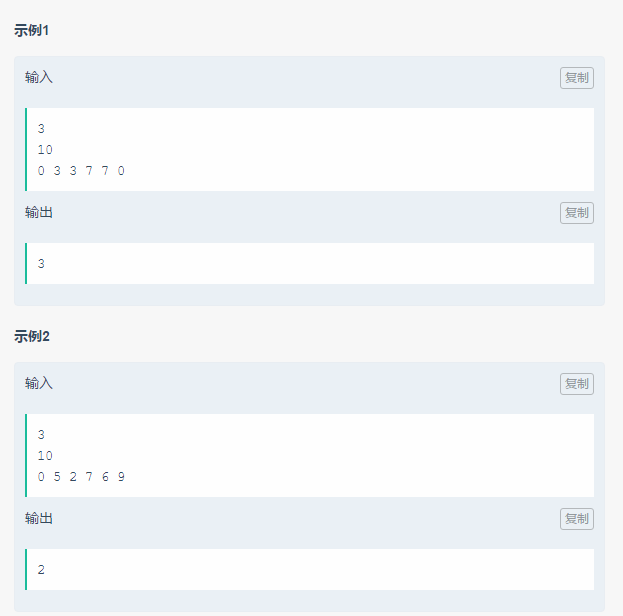

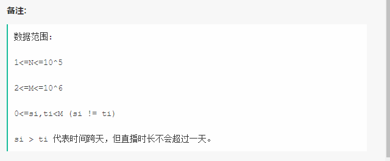

> 待填写
>
> 

