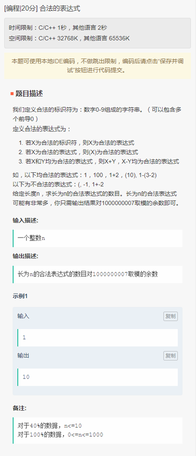

# 1 朋友圈

（Leetcode 547 相似）

 假如已知有 n 个人和 m 对好友关系 （存于数字 r） 。 如果两个人是直接或间接的好友 （好友的好友的好友...） ， 则认为他们属于同一个朋友圈，请写程序求出这 n 个人里一共有多少个朋友圈。 假如：n = 5 ， m = 3 ， r = {{1 , 2} , {2 , 3} , {4 , 5}}，表示有 5 个人，1 和 2 是好友，2 和 3 是好友，4 和 5 是好友，则 1、2、3 属于一个朋友圈，4、5 属于另一个朋友圈，结果为 2 个朋友圈。 

## 分析

并查集，将有关系的<n,m> 全部合并到一个集合中，集合的个数就是朋友圈的个数。

## 并查集

用leads保存每个元素 x 所在的组的指针，这个指针指向与x同组的元素的下标。每次查询的时候都需要从当前下标遍历到 leads[x] == x 的位置，此时x即为该元素的组号。

e.g  

1, 2, 3, 4

1, 1, 2, 3 

1,2,3,4 同属于一个组，查询元素4的组号时，发现它指向元素3， 再找发现指向1，再找指向1.此时寻找过程结束，元素4的组号为1.  通过路径压缩的技巧可以将查询路径变短。

```cpp
// 显而易见的递归
int find(vector<int> &leads, int x) {
	if (leads[x] != x)
		leads[x] = find(leads, leads[x]);
	return leads[x];
}
// 迭代
int find(vector<int> &leads, int x) {
	while (leads[x] != x) {
		leads[x] = leads[leads[x]];
		x = leads[x];
	}
	return x;
}
```
## 分批合并
1. 每一组元素输入，就将 i 与他的好友合并为一组。

2. 如果 i 的好友序号 j 小于 i ，由于 i 递增，所以他的好友 j 在前面的某一个组里，将 i 并入 j 所在的组

   此时需要更新 i 的组号。

3.  groups 初始为 n , 既一人一组。每一次合并，groups -= 1. 当所有组合并完毕时候，groups就是现有组的个数。

```cpp
int main() {
	int n, a;
	cin >> n;
	vector<int> leads(n+1, 0);
	for (int i = 1; i<=n; i++) { leads[i] = i; }
	int groups = n;
	for (int i = 1; i <= n; i++) {
		int lead1 = find(leads, i);
		while (cin >> a) {
			if (a == 0) break;
			int lead2 = find(leads, a);
			if (lead2 != lead1) {
				if (a<i){ //a 以前出现过
					leads[lead1] = lead2;
					lead1 = find(leads, i);
				}
				else {
					leads[lead2] = lead1;
				}
				groups -= 1;
			}
		}
	}
	cout << groups << endl;
	return 0;
}
```

# 2 所有合法的算式数




# 3. 双生词


 

# 4 空气质量 


# 5 减法求值


354