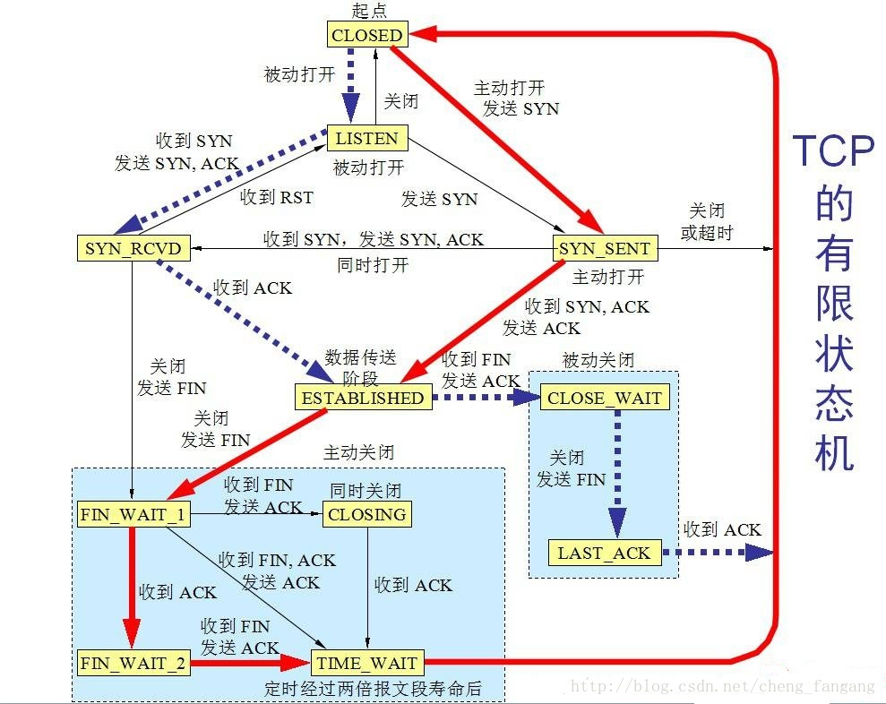

二分法查找次数，100个数最多查找多少次？  [log(n)] - 1

### 外排序

多路归并，败者树

### 三次握手中accept函数处于第几次，拥塞控制。 

 accept/connect这两个socket调用完全是基于TCP三次握手状态机的，即只要本地TCP状态机进入ESTABLISH状态，就会成功返回。而我们知道，TCP的三次握手本身就是一次权衡的结果

https://blog.csdn.net/cheng_fangang/article/details/23183173




因式分解数字组合最小


### post、put和get的区别什么 

 **GET操作是安全的**。所谓安全是指不管进行多少次操作，资源的状态都不会改变。 

**PUT，DELETE **操作是幂等的。所谓幂等是指不管进行多少次操作，结果都一样。 一次请求只执行一次

**POST操作既不是安全的，也不是幂等的**，比如常见的POST重复加载问题：当我们多次发出同样的POST请求后，其结果是创建出了若干的资源。 


页面加载速度很慢，如何加速页面的渲染  条件请求

cookie和session有什么区别  服务器和客户端

图片很大，如何进行优化 压缩，分片

你对迅雷了解多少？ 

### websocket和http的区别是什么？

相同点

1. 都是一样基于TCP的，都是可靠性传输协议。
2. 都是应用层协议。

不同点

 1. WebSocket是双向通信协议，模拟Socket协议，可以双向发送或接受信息。HTTP是单向的。
 2. WebSocket是需要浏览器和服务器握手进行建立连接的。而http是浏览器发起向服务器的连接，服务器预先并不知道这个连接。

联系

WebSocket在建立握手时，数据是通过HTTP传输的。但是建立之后，在真正传输时候是不需要HTTP协议的。

cookie和localStorage区别，如何把cookie写在一个对象中，其属性就是键值对 


堆排序怎么写 


### http1.1中的keep-alive是怎么理解的？ 

keep-alive是http1.0与http1.1的特性之一，意在提供长效的HTTP会话，以避免客户端频繁建立tcp连接的消耗。

同时，Server不释放tcp连接，在Client收到response后，认定为长连接，同样也不释放tcp连接。这样就实现了会话的保持。

### HTTP2.0和HTTP1.X相比的新特性

- **新的二进制格式**（Binary Format），HTTP1.x的解析是基于文本。基于文本协议的格式解析存在天然缺陷，文本的表现形式有多样性，要做到健壮性考虑的场景必然很多，二进制则不同，只认0和1的组合。基于这种考虑HTTP2.0的协议解析决定采用二进制格式，实现方便且健壮。
- **多路复用**（MultiPlexing），即连接共享，即每一个request都是是用作连接共享机制的。一个request对应一个id，这样一个连接上可以有多个request，每个连接的request可以随机的混杂在一起，接收方可以根据request的 id将request再归属到各自不同的服务端请求里面。
- **header压缩**，如上文中所言，对前面提到过HTTP1.x的header带有大量信息，而且每次都要重复发送，HTTP2.0使用encoder来减少需要传输的header大小，通讯双方各自cache一份header fields表，既避免了重复header的传输，又减小了需要传输的大小。
- **服务端推送**（server push），同SPDY一样，HTTP2.0也具有server push功能。

区块链 

### malloc 和 new

new 自由存储器、完整类型指针、不足抛异常、允许重载、调用构造，析构函数

malloc 堆，void*, 不足返回nullptr, 不允许重载

###stl remove 和erase 区别

vector中的remove的作用是将等于value的元素放到vector的尾部，但并不减少vector的size

vector中erase的作用是删除掉某个位置position或一段区域（begin, end)中的元素，减少其size

### 运行时类型信息

RTTI（Run-Time Type Identification，运行时类型识别）

dynamic_cast允许运行时刻进行类型转换，从而使程序能够在一个类层次结构中安全地转化类型，与之相对应的还有一个非安全的转换操作符static_cast

它使程序能够获取由基指针或引用所指向的对象的实际派生类型，即允许“用指向基类的指针或引用能够获取到对应“对象”的实际派生类型。

### 有三个线程ID分别是A、B、C,请有多线编程实现，在屏幕上循环打印10次ABCABC…  

```
pthread_cond_signal()的一个简单的例子。
pthread_mutex_t mlock;
pthread_cond_t cond;
unsigned count;
printCHAR (char* p, flag=0) {
    pthread_mutex_lock (&mlock);
    while(count != flag) 
        pthread_cond_wait( &cond, &count_lock);
        
    cout<< p <<endl;
    count= (count+1)%3;
    pthread_mutex_unlock (&count_lock);
}
```

