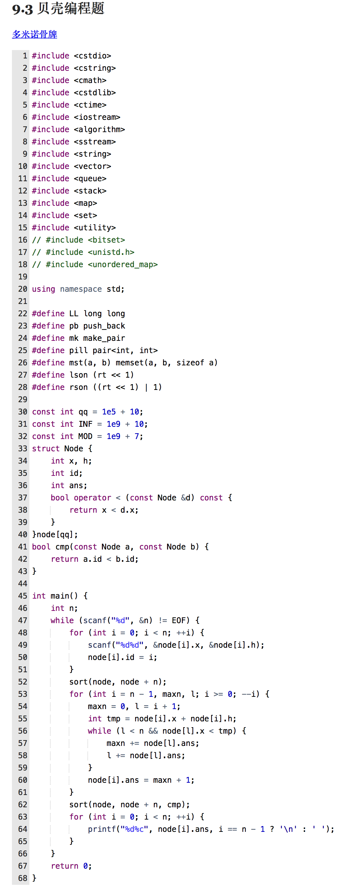

贝壳

多米诺骨牌



## 1. 走遍所有的城市

给定一个拥有n个顶点，n-1一个边的无环图，从1开始依次经历所有的点（需要回退），求最小的距离和。

1. 由于是无环图，以最长的线路为主线A，其他的路线为支线bi (i=1,2,3,...)，支线走两边，主线走一遍

   S = len(A) + sum(len(b1), len(b2), len(b3), ...) * 2

2. 如果计算每一条支线的距离？答：不用算！

   S = 2 * 路径之和 - len(A)

3. 如何计算路径之和

   1. 遍历所有的边
   2. 边的个数 n - 1 早就告诉你了！

4. 上代码

```python
#!/usr/bin/env python
n = int(input())
graph = {}
for i in range(n-1):
    a,b = list(map(int, input().split(' ')))
    if a not in graph:
        graph[a] = set()
    graph[a].add(b)
    
visited = set()
v2 = set()

def get_deep(graph, cur):
    if cur in visited:
        return 0
    if cur not in graph:
        return 1
    di = 0
    deep = 0
    for child in graph[cur]:
        di = get_deep(graph, child)
        deep = max(deep, di)
    return deep + 1

def min_path(graph, n):
    deep = get_deep(graph, 1)
    return 2*(n-1) - deep + 1

min_path(graph, n)
```

## 2. 反转二进制

给定一个二进制序列，通过反转最大k个0使得连续1的长度最大，求最大长度。

