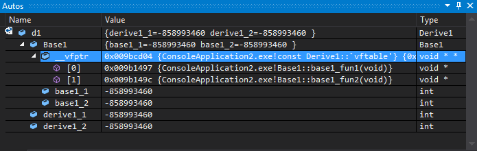
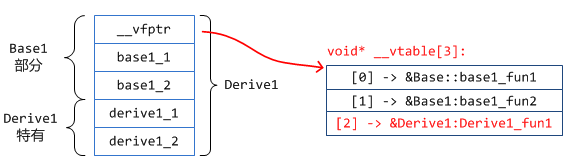
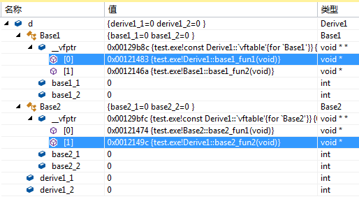
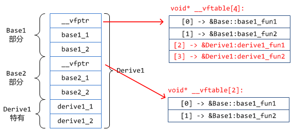
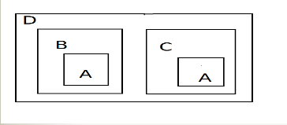
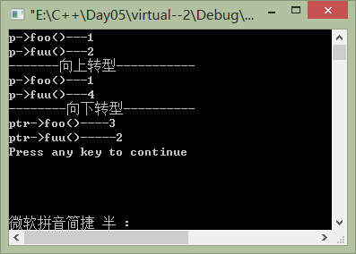

前言知识

const的位置与区别

1)  const char * p  p 是一个指向常量字符的指针，不变的是 char 的值，

2)  char * const p  p 是一个指向字符的常量指针，不变的是 p 的值，即该指针不能再指向别的。

一个助记的方法——“以 * 分界，把一个声明从右向左读”。

# 1. 虚函数

内容来源 [陪她去流浪](https://blog.twofei.com/)  网址https://blog.twofei.com/496/ 

## 1.1 __vfptr是指向虚表的指针

没有虚函数的对象

```cpp
class Base1
{
public:
    int base1_1;
    int base1_2;

    void foo(){}cpp
};
```

| sizeof(Base1)            | 8    |
| ------------------------ | ---- |
| offsetof(Base1, base1_1) | 0    |
| offsetof(Base1, base1_2) | 4    |

仅有一个虚函数的类对象

```cpp
class Base1
{
public:
    int base1_1;
    int base1_2;

    virtual void base1_fun1() {}
    virtual void base1_fun2() {}
};
```

| sizeof(Base1)            | 12   |
| ------------------------ | ---- |
| offsetof(__vfptr)        | 0    |
| offsetof(Base1, base1_1) | 4    |
| offsetof(Base1, base1_2) | 8    |


 base1_1前面多了一个变量 __vfptr(常说的虚函数表vtable指针), 其类型为void**, 这说明它是一个void*指针

```cpp
// vfptr 的定义如下：
// 虚函数表
void*   __fun[1] = { &Base1::base1_fun1, &Base1::base1_fun2 };
// 指向虚函数表的定向指针
const void**  __vfptr = &__fun[0];
```

更加肯定前面我们所描述的: __vfptr只是一个指针, 她指向一个函数指针数组(即: 虚函数表)

只是简单地向该类对应的虚函数表中增加一项而已, 并不会影响到类对象的大小以及布局情况


## 1.2 同一个类的不同实例共用同一份虚函数表
她们都通过一个虚函数表指针__vfptr(定义为void\*\*类型)指向该虚函数表.
e.g. 定义两个类的实例 b1, b2 


## 1.3 虚函数表的位置

1. 编译器在**编译时期**自动创建好的, 只存在一份
2. 定义类对象时, 编译器自动将类对象的__vfptr指向这个虚函数表

## 1.4 单继承

### 1.4.1 单继承且本身不含虚函数的继承类

```cpp
class Base1
{
public:
    int base1_1;
    int base1_2;

    virtual void base1_fun1() {}
    virtual void base1_fun2() {}
};

class Derive1 : public Base1
{
public:
    int derive1_1;
    int derive1_2;
};
```

内存布局


### 1.4.2 单继承且只有继承而得来的基类虚函数的继承类

除经过继承而得来的基类虚函数以外, 自身没有再定义其它的虚函数.

```cpp
class Base1
{
public:
    int base1_1;
    int base1_2;

    virtual void base1_fun1() {}
    virtual void base1_fun2() {}
};

class Derive1 : public Base1
{
public:
    int derive1_1;
    int derive1_2;

    // 覆盖基类函数
    virtual void base1_fun1() {}
};
```

内存布局


无论是通过Derive1的指针还是Base1的指针来调用此方法, 调用的都将是被继承类重写后的那个方法(函数), 

多态!!!

### 1.4.3 定义了基类没有的虚函数的单继承的类对象布局 

```cpp
class Base1
{
public:
    int base1_1;
    int base1_2;

    virtual void base1_fun1() {}
    virtual void base1_fun2() {}
};

class Derive1 : public Base1
{
public:
    int derive1_1;
    int derive1_2;

    virtual void derive1_fun1() {}
}; 
```

理论上多了一个自身定义的虚函数. 但是vs中却无法跟踪



利用汇编来追踪

```
Derive1 d1;
Derive1* pd1 = &d1;
// d1.derivel_fun1()
pd1->derive1_fun1();
```

```asm
; pd1->derive1_fun1();
00825466  mov         eax,dword ptr [pd1]  ;由于pd1是指向d1的指针
;__vfptr是Base1的第1个成员,edx就得到了__vfptr的值, 也就是虚函数表的地址
00825469  mov         edx,dword ptr [eax]  
0082546B  mov         esi,esp  
;由于是__thiscall调用, 所以把this保存到ecx中.
0082546D  mov         ecx,dword ptr [pd1]  
;由于edx是虚函数表的地址, 那么 edx+8将是虚函数表的第3个元素, 也就是__vftable[2]!!!
00825470  mov         eax,dword ptr [edx+8]  
;第7行: 调用虚函数.
00825473  call        eax
```

1. 由于Base1只知道自己的两个虚函数索引[0][1], 所以就算在后面加上了[2], Base1根本不知情, 不会对她造成任何影响.
2. 如果**基类没有虚函数**呢? 这个问题我们留到第9小节再来讨论!



## 1.5 多继承

### 1.5.1存在覆写、自身有虚函数

```cpp
class Base1
{
public:
    int base1_1;
    int base1_2;

    virtual void base1_fun1() {}
    virtual void base1_fun2() {}
};

class Base2
{
public:
    int base2_1;
    int base2_2;

    virtual void base2_fun1() {}
    virtual void base2_fun2() {}
};

// 多继承
class Derive1 : public Base1, public Base2
{
public:
    int derive1_1;
    int derive1_2;

    // 基类虚函数覆盖
    virtual void base1_fun1() {}
    virtual void base2_fun2() {}

    // 自身定义的虚函数
    virtual void derive1_fun1() {}
    virtual void derive1_fun2() {}
};
```

初步了解一下对象大小及偏移信息:

| sizeof(Derive1)                       |  32  |
| :------------------------------------ | :--: |
| offsetof(Derive1, Derive1::base2_1)   |  16  |
| offsetof(Derive1, Derive1::base2_2)   |  20  |
| offsetof(Derive1, Derive1::derive1_1) |  24  |
| offsetof(Derive1, Derive1::derive1_2) |  28  |

貌似, 若有所思? 不管, 来看看VS再想:



结论:

1. 按照基类的声明顺序, 基类的成员依次分布在继承中.
2. 注意被我高亮的那两行, 已经发生了虚函数覆盖!

**我们自己定义的虚函数呢? **怎么还是看不见?!  好吧, 继承反汇编, 这次的调用代码如下:

```cpp
Derive1 d1;
Derive1* pd1 = &d1;
pd1->derive1_fun2();
```

```asm
;	Derive1* pd1 = &d;
00A01A6B  lea         eax,[d]  
00A01A6E  mov         dword ptr [pd1],eax  
;	pd1->base1_fun1();
01001A71  mov         eax,dword ptr [pd1]  
01001A74  mov         edx,dword ptr [eax]  
01001A76  mov         esi,esp  
01001A78  mov         ecx,dword ptr [pd1]  
01001A7B  mov         eax,dword ptr [edx]  
01001A7D  call        eax  
01001A7F  cmp         esi,esp  
01001A81  call        __RTC_CheckEsp (01001195h)
;   pd1->base1_fun2(); 以下省略相同的部分
01001A90  mov         eax,dword ptr [edx+4] 
;   pd1->derive1_fun1();
01001AA6  mov         eax,dword ptr [edx+8] 
;   pd1->derive1_fun2();
01001ABC  mov         eax,dword ptr [edx+0Ch]
;   pd1->base2_fun1();
00F61AC8  mov         ecx,dword ptr [pd1]  
00F61ACB  add         ecx,0Ch  
00F61ACE  mov         eax,dword ptr [pd1]  
00F61AD1  mov         edx,dword ptr [eax+0Ch]  
00F61AD4  mov         esi,esp  
00F61AD6  mov         eax,dword ptr [edx]  
00F61AD8  call        eax  
00F61ADA  cmp         esi,esp  
00F61ADC  call        __RTC_CheckEsp (0F61195h)  
;    pd1->base2_fun2();
00F61AE1  mov         ecx,dword ptr [pd1]  
00F61AE4  add         ecx,0Ch  
00F61AE7  mov         eax,dword ptr [pd1]  
00F61AEA  mov         edx,dword ptr [eax+0Ch]  
00F61AED  mov         esi,esp  
00F61AEF  mov         eax,dword ptr [edx+4]  
00F61AF2  call        eax  
00F61AF4  cmp         esi,esp  
00F61AF6  call        __RTC_CheckEsp (0F61195h)  
```

**Derive1的虚函数表依然是保存到第1个拥有虚函数表的那个基类的后面的.**



### 1.5.2 基类没有虚函数，自己定义虚函数

去掉1.5.1 中base1 中的虚函数。

```
class Base1{
public:
    int base1_1;
    int base1_2;
};

class Base2{
public:
    int base2_1;
    int base2_2;

    virtual void base2_fun1() {}
    virtual void base2_fun2() {}
};
// 多继承
class Derive1 : public Base1, public Base2
{
public:
    int derive1_1;
    int derive1_2;
    // 自身定义的虚函数
    virtual void derive1_fun1() {}
    virtual void derive1_fun2() {}
};
```

来看看VS的布局:


现在的大小及偏移情况: 注意: `sizeof(Base1) == 8;`


重点是看虚函数的位置, 进入函数调用(和前一次是一样的):

 那么问题就来了! Base1 已经没有虚函数表了, 为什么还是把b1的第1个元素当作__vfptr呢? 不难猜测: 当前的布局已经发生了变化, 有虚函数表的基类放在对象内存前面!? , 不过事实是否属实? 需要仔细斟酌.

我们可以通过对基类成员变量求偏移来观察:


可以看到:

| sizeof(Derive1)                       | 28   |
| ------------------------------------- | ---- |
| offsetof(Derive1, Derive1::base1_1)   | 12   |
| offsetof(Derive1, Derive1::base1_2)   | 16   |
| offsetof(Derive1, Derive1::base2_1)   | 4    |
| offsetof(Derive1, Derive1::base2_2)   | 8    |
| offsetof(Derive1, Derive1::derive1_1) | 20   |
| offsetof(Derive1, Derive1::derive1_2) | 24   |

所以不难验证: 我们前面的推断是正确的, **谁有虚函数表, 谁就放在前面!**

现在类的布局情况:


那么, 如果两个基类都没有虚函数表呢?

```
class Base1{
public:
    int base1_1;
    int base1_2;
};
class Base2{
public:
    int base2_1;
    int base2_2;
};
// 多继承
class Derive1 : public Base1, public Base2
{
public:
    int derive1_1;
    int derive1_2;

    // 自身定义的虚函数
    virtual void derive1_fun1() {}
    virtual void derive1_fun2() {}
};
```

前面吃了个亏, 现在先来看看VS的基本布局:


可以看到, 现在__vfptr已经独立出来了, 不再属于Base1和Base2! 

回顾汇编中语句

```asm
;	pd1->derive1_fun1();
009A1CF8  mov         eax,dword ptr [pd1]  
009A1CFB  mov         edx,dword ptr [eax] 
```

或者求偏移情况: 注意高亮的那两行, `&d1==&d1.__vfptr`, 


**说明虚函数始终在最前面!**

对象布局:


### 1.5.3 如果有三个基类: 虚函数表分别是有, 没有, 有!

只需要看看偏移就行了:


只需知道: 谁有虚函数表, 谁就往前靠!

### 1.5.4 C++中父子对象指针间的转换与函数调用

由于继承完全拥有父类的所有, 包括数据成员与虚函数表, 

所以:**把一个继承类强制转换为一个基类**是完全可行的.

如果有 :Derive1 *pd1 = new Derive1()

- 得到Base1的指针: Base1* pb1 = pd1;
- 得到Base2的指针: Base2* pb2 = pd1;
- 得到Base3的指针: Base3* pb3 = pd1;

非常值得注意的是:

这是在基类与继承类之间的转换, 这种转换会自动计算偏移! 按照前面的布局方式!
也就是说: 在这里极有可能: pb1 != pb2 != pb3 ~~, 不要以为她们都等于 pd1!

至于函数调用, 我想, 不用说大家应该知道了:

1. 如果不是虚函数, 直接调用指针对应的基本类的那个函数
2. 如果是虚函数, 则查找虚函数表, 并进行后续的调用. 虚函数表在定义一个时, 编译器就为我们创建好了的. 所有的, 同一个类, 共用同一份虚函数表.

## 1.6 虚继承

问题1

```
class Base1{
public:
	int base1_1;
	int base1_2;
	virtual void base1_fun1() {}
	virtual void base1_fun2() {}
};
class Derive1 : virtual public Base1{
public:
	int derive1_1;
	int derive1_2;
	// 自身定义的虚函数
	virtual void derive1_fun1() {}
	virtual void derive1_fun2() {}
};
// 下面语句 编译报错： 读取位置 0x00000004 时发生访问冲突。
cout << offsetof(Derive1, Derive1::base1_1) << endl; 
```

问题2 Diamond

```
class A{
public:
      A (int x) :  m_x(x) {}
      int m_x;     
};
class B : public A {
public:
      B (int x) : A(x) {}
      void set(int x) {
            this -> m_x = x;
      }
};
class C : public A {
public:
      C (int x) : A(x) {}
      int get(void) {
            return this -> m_x;
      }
};
class D : public B,public C {
public:
      D (int x) : B(x),C(x) {}
};
int main(void) {
     D d(10);
     d.set(20);
     cout << d.get() << endl;
     return 0;
}
```

这样的运行结果是10？还是20呢？结果是10，为什么？明明sets的是20,为什么get的还是10呢？ 



```
我们需要按如下方式修改代码：
class B : virtual public A //虚继承
class C : virtual public A //虚继承
D(int x) : B(x),C(x),A(x) {}
```

在这个过程中，**A对象只在D的初始化表中**A（x）进行构造（虚基类最先被构造），

而在B和C的初始化表中不再对A进行构造（实际上是都有一个指针指向了D中的A（x）,来对A进行构造）。 

### 1.6.1 虚继承与普通继承的区别:

假设derived 继承自base类，那么derived与base是一种“is a”的关系，即derived类是base类，而反之错误；

假设derived 虚继承自base类，那么derivd与base是一种“has a”的关系，即derived类有一个指向base类的vptr。

```cpp
class stream{
public:
    stream(){cout<<"stream::stream()!"<<endl;}
};
class iistream:virtual stream{
public:
    iistream(){cout<<"istream::istream()!"<<endl;}
};
class oostream:virtual stream{
public:
    oostream(){cout<<"ostream::ostream()!"<<endl;}
};
class iiostream:public iistream,public oostream{
public:
    iiostream(){cout<<"iiostream::iiostream()!"<<endl;}
};
int main(int argc, const char * argv[]){
    iiostream oo;
｝
/*
程序运行的输出结果为：
stream::stream()!
istream::istream()!
ostream::ostream()!
iiostream::iiostream()!  */
```

### 1.6.2 规则

**1.最上层派生类的构造函数负责调用虚基类子对象的构造函数。所有虚基类子对象会按照深度优先、从左到右的顺序进行初始化；**

**2.直接基类子对象按照它们在类定义中声明的顺序被一一构造起来；**

**3.非静态成员子对象按照它们在类定义体中的声明的顺序被一一构造起来；**

**4.最上层派生类的构造函数体被执行**


## 虚函数与多态

### 1.7.1 抽象类

* 称带有纯虚函数的类为抽象类。它为了抽象和设计的目的为建立的，它处于继承层次结构的较上层。

* 继承纯虚函数必须实现，空实现也行，否则它也是一个抽象类。
* 继承虚函数可以实现多态，否则基类无法调用子类的函数，如析构函数。

### 1.7.2 抽象类的作用

抽象类的主要作用是将有关的操作作为结果接口组织在一个继承层次结构中，由它来为派生类提供一个公共的根，派生类将具体实现在其基类中作为接口的操作。所以派生类实际上刻画了一组子类的操作接口的通用语义，这些语义也传给子类，子类可以具体实现这些语义，也可以再将这些语义传给自己的子类。


声明虚函数的目的在于，使派生类继承函数的接口和缺省实现。

1. 纯虚函数声明如下： virtual void funtion1()=0;

2. 纯虚函数一定没有定义，纯虚函数用来规范派生类的行为，即接口。包含纯虚函数的类是抽象类，抽象类不能定义实例，但可以声明指向实现该抽象类的具体类的指针或引用。

3. 定义他为虚函数是为了允许用基类的指针来调用子类的这个函数。 

4. 对于虚函数来说，父类和子类都有各自的版本。由多态方式调用的时候动态绑定。

   实例一旦绑定无法通过向上、向下转型修改调用的函数。而普通函数可以转换。

   ```cpp
   class A{
   public:
       void foo(){
           printf("1\n");
       }
       virtual void fuu(){
           printf("2\n");    
       }
   };
   
   class B:public A{
   public :
       void foo(){
           printf("3\n");
       }
       void fuu(){
           printf("4\n");
       }
   };
   int main(){
       A a;
       B b;
       A *p = &a;
       cout<< "p->foo()---" ; p->foo() ; 
       cout<<"p->fuu()---";p->fuu();    
       cout <<"-------向上转型-----------"<<endl;
       p=&b;
       cout<<"p->foo()---";p->foo();    
       cout<<"p->fuu()---";p->fuu();    
       cout <<"--------向下转型----------"<<endl;
       B *ptr =(B *)&a;
       cout<<"ptr->foo()----";ptr->foo();
       cout<<"ptr->fuu()-----";ptr->fuu();
       return 0;
   }
   ```

   

   

5. 实现了纯虚函数的子类，该纯虚函数在子类中就编程了虚函数，子类的子类即孙子类可以覆盖该虚函数，由多态方式调用的时候动态绑定。

6. 虚函数是C++中用于实现多态(polymorphism)的机制。核心理念就是通过基类访问派生类定义的函数。

7. 友元不是成员函数，只有成员函数才可以是虚拟的，因此友元不能是虚拟函数。但可以通过让友元函数调用虚拟成员函数来解决友元的虚拟问题。

8. 在有动态分配堆上内存的时候，析构函数必须是虚函数，但没有必要是纯虚的。析构函数应当是虚函数，将调用相应对象类型的析构函数，因此，如果指针指向的是子类对象，将调用子类的析构函数，然后自动调用基类的析构函数。

### 1.7.2 关于重载虚函数的两个常见错误

#### 1.7.2.1 无意中重载

你可能只是通过声明了一个与基类的某个虚成员函数具有相同的名字和签名的成员函数而无意中重载了这个虚函数。

```cpp
struct A
{ 

virtual void func();
};             
struct B: A{};
struct F{};
struct D: A, F
{
  void func();//meant to declare a new function but 

 //accidentally overrides A::func};
```

#### 1.7.2.2 签名不匹配

这种情况下，程序员本打算在类H中重载G::func()的。然而，由于H::func()拥有不同的签名，结果创建了一个新的虚函数，而非对基类函数的重载：

```cpp
struct G{
 virtual void func(int);
};
struct H: G {
 virtual void func(double); //accidentally creates a new virtual function
};
```

我们来看看override如何消除签名不匹配bug的：

```cpp
struct G{
 virtual void func(int);
};
struct H: G{
 virtual void func(double) override; //compilation error
};
```

当处理到H::func()声明时，编译器会 

在一个基类

查找与之匹配的虚函数。回想一下，“匹配”在上下文中的意思是：

- 相同的函数名
- 在声明该函数的第一个基类中的一个虚拟说明符
- 基类函数和派生类重载函数具有相同的参数列表、返回类型（一种情况例外）、cv资格等。

如果这三个条件中任意一个不满足，编译器就会报错。

### 1.7.3 final 禁止继承 

C++11的关键字final有两个用途。第一，它阻止了从类继承；第二，阻止一个虚函数的重载。

override和final不是普通关键字。事实上官方地说，它们根本不是关键字。C++11把它们作为只是为了在特定上下文和位置下获取特殊意义的标示符。在任何其他位置或上下文，它们都被当成标示符。


# 2 强制转换

## 2.1 const_cast

1、常量指针被转化成非常量的指针，并且仍然指向原来的对象； 
2、常量引用被转换成非常量的引用，并且仍然指向原来的对象； 
3、const_cast一般用于修改指针。如const char *p形式。

```cpp
ostream& operator<<(ostream& out, const vector<int> arr){
    for(auto it = arr.begin(); it!=arr.end(); it++){
        out<<(*it)<<' ';
    }
    return out;
}
int main(){
    vector<int> arr = {1,2,3,4};
    const vector<int> *ptr = &arr;
    // (*ptr)[0] = 12; compilation error 
    cout<<*ptr<<endl;
    //用 const_cast<> 取消const约束
    vector<int> *what = const_cast< vector<int>* >(ptr);
    (*what)[0] =10;
    cout<<*ptr<<endl;
    return 0;
}
```

对于 const int a=10 这样的常量，不同的编译器有不同的效果。可能改变也可能不变。

运行环境： CLion-GUN 4.8.5， 也可用volatile禁止编译器优化，强制读取地址中内容。

```cpp
int main(){
    const int a = 10;
    int *p = const_cast< int* >(&a);
    int &r = const_cast< int& >(a);
    cout<<a<<' '<<*p <<' '<< r<<endl;
    (*p) = 2;
    cout<<a<<' '<<*p <<' '<< r<<endl;
    r = 3;
    cout<<a<<' '<<*p <<' '<< r<<endl;
    return 0;
}
```

```
10 10 10
10 2 2
10 3 3
```

## 2.2 static_cast

1. static_cast 作用和C语言风格强制转换的效果基本一样，由于没有运行时类型检查来保证转换的安全性，所以这类型的强制转换和C语言风格的强制转换都有安全隐患。
2. 用于类层次结构中基类（父类）和派生类（子类）之间指针或引用的转换。注意：进行上行转换（把派生类的指针或引用转换成基类表示）是安全的；进行下行转换（把基类指针或引用转换成派生类表示）时，由于没有动态类型检查，所以是不安全的。
3. 用于基本数据类型之间的转换，如把int转换成char，把int转换成enum。这种转换的安全性需要开发者来维护。
4. static_cast不能转换掉原有类型的const、volatile、或者 __unaligned属性。(前两种可以使用const_cast 来去除)
5. 在c++ primer 中说道：c++ 的任何的隐式转换都是使用 *static_cast* 来实现。

```cpp
/* 常规的使用方法 */
float f_pi=3.141592f
int   i_pi=static_cast<int>(f_pi); /// i_pi 的值为 3
/* class 的上下行转换 */
class Base{
    // something
};
class Sub:public Base{
    // something
}

//  上行 Sub -> Base
//编译通过，安全
Sub sub;
Base *base_ptr = static_cast<Base*>(&sub);  

//  下行 Base -> Sub
//编译通过，不安全
Base base;
Sub *sub_ptr = static_cast<Sub*>(&base);  
```

## 2.3 dynamic_cast

*dynamic_cast*强制转换,应该是这四种中最特殊的一个,因为他涉及到面向对象的多态性和程序运行时的状态,也与编译器的属性设置有关.所以不能完全使用C语言的强制转换替代,它也是最常有用的,最不可缺少的一种强制转换.

1. 虚函数经过子类重写后，绑定，上转型指向不变。

2. 下转型编译通过，但是如下例所示，一旦出现override 并且父类dynamic_cast 

   运行过程中找不到函数地址而报错。

```
int main(){
    A a;
    B b;
    A *p = &a;
    cout<< "p->foo()---" ; p->foo() ;
    cout<<"p->fuu()---";p->fuu();
    cout <<"-------向上转型-----------"<<endl;
    p=&b;
    cout<<"p->foo()---";p->foo();
    cout<<"p->fuu()---";p->fuu();
    cout <<"---向上转型(dynamic_cast)---"<<endl;
    p= dynamic_cast<A*> (&b);
    cout<<"p->foo()---";p->foo();
    cout<<"p->fuu()---";p->fuu();
    cout <<"--------向下转型----------"<<endl;
    B *ptr =(B *)&a;
    cout<<"ptr->foo()----";ptr->foo();
    cout<<"ptr->fuu()-----";ptr->fuu();
    cout <<"---向下转型(dynamic_cast)---"<<endl;
    ptr =dynamic_cast<B *>(&a);
    cout<<"ptr->foo()----";ptr->foo();
    //cout<<"ptr->fuu()-----";ptr->fuu(); runtime error
    return 0;
}
```

```
p->foo()---1
p->fuu()---2
-------向上转型-----------
p->foo()---1
p->fuu()---4
---向上转型(dynamic_cast)---
p->foo()---1
p->fuu()---4
--------向下转型----------
ptr->foo()----3
ptr->fuu()-----2
---向下转型(dynamic_cast)---
ptr->foo()----3
```

## 2.4 reinterpret_cast

reinterpret_cast是强制类型转换符用来处理无关类型转换的，通常为操作数的位模式提供较低层次的重新解释！但是他仅仅是**重新解释了给出的对象的比特模型**，并没有进行二进制的转换！  他是用在任意的指针之间的转换，引用之间的转换，指针和足够大的int型之间的转换，整数到指针的转换，在在面的文章中将给出. 

```cpp
int main() {
    int *ptr = new int(233);
    // 将地址重新解释为 uint64_t 类型的整数
    uint64_t ptr_addr = reinterpret_cast<uint64_t>(ptr);
    cout << "ptr 的地址: " << ptr << endl
         << "ptr_addr 的值(hex): " << hex << ptr_addr << endl;
    delete ptr;
    return 0;
}
/*
ptr 的地址: 0xffbe70
ptr_addr 的值(hex): ffbe70
*/
```

适用情况

1. 指针转向足够大的整数类型
2. 从整形或者enum枚举类型转换为指针
3. 从指向函数的指针转向另一个不同类型的指向函数的指针
4. 从一个指向成员的指针转向另一个指向类成员的指针！或者是类型

```cpp
// expre_reinterpret_cast_Operator.cpp   哈希函数辅助
// compile with: /EHsc  
#include <iostream>  

// Returns a hash code based on an address  
uint_64_t short Hash(void *p) {
    uint64_t val = reinterpret_cast<uint64_t>(p);
    return (unsigned short)(val ^ (val >> 16));
}
using namespace std;
int main() {
    int a[20];
    for (int i = 0; i < 20; i++)
        cout << Hash(a + i) << endl;
}
```

# 3 三种访问权限和三种继承

## 3.1 三种访问权限 

| 访问权限       | public | protected | private |
| -------------- | ------ | --------- | ------- |
| 对本类         | 可见   | 可见      | 可见    |
| 对子类         | 可见   | 可见      | 不可见  |
| 对外部(调用方) | 可见   | 不可见    | 不可见  |

## 3.2 三种继承 

1. 三种继承方式不影响子类对父类的访问权限，子类对父类只看父类的访问控制权
2. public、protected、private三种继承方式，相当于把父类的public访问权限在子类中变成了对应的权限。 如protected继承，把父类中的public成员在本类中变成了protected的访问控制权限；private继承，把父类的public成员和protected成员在本类中变成了private访问控制权。

```
class Person {
public:
    Person(const string& name, int age) : m_name(name), m_age(age) {}
    void ShowInfo() {
        cout << "姓名：" << m_name << endl;
        cout << "年龄：" << m_age << endl;
    }
protected:
    string  m_name;     //姓名
private:
    int     m_age;      //年龄
};

class Teacher : public Person{
public:
    Teacher(const string& name, int age, const string& title)
            : Person(name, age), m_title(title){}

    void ShowTeacherInfo(){
        ShowInfo();                             //正确，public属性子类可见
        cout << "姓名：" << m_name << endl;        //正确，protected属性子类可见
        //cout << "年龄：" << m_age << endl;     //错误，private属性子类不可见
        cout << "职称：" << m_title << endl;   //正确，本类中可见自己的所有成员
    }
private:
    string  m_title;        //职称
};
int main(){
    Teacher t("张三", 22,"讲师");
    t.ShowInfo();                  //public属性,对外部可见
    //cout << t.m_name << endl;      //protected属性,对外部不可见
    //cout << t.m_age << endl;       //private属性,对外部不可见
}
```

改为  protect

```
class Teacher : protect Person{
public:
    Teacher(const string& name, int age, const string& title)
            : Person(name, age), m_title(title){}

    void ShowTeacherInfo(){
        ShowInfo();                             //正确，父类public->protected 子类可见
        cout << "姓名：" << m_name << endl;        //正确，protected属性子类可见
        //cout << "年龄：" << m_age << endl;     //错误，private属性子类不可见
        cout << "职称：" << m_title << endl;   //正确，本类中可见自己的所有成员
    }
private:
    string  m_title;        //职称
};
int main(){
    Teacher t("张三", 22,"讲师");
    //t.ShowInfo();                  //protect属性,对外部不可见
    //cout << t.m_name << endl;      //protected属性,对外部不可见
    //cout << t.m_age << endl;       //private属性,对外部不可见
}
```

# 4. 指针和内存

## 指针和引用的区别

在C和C++中，指针一般指的是某块内存的**地址**，通过这个地址，我们可以寻址到这块内存；而引用是一个变量的**别名**，**指针可以为空，引用不能为空。**

### 内存泄露和溢出

泄漏就是内存申请后，用完没有释放，造成可用内存越来越少。 溢出指用户实际的数据长度超过了申请的内存空间大小，导致覆盖了其他正常数据，容易造成程序异常，严重的，攻击者可以以此获取程序控制权。

* vector等STL容器可用通过【】来获取元素，但是非法的输入会造成内存溢出（运行时保存），可以改用at。它可以做越界检查。
* v.size() - 1 作为循环结束位置，会在size = 0 时候 unsigned(0-1)是最大的数，很容易内存溢出。

 ## new和malloc的区别

| 特征                 | new/delete                            | malloc/free                          |
| -------------------- | ------------------------------------- | ------------------------------------ |
| 分配内存的位置       | 自由存储区                            | 堆                                   |
| 内存分配成功的返回值 | 完整类型指针                          | void*                                |
| 内存分配失败的返回值 | 默认抛出异常                          | 返回NULL                             |
| 分配内存的大小       | 由编译器根据类型计算得出              | 必须显式指定字节数                   |
| 处理数组             | 有处理数组的new版本new[]              | 需要用户计算数组的大小后进行内存分配 |
| 已分配内存的扩充     | 无法直观地处理                        | 使用realloc简单完成                  |
| 是否相互调用         | 可以，看具体的operator new/delete实现 | 不可调用new                          |
| 分配内存时内存不足   | 客户能够指定处理函数或重新制定分配器  | 无法通过用户代码进行处理             |
| 函数重载             | 允许                                  | 不允许                               |
| 构造函数与析构函数   | 调用                                  | 不调用                               |

拷贝构造函数

拷贝构造函数是一种**特殊的**构造函数**，函数的名称必须和类名称一致，它必须的一个参数是本类型的一个**引用变量。

在C++中，下面三种对象需要调用拷贝构造函数！ 

1. 对象以值传递的方式传入函数参数
2. 对象以值传递的方式从函数返回
3. 对象需要通过另外一个对象进行初始化；

**默认拷贝构造函数**

