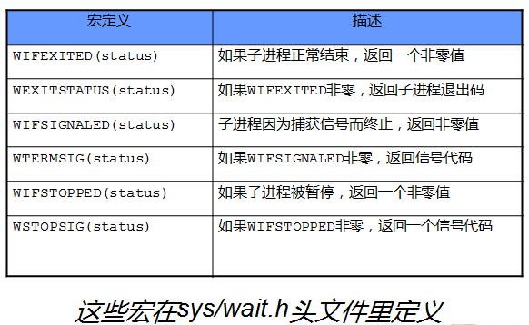

# 一、多进程

## 1. fork 系统调用

写时拷贝,

* 在fork之后exec之前两个进程用的是相同的物理空间（内存区），子进程的代码段、数据段、堆栈都是指向父进程的物理空间，也就是说，两者的虚拟空间不同，但其对应的物理空间是同一个。
* 只有进程空间的各段的内容要发生变化时，才会将父进程的内容复制一份给子进程。
* fork之后内核会通过将子进程放在队列的前面，以让子进程先执行，以免父进程执行导致写时复制

### 1.1 fork 基本知识 

fork仅被调用一次，却能够返回两次，它可能有三种不同的返回值：

1. 在父进程中，fork返回新创建子进程的进程ID；
2. 在子进程中，fork返回0；
3. 如果出现错误，fork返回一个负值；
   1. 当前的进程数已经达到了系统规定的上限，这时 errno 的值被设置为 EAGAIN。
   2. 系统内存不足，这时 errno 的值被设置为 ENOMEM。

```cpp
#include <stdio.h>
#include <unistd.h>
//#include <sys/types.h>
int main ()
{
    pid_t fpid; //fpid表示fork函数返回的值
    int count=0;
    printf("fork之前的语句只在父进程执行\n");
    fpid=fork();
    if (fpid < 0)
        printf("error in fork!");
    else if (fpid == 0) {
        printf("子进程, pid = %d\n",getpid());
        count+=2;
    }
    else {
        printf("父进程, pid = %d\n",getpid());
        count++;
    }
    printf("pid = %d count = %d\n",getpid(), count);
    return 0;
}
```

```
fork之前的语句只在父进程执行
父进程, pid = 18762
pid = 18762 count = 1
子进程, pid = 18763
pid = 18763 count = 2
```

### 1.2 for循环中的fork

```cpp
#include <stdio.h>
#include <unistd.h>
int main(void)
{
    int i=0;
    printf("fork 之前\n");
    //ppid指当前进程的父进程pid
    //pid指当前进程的pid,
    //fpid指fork返回给当前进程的值
    for(i=0;i<2;i++){
        pid_t fpid=fork();
        if(fpid==0)
            printf("i=%d child  %4d %4d %4d\n",i,getppid(),getpid(),fpid);
        else
            printf("i=%d parent %4d %4d %4d\n",i,getppid(),getpid(),fpid);
    }
    return 0;
}
```

```
fork 之前
0 parent 13175 19321 19323
0 child  19321 19323    0
1 parent 13175 19321 19324
1 parent 19321 19323 19325
1 child     1 19325    0
1 child     1 19324    0
```

进程说输出对应表

* 19321

  fork 之前
  0 parent 13175 19321 19323

  1 parent 13175 19321 19324

  * 19323

    0 child  19321 19323    0

    1 parent 19321 19323 19325

    * 19325

      1 child     1 19325    0

  * 19324

    1 child     1 19324    0

解释:

1931 为爷爷, 有两个儿子 19323(i=0), 19324(i=1)

19323(i=0) i++, 在 i<2 范围内, 执行循环 造了个孙子 19325(i=1)

19324(i=1) i++, 在 i<2 范围外,退出循环

fork() 在父进程中返回子进程pid, 在子进程中返回0

### 1.3 使用exit() 
一旦if执行完成, 他们还是会各自执行forx循环之后的代码,此时可以在 if(pid==0 && 条件) 内追加一句 exit(0).让子进程提前结束.

```
int status = -1;
for(i=0;i<4;i++){
    pid_t fpid=fork();
    if(fpid==0) {
        //子进程开始
		if(i==0){
            //一号子进程
		}
		else if(i==1){
            //二号子进程
		}
		
		//status是按位存储的状态信息，需要调用相应的宏来还原一下
		printf("child exit status is %d\n", WEXITSTATUS(status));
		//子进程退出
        exit(0);
    }
    else{
    	//父进程
    	
    	//等待子进程结束
        wait(&status)
        
    }
```

### 1.4 wait

wait()函数就提供了这个功能,    在if 条件内的  主进程呢部分内 加上wait() 函数, 就可以让主进程执行fork()函数时先hold 住, 等子进程退出后再执行, 通常会配合子进程的exit()函数一同使用.

 

## 2. exec

### exec 函数组

​      需要注意的是exec并不是1个函数, 其实它只是一组函数的统称, 它包括下面6个函数:

​     

```
　　#include <unistd.h>
　　int execl(const char *path, const char *arg, ...);
　　int execlp(const char *file, const char *arg, ...);
　　int execle(const char *path, const char *arg, ..., char *const envp[]);
　　int execv(const char *path, char *const argv[]);
　　int execvp(const char *file, char *const argv[]);
　　int execve(const char *path, char *const argv[], char *const envp[]);
```

​       可以见到这6个函数名字不同, 而且他们用于接受的参数也不同.

​       实际上他们的功能都是差不多的, 因为要用于接受不同的参数所以要用不同的名字区分它们, 毕竟c语言没有函数重载的功能嘛..  

​       但是实际上它们的命名是有规律的:

​       exec[l or v][p][e]

​       exec函数里的参数可以分成3个部分,      执行文件部分,     命令参数部分,   环境变量部分.

​        例如我要执行1个命令   ls -l /home/gateman  

​        执行文件部分就是  "/usr/bin/ls"

​        命令参赛部分就是 "ls","-l","/home/gateman",NULL              见到是以ls开头 每1个空格都必须分开成2个部分, 而且以NULL结尾的啊.

​        环境变量部分, 这是1个数组,最后的元素必须是NULL 例如  char * env[] = {"PATH=/home/gateman", "USER=lei", "STATUS=testing", NULL};

​        好了说下命名规则:

​        e后续,  参数必须带环境变量部分,   环境变零部分参数会成为执行exec函数期间的环境变量, 比较少用

​        l 后续,   命令参数部分必须以"," 相隔, 最后1个命令参数必须是NULL

​        v 后续,   命令参数部分必须是1个以NULL结尾的字符串指针数组的头部指针.         例如char * pstr就是1个字符串的指针, char * pstr[] 就是数组了, 分别指向各个字符串.

​        p后续,   执行文件部分可以不带路径, exec函数会在$PATH中找


## 3 僵尸进程

自进程退出后, 父进程退出前, 系统不会立即释放进程表的表项, 此时子进程由 init 接管. ppid = 1, 进入僵尸态.

wait(&status) 函数会阻塞进程,直到该进程的某个子进程结束,并且返回子进程的pid, 并将子进程退出状态写入status



只等待特定的pid, 可以用 waitpid(child_pid, &stat, mode)

waitpid(-1, &status, 0) == wait(&status)

* child_pid == -1 等待任一子进程。于是在这一功能方面waitpid与wait等效。

* pid < -1 等待其组I D等于p i d的绝对值的任一子进程

* pid == 0 等待与调用者进程同在一个组的进程。

* mode == WHOHAVE 

  waitpid 非阻塞,

  * 如果 child 没有结束或者意外终止 立即返回0
  * 正常退出返回 child_pid
  * 调用失败返回-1 并设置 errno

## 4 继承通信

### 4.1 管道

* 管道能在父子进程之间传递数据,利用fork调用之后两个管道文件描述符(fd[0], df[1])都保持打开.一对这样的文件描述符只能保证父子进程**单方向传输数据**
* FIFO (命名管道) 无关联的进程之间的通信
* SystemV IPC用于无关联的多个进程之间的通信,他们都适用一个全局唯一的键值来标示一条信道.

### 4.2 信号量

### 4.2.1 信号原语

程序对共享代码访问时,引发了进程间的竞争状态.我们称这段代码为临界区.

信号两支持两种操作 P(passeren 传递,进入临界区), V(vrijgeven 释放,退出临界区)

### 4.3 共享内存

必须同步进程对于内存的访问,否则会产生竞态条件

1. 创建一段共享内存 shmget(key_t key, size_t size, int shmflg) 
2. 将它关联到进程的地址空间中 shmat(shm_id, shm_addr, shmflg)
3. 使用完毕后将它从进程地址空间中分离 shmdt(shm_addr)

### 4.4 消息队列

两个进程之间传递二进制数据快,每一个快都有特定的类型,接收方可以有选择的接受,不想管道必须FIFO

## 5 同步算法

生产者和消费者

哲学家进餐

银行家算法

# 二  I/O复用

## 0 . I/O函数

* 文件描述符（file descriptor）是内核为了高效管理已被打开的文件所创建的索引，其是一个非负整数（通常是小整数），用于指代被打开的文件，所有执行I/O操作的系统调用都通过文件描述符。 

* 因为文件描述符是系统的一个重要资源，在实际实现过程中内核是会做相应的处理的，一般最大打开文件数会是系统内存的10%（以KB来计算） 

* 两个不同的文件描述符，若指向同一个打开文件句柄，将共享同一文件偏移量 

* 相同文件描述符有可能指向同一个文件，也有可能指向不同的文件。具体情况要具体分析

* 内核维护的3个数据结构。

  1. 进程级的文件描述符表

  2. 系统级的打开文件描述符表

     内核对所有打开的文件的文件维护有一个系统级的描述符表格（open file description table）。有时，也称之为打开文件表（open file table），并将表格中各条目称为打开文件句柄（open file handle）。 

  3. 文件系统的i-node表

  


1. 创建文件描述符
   1. pipe 创建管道，实现进程间通信
   2. dup2 重定向，标准输入重定向到一个文件，输出重定向到网络连接
2. 读写数据
   1. readv writev 分散读 分散写
   2. sendfile 文件描述符直接传递数据 完全在内核中操作，**零拷贝**
   3. mmap 和 munmap 共享内存、文件映射到内存
   4. splice 文件描述符之间移动数据、零拷贝
3. 控制I/O行为和属性的函数

## 1. 适用情况

1. 同时处理多个socket， 非阻塞 connect技术
2. 同时处理用户输入和socket连接，聊天室
3. TCP服务器同时监听和连接socket（最常用）
4. 同时处理UDP、TCP
5. 同时监听多个端口或者多种服务

## 2. select、poll、epoll

### 2.1 select

在一段时间内，监听用户感兴趣的文件描述符上的可读、可写和异常事件.采用轮查方式监测就绪时间


select的几大缺点：

（1）每次调用select，都需要把fd集合从用户态拷贝到内核态，这个开销在fd很多时会很大

（2）同时每次调用select都需要在内核遍历传递进来的所有fd，这个开销在fd很多时也很大

（3）select支持的文件描述符数量太小了，默认是1024

### 2.2 poll实现

　　poll的实现和select非常相似，只是描述fd集合的方式不同，poll使用pollfd结构而不是select的fd_set结构，其他的都差不多。

### 2.3 epoll

（1）select，poll实现需要自己不断轮询所有fd集合，直到设备就绪，期间可能要睡眠和唤醒多次交替。

而epoll其实也需要调用epoll_wait不断轮询就绪链表，但当设备就绪时，调用回调函数，把就绪fd放入就绪链表中，并唤醒在epoll_wait中进入睡眠的进程。

虽然都要睡眠和交替，但是select和poll在“醒着”的时候要遍历整个fd集合，而epoll在“醒着”的时候只要判断一下就绪链表是否为空就行了，这节省了大量的CPU时间。这就是回调机制带来的性能提升。

（2）select，poll每次调用都要把fd集合从用户态往内核态拷贝一次，并且要把current往设备等待队列中挂一次

而epoll只要一次拷贝，而且把current往等待队列上挂也只挂一次（在epoll_wait的开始，注意这里的等待队列并不是设备等待队列，只是一个epoll内部定义的等待队列）。这也能节省不少的开销。

# 三 多线程编程

## 1 线程

### 1.1 概念

* 线程是一个程序中完成一个独立任务的的完整执行序列，一个可调度的实体。内核线程（Light Weight Process）和，由内核调度； 用户线程用线程库调度。
* 内核线程或者CPU使用权是，加载并运行一个用户线程。内核线程相当于用户线程的运行容器。
* 一个进程可以拥有M个内核线程和N个用户线程。在一个系统中所有进程的M:N 比值不变。
* 根据M:N 的比值分三类
  * M = 1，完全用户空间，无序内核支持。线程库利用longjup来切换，模拟“并发”。但是内核的调度单位仍然是进程。优点无序用户-内核态切换。缺点同进程的多个线程只能在一个CPU上运行
  * M = N, 完全内核空间，优点有效利用CPU资源，多线程并发。缺点占用内核资源
  * M《 N, 双层调度， 结合上面两点的优势。

### 1.2 创建和结束线程 

* pthread_create 创建
* pthread_exit 退出
* pthread_join 回收线程，类似于wait
* pthread_cancel 终止线程

### 1.3 线程同步方式

与进程中信号量相似，但是语义不同

* POSIX 信号量
  * sem_init
  * sem_destory
  * sem_wait          以原子方式将信号量减一（阻塞）
  * sem_trywait     （非阻塞）
  * sem_pos            以原子方式将信号量加一， 其他sem_wait的线程将被唤醒。

* 互斥锁

  同步线程对共享数据的访问

  * 互斥锁pshared 指明是否允许跨进程共享互斥锁
  * 互斥锁的类型
    * SHARED 可以跨进程共享
    * PRIVATE 只属于同一进程（该进程的某个线程加的锁）
    * MUTEX_NORMAL 普通锁，互斥锁默认级别。其他请求线程加入有限队列中
      * 一个线程对已经加普通锁的资源再加锁，引发死锁
      * 对其他线程加锁的资源解锁，或者对已经解锁的资源解锁将导致不可预期的后果
    * MUTE_ERRORCHECK 检错锁，防止NORMAL的两大问题
      * 加锁资源加锁，直接返回EDEADLK
      * 解锁资源解锁，直接返回EPERM
    * MUTEX_RECURSIVE 嵌套锁，多次加锁不死锁，按需使用
      * 解锁资源解锁，直接返回EPERM
    * MUTEX_DEFAULT 默认锁，对普通锁相似

* 条件变量

  提供线程间的通知机制
  * pthread_cond_init                 初始化各个字段为零
  * pthread_cond_destory         
  * pthread_cond_broadcast     广播方式唤醒所有等待目标条件变量的线程
  * pthread_cond_signal            
  * pthread_cond_wait(conda, mutex)              等待目标变量，mutex必须已经上锁

## 2. 线程池和进程池

### 2.1 动机

* 动态创建进程，线程慢
* 由于一个进程可能只为一个客户服务，所以进程切换慢
* 子进程是当前进程的完整映射，当前进程必须谨慎管理它的文件描述符和堆资源，子进程可能复制，占用大量资源

### 2.2 概述

* 提前创建一个子进程组，数目与CPU数量相当。每个子进程都运行相同的代码，不占用多余的资源
* 父进程接受到新任务后，通过选择算法从进程池中选择一个子进程来为之服务，子进程接受新连接。
* 通过生产者消费者模型分配任务，解除父子耦合关系

# 四 内存分配


段表页表

伙伴算法

置换算法

