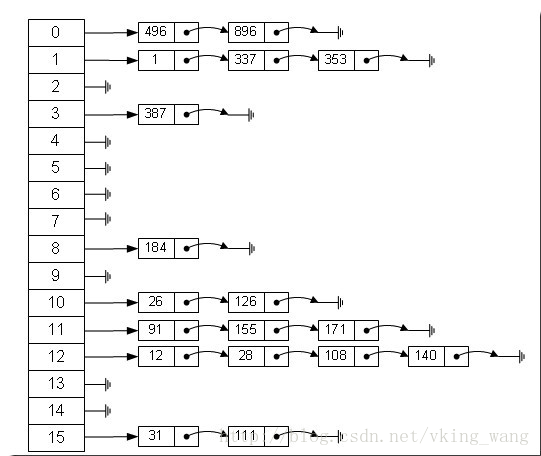

转载: 出处*wenmingxing 你好呀 C++*  https://www.jianshu.com/p/834cc223bb57

# 1. vector

## 1.1 vector底层数据结构

vector是我们用到最多的数据结构，其底层数据结构是**数组**，由于数组的特点，vector也具有以下特性：
 1、O(1)时间的快速访问；
 2、顺序存储，所以插入到非尾结点位置所需时间复杂度为O(n)，删除也一样；
 3、**扩容规则：**  
 当我们新建一个vector的时候，会首先分配给他一片连续的内存空间，如`std::vector<int> vec`，当通过push_back向其中增加元素时，如果初始分配空间已满，就会引起vector扩容，其扩容规则在gcc下以2倍方式完成

 4、**注意事项：**  根据vector的插入和删除特性，以及扩容规则，我们在使用vector的时候要注意，**在插入位置和删除位置之后的所有迭代器和指针引用都会失效，同理，扩容之后的所有迭代器指针和引用也都会失效。** 

 

 # 2 map

map与multimap是STL中的**关联容器**、提供一对一key-value的数据处理能力； map与multimap的区别在于，multimap允许关键字重复，而map不允许重复。 

map与multimap为**有序的**。 而unordered_map与unordered_multimap中key为无序排列，其底层实现为**hash table**，因此其查找时间复杂度理论上达到了**O(n)**

# 3 set

set与multiset有序存储元素，这两种容器的底层实现与map一样都是**红黑树**，所以能实现O(lgn)的查找，插入，删除操作。set与multiset的区别在于是否允许重复；

与unordered_map & unordered_multimap相同，其底层实现为**hash table**； 

# 4 priority_queue

优先级队列相当于一个有权值的单向队列queue，在这个队列中，所有元素是按照优先级排列的。

priority_queue根据堆的处理规则来调整元素之间的位置，关于堆的原理，可以参考堆；

根据堆的特性，优先级队列实现了取出最大最小元素时间复杂度为O(1),对于插入和删除，其最坏情况为O(lgn)。

# 5 list

list 的底层数据结构为**双向链表**，特点是支持快速的增删。 queue为单向队列，为先入先出原则。 deque为双向队列，其对比queue可以实现在头尾两端高效的插入和删除操作。 

 

# 6 HashMap

哈希表（(Hash table）既满足了数据的查找方便，同时不占用太多的内容空间，使用也十分方便。 

1. 开放定址法（线性探测再散列，二次探测再散列，伪随机探测再散列）
2. 再哈希法
3. **链地址法**
4. 建立一个公共溢出区

