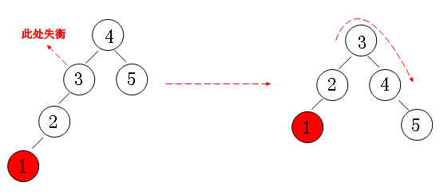
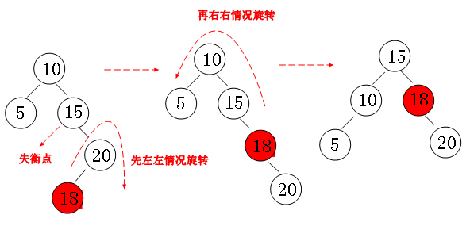

# 1 平衡二叉树

转载 http://www.cnblogs.com/huangxincheng/archive/2012/07/22/2603956.html

平衡因子 = 右子树的高度 - 左子树的高度 

左左失衡

右右失衡

左右失衡

右左失衡

删除

- 如果该节点的平衡因子为0或者1，则找到其左子树中具有最大值的节点max（我们只讨论有序平衡二叉树，并且有序平衡二叉树中任意一个节点的左子树上的所有节点的值小于该节点的值，右子树上所有节点的值大于该节点的值），将max的内容与x的内容交换（只替换保存的真正的数据，不替换指针，平衡因子等用于管理目的的信息），并且max即为新的要删除的节点。由于树是有序的，因而这样找到的节点要么是一个叶子节点，要么是一个没有右子树的节点。
- 如果该节点的平衡因子为-1，则找到其右节点中具有最小值的节点min，将min的内容与x的内容交换，并且min即为新的要删除的节点。由于树是有序的，因而这样找到的节点要么是一个叶子节点，要么是一个没有左子树的节点。

待继续

