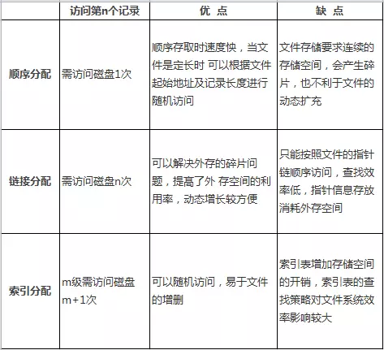
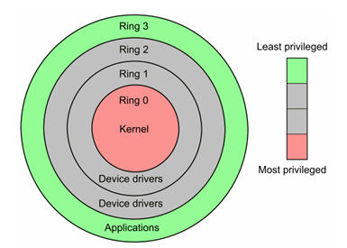

### 一、问题

来源：

CSDN 671coder

网址：https://blog.csdn.net/liuqiyao_01/article/details/12205549


1. 进程通信的几种方式。

2. 线程同步几种方式。(一定要会写生产者、消费者问题，完全消化理解)

3. 线程的实现方式. (也就是用户线程与内核线程的区别)

4. 用户态和核心态的区别。

   1. **用户态--->内核态：**唯一途径是通过中断（外设）、异常、陷入机制（访管指令,系统调用）

      **内核态--->用户态：**设置程序状态字PSW

5. 用户栈和内核栈的区别。

6. 内核在创建进程时，会同时创建task_struct和进程相应堆栈。每个进程都会有两个堆栈，一个用户栈，存在于用户空间，一个内核栈，存在于内核空间。当进程在用户空间运行时，CPU堆栈寄存器的内容是用户堆栈地址，使用用户栈。当进程在内核空间时，CPU堆栈寄存器的内容是内核栈地址空间，使用的是内核栈。

7. 内存池、进程池、线程池。(c++程序员必须掌握)

8. 死锁的概念，导致死锁的原因.

9. 导致死锁的四个必要条件。互斥、请求与保持、不剥夺、循环等待

10. 处理死锁的四个方式。

   1. 破坏死锁
      1. 安顺序请求
      2. 定时剥夺
      3. 打破循环
   2. 预防死锁
      1. 银行家算法
   3. 监测死锁、解除死锁

   

   

11. 进程调度算法。

    1. FIFO

    2. 优先级调度

       1. 静态调度 优先级不变

       2. 动态调度 优先级改变

          1. 不剥夺
          2. 剥夺

       3. 时间片轮转

       4. 多级队列

          在采用 FB 的系统中，设置了多个不同优先级的就绪队列，并赋予各个队列大小不同的时间片，使优先级越高的时间片越小。

    

12. 内存连续分配方式采用的几种算法及各自优劣。

    1. 单一连续分配，内存在此方式下分为系统区和用户区 ，用户区是为用户提供的、除系统区之外的内存空间。这种方式无需进行内存保护 

    2. 固定分区分配 ，分为若干个固定大小的区域，每个分区只装入一道作业

    3. 动态分区分配

       1. 首次适应

       2. 循环首次适应

       3. 最佳适应

       4. 伙伴算法

          Linux 便是采用这著名的伙伴系统算法来解决外部碎片的问题。把所有的空闲页框分组为 11 块链表，每一块链表分别包含大小为1，2，4，8，16，32，64，128，256，512 和 1024 个连续的页框。对1024 个页框的最大请求对应着 4MB 大小的连续RAM 块。每一块的第一个页框的物理地址是该块大小的整数倍。例如，大小为 16个页框的块，其起始地址是 16 * 2^12 （2^12 = 4096，这是一个常规页的大小）的倍数。 

13. 动态链接及静态链接

    1. 静态链接：就是在编译链接时直接将需要的执行代码拷贝到调用处，优点就是在程序发布的时候就不需要的依赖库，程序可以独立执行，但是体积可能会相对大一些
    2. 动态链接：就是在编译的时候不直接拷贝可执行代码，而是通过记录一系列符号和参数，在程序运行或加载时将这些信息传递给操作系统，操作系统负责将需要的动态库加载到内存中。

14. 1. 1. 

       

15. 几种页面置换算法，会算所需换页数。(LRU用程序如何实现？)

    1. 最佳置换算法（OPT） 
    2. 先进先出置换算法（FIFO） 
    3. 最近最久未使用（LRU）算法 

16. 虚拟内存的定义及实现方式。

    1. 多次性，是指无需在作业运行时一次性地全部装入内存，而是允许被分成多次调入内存运行。
    2. 对换性，是指无需在作业运行时一直常驻内存，而是允许在作业的运行过程中，进行换进和换出。
    3. 虚拟性，是指从逻辑上扩充内存的容量，使用户所看到的内存容量，远大于实际的内存容量。
    4. 系统支持
    5. 一定容量的内存和外存。
       1. 页表机制（或段表机制），作为主要的数据结构。
       2. 中断机构，当用户程序要访问的部分尚未调入内存，则产生中断。
       3. 地址变换机构，逻辑地址到物理地址的变换。

17. 操作系统的四个特性。虚拟，异步，共享、并发

18. DMA。

    控制器是一种在系统内部转移数据的独特外设，可以将其视为一种能够通过一组专用总线将内部和外部存储器与每个具有DMA能力的外设连接起来的控制器。它之所以属于外设，是因为它是在处理器的编程控制下来 执行传输的。 

19. Spooling。

    1. 提高了I/O速度.从对低速I/O设备进行的I/O操作变为对输入井或输出井的操作,如同脱机操作一样,提高了I/O速度,缓和了CPU与低速I/O设备速度不匹配的矛盾. 
    2. 设备并没有分配给任何进程.在输入井或输出井中,分配给进程的是一存储区和建立一张I/O请求表
    3. 实现了虚拟设备功能.多个进程同时使用一独享设备,而对每一进程而言,都认为自己独占这一设备,不过,该设备是逻辑上的设备.   

20. 外存分配的几种方式，及各种优劣。

    


##### 7.用户态和核心态



 

当程序运行在3级特权级上时，就可以称之为运行在用户态

反之，**当程序运行在级特权级上时，就可以称之为运行在内核态。**

虽然用户态下和内核态下工作的程序有很多差别，**但最重要的差别就在于特权级的不同，即权力的不同。**运行在用户态下的程序不能直接访问操作系统内核数据结构和程序。

当我们在系统中执行一个程序时，大部分时间是运行在用户态下的，在其需要操作系统帮助完成某些它没有权力和能力完成的工作时就会切换到内核态。

**用户态切换到内核态的3种方式**

1. 系统调用：这是用户态进程主动要求切换到内核态的一种方式，用户态进程通过系统调用申请使用操作系统提供的服务程序完成工作。而系统调用的机制其核心还是使用了操作系统为用户特别开放的一个中断来实现，例如Linux的int 80h中断。

2. ```
   异常：当CPU在执行运行在用户态下的程序时，发生了某些事先不可知的异常，这时会触发由当前运行进程切换到处理此异常的内核相关程序中，也就转到了内核态，比如缺页异常。
   ```

3. ```
   外围设备的中断：当外围设备完成用户请求的操作后，会向CPU发出相应的中断信号，这时CPU会暂停执行下一条即将要执行的指令转而去执行与中断信号对应的处理程序，如果先前执行的指令是用户态下的程序，那么这个转换的过程自然也就发生了由用户态到内核态的切换。比如硬盘读写操作完成，系统会切换到硬盘读写的中断处理程序中执行后续操作等。
   ```


 

 

 

 