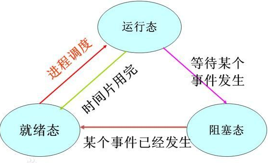
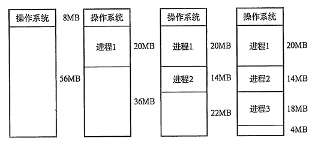

### 一、问题

来源：

CSDN 671coder

网址：https://blog.csdn.net/liuqiyao_01/article/details/12205549


1. 进程的有哪几种状态，状态转换图，及导致转换的事件。

2. 进程与线程的区别。

3. 进程通信的几种方式。

4. 线程同步几种方式。(一定要会写生产者、消费者问题，完全消化理解)

5. 线程的实现方式. (也就是用户线程与内核线程的区别)

6. 用户态和核心态的区别。

   1. **用户态--->内核态：**唯一途径是通过中断（外设）、异常、陷入机制（访管指令,系统调用）

      **内核态--->用户态：**设置程序状态字PSW

7. 用户栈和内核栈的区别。

8. 内核在创建进程时，会同时创建task_struct和进程相应堆栈。每个进程都会有两个堆栈，一个用户栈，存在于用户空间，一个内核栈，存在于内核空间。当进程在用户空间运行时，CPU堆栈寄存器的内容是用户堆栈地址，使用用户栈。当进程在内核空间时，CPU堆栈寄存器的内容是内核栈地址空间，使用的是内核栈。

9. 内存池、进程池、线程池。(c++程序员必须掌握)

10. 死锁的概念，导致死锁的原因.

11. 导致死锁的四个必要条件。互斥、请求与保持、不剥夺、循环等待

12. 处理死锁的四个方式。

    1. 破坏死锁
       1. 安顺序请求
       2. 定时剥夺
       3. 打破循环
    2. 预防死锁
       1. 银行家算法
    3. 监测死锁、解除死锁

    

13. 作业调度

    1. 初级调度 进程调度
    2. 中级调度 对换调度 内存和交换区
    3. 高级调度 作业调度 作业队列

14. 进程调度算法。

    1. FIFO

    2. 优先级调度

       1. 静态调度 优先级不变

       2. 动态调度 优先级改变

          1. 不剥夺
          2. 剥夺

       3. 时间片轮转

       4. 多级队列

          在采用 FB 的系统中，设置了多个不同优先级的就绪队列，并赋予各个队列大小不同的时间片，使优先级越高的时间片越小。

    

15. 内存连续分配方式采用的几种算法及各自优劣。

    1. 单一连续分配，内存在此方式下分为系统区和用户区 ，用户区是为用户提供的、除系统区之外的内存空间。这种方式无需进行内存保护 

    2. 固定分区分配 ，分为若干个固定大小的区域，每个分区只装入一道作业

    3. 动态分区分配

       1. 首次适应

       2. 循环首次适应

       3. 最佳适应

       4. 伙伴算法

          Linux 便是采用这著名的伙伴系统算法来解决外部碎片的问题。把所有的空闲页框分组为 11 块链表，每一块链表分别包含大小为1，2，4，8，16，32，64，128，256，512 和 1024 个连续的页框。对1024 个页框的最大请求对应着 4MB 大小的连续RAM 块。每一块的第一个页框的物理地址是该块大小的整数倍。例如，大小为 16个页框的块，其起始地址是 16 * 2^12 （2^12 = 4096，这是一个常规页的大小）的倍数。 

16. 动态链接及静态链接

    1. 静态链接：就是在编译链接时直接将需要的执行代码拷贝到调用处，优点就是在程序发布的时候就不需要的依赖库，程序可以独立执行，但是体积可能会相对大一些
    2. 动态链接：就是在编译的时候不直接拷贝可执行代码，而是通过记录一系列符号和参数，在程序运行或加载时将这些信息传递给操作系统，操作系统负责将需要的动态库加载到内存中。

17. 基本分页、请求分页储存管理方式。

    1. 页式存储管理：

       1. 内存空间划分 : 内存空间被静态的划分为若干个等长的区域。每个区域被称为一个**物理页**框。
       2. 进程空间划分 : 进程空间也被静态的划分为若干个等长的区域，每个区域称为一个**逻辑页**面，其长度与页框的长度相等。
       3. 进程空间与内存空间的对应关系：当进程运行时，需要将它的各个逻辑页面保存到存储空间的物理页框中，即需要确定逻辑页面与页框的对应关系，**进程的逻辑页面是连续的，但是物理页面却不一定是连续的。**
       4. 特点：允许一个进程占用内存空间中多个连续的区域，而这些区域的长度相等，因而采用静态等长存储分配的方法，不会产生碎片。

    2. 段式存储管理

       1. 内存空间划分 : 内存空间被**动态**的划分为若干个长度各异的区域，每个区域称为一个**物理段**。
       2. 进程空间划分 : 进程空间被静态的划分为若干个长度各异的区域，每个区域称为一个**逻辑段**。一个逻辑段通常对应一个程序段，各个程序断的长度使不等的。
       3. 进程空间与内存空间的对应关系：进程的一个逻辑段与内存的一个物理段相对应。一个进程的多个逻辑段可存放在内存的若干个不相连的物理段中。
       4. 特点：会产生碎片，但是便于实现共享。

    3. 断页式存储管理：

       1. 内存空间划分 : 与页式存储管理相同。
       2. 进程空间划分 :与段式存储管理相同。
       3. 进程空进与内存空间的对应关系：进程空间的一个逻辑页面对应内存空间的一个页框。同一段内的逻辑地址是连续的，而对应的页框却未必是连续。
       4. 特点：既不会产生碎片，又便于共享。

       

18. 几种页面置换算法，会算所需换页数。(LRU用程序如何实现？)

    1. 最佳置换算法（OPT） 
    2. 先进先出置换算法（FIFO） 
    3. 最近最久未使用（LRU）算法 

19. 虚拟内存的定义及实现方式。

    1. 多次性，是指无需在作业运行时一次性地全部装入内存，而是允许被分成多次调入内存运行。
    2. 对换性，是指无需在作业运行时一直常驻内存，而是允许在作业的运行过程中，进行换进和换出。
    3. 虚拟性，是指从逻辑上扩充内存的容量，使用户所看到的内存容量，远大于实际的内存容量。
    4. 系统支持
    5. 一定容量的内存和外存。
       1. 页表机制（或段表机制），作为主要的数据结构。
       2. 中断机构，当用户程序要访问的部分尚未调入内存，则产生中断。
       3. 地址变换机构，逻辑地址到物理地址的变换。

20. 操作系统的四个特性。虚拟，异步，共享、并发

21. DMA。

    控制器是一种在系统内部转移数据的独特外设，可以将其视为一种能够通过一组专用总线将内部和外部存储器与每个具有DMA能力的外设连接起来的控制器。它之所以属于外设，是因为它是在处理器的编程控制下来 执行传输的。 

22. Spooling。

    1. 提高了I/O速度.从对低速I/O设备进行的I/O操作变为对输入井或输出井的操作,如同脱机操作一样,提高了I/O速度,缓和了CPU与低速I/O设备速度不匹配的矛盾. 
    2. 设备并没有分配给任何进程.在输入井或输出井中,分配给进程的是一存储区和建立一张I/O请求表
    3. 实现了虚拟设备功能.多个进程同时使用一独享设备,而对每一进程而言,都认为自己独占这一设备,不过,该设备是逻辑上的设备.   

23. 外存分配的几种方式，及各种优劣。

    

### 二、面试问题总结

原文来源：

简书： Ruheng

网址： https://www.jianshu.com/p/d254b138de03


参考：[面试复习重点——基础篇：操作系统、计算机网络、设计模式](https://link.jianshu.com?t=http://blog.csdn.net/liuqiyao_01/article/details/12205549)

1. 操作系统的四个特性。
2. 操作系统的主要功能。
3. 进程的有哪几种状态，状态转换图，及导致转换的事件。
    4.进程与线程的区别。
    5.进程通信的几种方式。
    6.进程同步的几种方式
    7.用户态和核心态的区别。
    8.死锁的概念，导致死锁的原因.
    9.导致死锁的四个必要条件。
    10.处理死锁的四个方式。
    11.预防死锁的方法、避免死锁的方法。
    12.进程调度算法。
    13.内存连续分配方式采用的几种算法及各自优劣。
    14.基本分页储存管理方式。
    15.基本分段储存管理方式。
    16.分段分页方式的比较各自优缺点。
    17.几种页面置换算法，会算所需换页数
    18.虚拟内存的定义及实现方式。

### 三、重难点总结

##### 1. 操作系统的四个特性

并发：同一段时间内多个程序执行(注意区别并行和并发，前者是同一时刻的多个事件，后者是同一时间段内的多个事件)
 共享：系统中的资源可以被内存中多个并发执行的进线程共同使用
 虚拟：通过时分复用（如分时系统）以及空分复用（如虚拟内存）技术实现把一个物理实体虚拟为多个
 异步：系统中的进程是以走走停停的方式执行的，且以一种不可预知的速度推进

##### 2.操作系统的主要功能

处理机管理：处理机分配都是以进程为单位，所以处理机管理也被看做是进程管理。包括进程控制，进程同步，进程通信和进程调度
 存储器管理（或者内存管理）：内存分配，内存保护，地址映射，内存扩充
 设备管理：管理所有外围设备，包括完成用户的IO请求；为用户进程分配IO设备；提高IO设备利用率；提高IO速度；方便IO的使用
 文件管理：管理用户文件和系统文件，方便使用同时保证安全性。包括：磁盘存储空间管理，目录管理，文件读写管理以及文件共享和保护
 提供用户接口：程序接口（如API）和用户接口（如GUI）

##### 3.进程的状态与转换



 

运行状态：进程正在处理机上运行。在单处理机环境下，每一时刻最多只有一个进程处于运行状态。

就绪状态：进程已处于准备运行的状态，即进程获得了除处理机之外的一切所需资源，一旦得到处理机即可运行。

阻塞状态，又称等待状态：进程正在等待某一事件而暂停运行，如等待某资源为可用（不包括处理机）或等待输入/输出完成。即使处理机空闲，该进程也不能运行。

**注意区别就绪状态和等待状态：**就绪状态是指进程仅缺少处理机，只要获得处理机资源就立即执行；而等待状态是指进程需要其他资源（除了处理机）或等待某一事件。

**就绪状态 -> 运行状态：**处于就绪状态的进程被调度后，获得处理机资源（分派处理机时间片），于是进程由就绪状态转换为运行状态。

**运行状态 -> 就绪状态：**处于运行状态的进程在时间片用完后，不得不让出处理机，从而进程由运行状态转换为就绪状态。此外，在可剥夺的操作系统中，当有更高优先级的进程就 、 绪时，调度程度将正执行的进程转换为就绪状态，让更高优先级的进程执行。

**运行状态 -> 阻塞状态：**当进程请求某一资源（如外设）的使用和分配或等待某一事件的发生（如I/O操作的完成）时，它就从运行状态转换为阻塞状态。进程以系统调用的形式请求操作系统提供服务，这是一种特殊的、由运行用户态程序调用操作系统内核过程的形式。

**阻塞状态 -> 就绪状态：**当进程等待的事件到来时，如I/O操作结束或中断结束时，中断处理程序必须把相应进程的状态由阻塞状态转换为就绪状态。

##### 4.进程与线程的区别

**进程：**进程是进程实体的运行过程，是系统进行资源分配和调度的一个独立单位（具有动态、并发、独立、异步的特性，以及就绪、执行、阻塞3种状态）；引入进程是为了使多个程序可以并发的执行，以提高系统的资源利用率和吞吐量。

**线程：**是比进程更小的可独立运行的基本单位，可以看做是轻量级的进程（具有轻型实体，独立调度分派单位，可并发执行，共享进程资源等属性）；引入目的是为了减少程序在并发执行过程中的开销，使OS的并发效率更高。

两者的对比：

1. 调度方面：在引入线程的OS中，线程是独立的调度和分派单位，而进程作为资源的拥有单位(相当于把未引入线程的传统OS中的进程的两个属性分开了)。由于线程不拥有资源，因此可以显著的提高并发度以及减少切换开销。
2. 并发性：引入了线程的OS中，进程间可以并发，而且一个进程内部的多个线程之间也是可以并发的，这就使OS具有更好的并发性，有效的提高了系统资源利用率和吞吐量。
3. 拥有资源：无论OS是否支持线程，进程都是基本的资源拥有单位，线程只拥有很少的基本的资源，但是线程可以访问所隶属的进程的资源（进程的代码段，数据段和所拥有的系统资源如fd）
4. 系统开销：创建或者撤销进程的时候，系统要为之创建或回收PCB，系统资源等，切换时也需要保存和恢复CPU环境。而线程的切换只需要保存和恢复少量的寄存器，不涉及存储器管理方面的工作，所以开销较小。此外，统一进程中的多个线程由于共享地址空间，所以通信同步等都比较方便。

##### 5.进程通信

进程通信是指进程之间的信息交换。PV操作是低级通信方式，髙级通信方式是指以较高的效率传输大量数据的通信方式。高级通信方法主要有以下三个类。

**共享存储**

在通信的进程之间存在一块可直接访问的共享空间，通过对这片共享空间进行写/读操作实现进程之间的信息交换。在对共享空间进行写/读操作时，需要使用同步互斥工具（如 P操作、V操作），对共享空间的写/读进行控制。共享存储又分为两种：低级方式的共享是基于数据结构的共享；高级方式则是基于存储区的共享。操作系统只负责为通信进程提供可共享使用的存储空间和同步互斥工具，而数据交换则由用户自己安排读/写指令完成。

需要注意的是，用户进程空间一般都是独立的，要想让两个用户进程共享空间必须通过特殊的系统调用实现，而进程内的线程是自然共享进程空间的。

**消息传递**

在消息传递系统中，进程间的数据交换是以格式化的消息(Message)为单位的。若通信的进程之间不存在可直接访问的共享空间，则必须利用操作系统提供的消息传递方法实现进程通信。进程通过系统提供的发送消息和接收消息两个原语进行数据交换。

1. 直接通信方式：发送进程直接把消息发送给接收进程，并将它挂在接收进程的消息缓冲队列上，接收进程从消息缓冲队列中取得消息。
2. 间接通信方式：发送进程把消息发送到某个中间实体中，接收进程从中间实体中取得消息。这种中间实体一般称为信箱，这种通信方式又称为信箱通信方式。该通信方式广泛应用于计算机网络中，相应的通信系统称为电子邮件系统。

**管道通信**

管道通信是消息传递的一种特殊方式。所谓“管道”，是指用于连接一个读进程和一个写进程以实现它们之间通信的一个共享文件，又名pipe文件。向管道（共享文件）提供输入的发送进程（即写进程），以字符流形式将大量的数据送入（写）管道；而接收管道输出的接收进程（即读进程），则从管道中接收（读）数据。为了协调双方的通信，管道机制必须提供以下三方面的协调能力：互斥、同步和确定对方的存在。

##### 6.进程同步

多进程虽然提高了系统资源利用率和吞吐量，但是由于进程的异步性可能造成系统的混乱。进程同步的任务就是对多个相关进程在执行顺序上进行协调，使并发执行的多个进程之间可以有效的共享资源和相互合作，保证程序执行的可再现性

同步机制需要遵循的原则：

1. 空闲让进：当没有进程处于临界区的时候，应该许可其他进程进入临界区的申请
2. 忙则等待：当前如果有进程处于临界区，如果有其他进程申请进入，则必须等待，保证对临界区的互斥访问
3. 有限等待：对要求访问临界资源的进程，需要在有限时间内进入临界区，防止出现死等
4. 让权等待：当进程无法进入临界区的时候，需要释放处理机，边陷入忙等

经典的进程同步问题：生产者-消费者问题；哲学家进餐问题；读者-写者问题

同步的解决方案：管程，信号量。

##### 7.用户态和核心态


 

当程序运行在3级特权级上时，就可以称之为运行在用户态

反之，**当程序运行在级特权级上时，就可以称之为运行在内核态。**

虽然用户态下和内核态下工作的程序有很多差别，**但最重要的差别就在于特权级的不同，即权力的不同。**运行在用户态下的程序不能直接访问操作系统内核数据结构和程序。

当我们在系统中执行一个程序时，大部分时间是运行在用户态下的，在其需要操作系统帮助完成某些它没有权力和能力完成的工作时就会切换到内核态。

**用户态切换到内核态的3种方式**

1. 系统调用：这是用户态进程主动要求切换到内核态的一种方式，用户态进程通过系统调用申请使用操作系统提供的服务程序完成工作。而系统调用的机制其核心还是使用了操作系统为用户特别开放的一个中断来实现，例如Linux的int 80h中断。

2. ```
   异常：当CPU在执行运行在用户态下的程序时，发生了某些事先不可知的异常，这时会触发由当前运行进程切换到处理此异常的内核相关程序中，也就转到了内核态，比如缺页异常。
   ```

3. ```
   外围设备的中断：当外围设备完成用户请求的操作后，会向CPU发出相应的中断信号，这时CPU会暂停执行下一条即将要执行的指令转而去执行与中断信号对应的处理程序，如果先前执行的指令是用户态下的程序，那么这个转换的过程自然也就发生了由用户态到内核态的切换。比如硬盘读写操作完成，系统会切换到硬盘读写的中断处理程序中执行后续操作等。
   ```

##### 8.死锁

死锁是指多个进程在运行过程中，因为争夺资源而造成的一种僵局，如果没有外力推进，处于僵局中的进程就无法继续执行。

**死锁原因：**

1. 竞争资源：请求同一有限资源的进程数多于可用资源数
2. 进程推进顺序非法：进程执行中，请求和释放资源顺序不合理，如资源等待链

**死锁产生的必要条件：**

1. 互斥条件 ---> 独占锁的特点之一。
2. 请求与保持条件 ---> 独占锁的特点之一，尝试获取锁时并不会释放已经持有的锁
3. 不剥夺条件 ---> 独占锁的特点之一。
4. 循环等待条件 ---> 唯一需要记忆的造成死锁的条件。

**死锁处理**

1. 预防死锁：破坏产生死锁的4个必要条件中的一个或者多个；实现起来比较简单，但是如果限制过于严格会降低系统资源利用率以及吞吐量
2. 避免死锁：在资源的动态分配中，防止系统进入不安全状态(可能产生死锁的状态)-如银行家算法
3. 检测死锁：允许系统运行过程中产生死锁，在死锁发生之后，采用一定的算法进行检测，并确定与死锁相关的资源和进程，采取相关方法清除检测到的死锁。实现难度大
4. 解除死锁：与死锁检测配合，将系统从死锁中解脱出来（撤销进程或者剥夺资源）。对检测到的和死锁相关的进程以及资源，通过撤销或者挂起的方式，释放一些资源并将其分配给处于阻塞状态的进程，使其转变为就绪态。实现难度大

##### 9.进程调度算法

**先来先服务调度算法FCFS：**既可以作为作业调度算法也可以作为进程调度算法；按作业或者进程到达的先后顺序依次调度；因此对于长作业比较有利；

**短作业优先调度算法SJF：**作业调度算法，算法从就绪队列中选择估计时间最短的作业进行处理，直到得出结果或者无法继续执行；缺点：不利于长作业；未考虑作业的重要性；运行时间是预估的，并不靠谱 ；

**高相应比算法HRN：**响应比=(等待时间+要求服务时间)/要求服务时间；

**时间片轮转调度RR：**按到达的先后对进程放入队列中，然后给队首进程分配CPU时间片，时间片用完之后计时器发出中断，暂停当前进程并将其放到队列尾部，循环 ;

**多级反馈队列调度算法：**目前公认较好的调度算法；设置多个就绪队列并为每个队列设置不同的优先级，第一个队列优先级最高，其余依次递减。优先级越高的队列分配的时间片越短，进程到达之后按FCFS放入第一个队列，如果调度执行后没有完成，那么放到第二个队列尾部等待调度，如果第二次调度仍然没有完成，放入第三队列尾部…。只有当前一个队列为空的时候才会去调度下一个队列的进程。

##### 10.内存连续分配

主要是指动态分区分配时所采用的几种算法。
 动态分区分配又称为可变分区分配，是一种动态划分内存的分区方法。这种分区方法不预先将内存划分，而是在进程装入内存时，根据进程的大小动态地建立分区，并使分区的大小正好适合进程的需要。因此系统中分区的大小和数目是可变的。

 



**首次适应(First  Fit)算法：**空闲分区以地址递增的次序链接。分配内存时顺序查找，找到大小能满足要求的第一个空闲分区。

**最佳适应(Best  Fit)算法：**空闲分区按容量递增形成分区链，找到第一个能满足要求的空闲分区。

**最坏适应(Worst  Fit)算法：**又称最大适应(Largest Fit)算法，空闲分区以容量递减的次序链接。找到第一个能满足要求的空闲分区，也就是挑选出最大的分区。

##### 11.基本分页储存管理方式

把主存空间划分为大小相等且固定的块，块相对较小，作为主存的基本单位。每个进程也以块为单位进行划分，进程在执行时，以块为单位逐个申请主存中的块空间。

因为程序数据存储在不同的页面中，而页面又离散的分布在内存中，**因此需要一个页表来记录逻辑地址和实际存储地址之间的映射关系，以实现从页号到物理块号的映射。**

由于页表也是存储在内存中的，因此和不适用分页管理的存储方式相比，访问分页系统中内存数据需要**两次的内存访问**(一次是从内存中访问页表，从中找到指定的物理块号，加上页内偏移得到实际物理地址；第二次就是根据第一次得到的物理地址访问内存取出数据)。


 

快表机制

在某些计算机中如果内存的逻辑地址很大，将会导致程序的页表项会很多，而页表在内存中是连续存放的，所以相应的就需要较大的连续内存空间。为了解决这个问题，可以采用**两级页表或者多级页表的方法**，其中外层页表一次性调入内存且连续存放，内层页表离散存放。相应的访问内存页表的时候需要一次地址变换，访问逻辑地址对应的物理地址的时候也需要一次地址变换，而且一共需要访问内存3次才可以读取一次数据。

##### 12.基本分段储存管理方式

分页是为了提高内存利用率，而分段是为了满足程序员在编写代码的时候的一些逻辑需求(比如数据共享，数据保护，动态链接等)。

分段内存管理当中，**地址是二维的，一维是段号，一维是段内地址；其中每个段的长度是不一样的，而且每个段内部都是从0开始编址的**。由于分段管理中，每个段内部是连续内存分配，但是段和段之间是离散分配的，因此也存在一个逻辑地址到物理地址的映射关系，相应的就是段表机制。段表中的每一个表项记录了该段在内存中的起始地址和该段的长度。段表可以放在内存中也可以放在寄存器中。


 

##### 分段分页方式的比较

页是信息的物理单位，是出于系统内存利用率的角度提出的离散分配机制；段是信息的逻辑单位，每个段含有一组意义完整的信息，是出于用户角度提出的内存管理机制

页的大小是固定的，由系统决定；段的大小是不确定的，由用户决定

##### 13.虚拟内存

如果存在一个程序，所需内存空间超过了计算机可以提供的实际内存，那么由于该程序无法装入内存所以也就无法运行。单纯的增加物理内存只能解决一部分问题，但是仍然会出现无法装入单个或者无法同时装入多个程序的问题。但是可以从逻辑的角度扩充内存容量，即可解决上述两种问题。

基于局部性原理，**在程序装入时，可以将程序的一部分装入内存，而将其余部分留在外存**，就可以启动程序执行。在程序执行过程中，**当所访问的信息不在内存时，由操作系统将所需要的部分调入内存,然后继续执行程序**。另一方面，操作系统将内存中**暂时不使用的内容换出到外存上，从而腾出空间存放将要调入内存的信息**。这样，系统好像为用户提供了一个比实际内存大得多的存储器，称为虚拟存储器。

虚拟存储器的特征：

1. 多次性：一个作业可以分多次被调入内存。多次性是虚拟存储特有的属性
2. 对换性：作业运行过程中存在换进换出的过程(换出暂时不用的数据换入需要的数据)
3. 虚拟性：虚拟性体现在其从逻辑上扩充了内存的容量(可以运行实际内存需求比物理内存大的应用程序)。虚拟性是虚拟存储器的最重要特征也是其最终目标。虚拟性建立在多次性和对换性的基础上行，多次性和对换性又建立在离散分配的基础上

##### 14.页面置换算法

**最佳置换算法：**只具有理论意义的算法，用来评价其他页面置换算法。置换策略是将当前页面中在未来最长时间内不会被访问的页置换出去。

**先进先出置换算法：**简单粗暴的一种置换算法，没有考虑页面访问频率信息。每次淘汰最早调入的页面。

**最近最久未使用算法LRU：**算法赋予每个页面一个访问字段，用来记录上次页面被访问到现在所经历的时间t，每次置换的时候把t值最大的页面置换出去(实现方面可以采用寄存器或者栈的方式实现)。

**时钟算法clock(也被称为是最近未使用算法NRU)：**页面设置一个访问位，并将页面链接为一个环形队列，页面被访问的时候访问位设置为1。页面置换的时候，如果当前指针所指页面访问为为0，那么置换，否则将其置为0，循环直到遇到一个访问为位0的页面。

**改进型Clock算法：**在Clock算法的基础上添加一个修改位，替换时根究访问位和修改位综合判断。优先替换访问位和修改位都是0的页面，其次是访问位为0修改位为1的页面。

**最少使用算法LFU：**设置寄存器记录页面被访问次数，每次置换的时候置换当前访问次数最少的。

### 四、总结

以上只是针对操作系统重点知识点的总结，如果没有相应的操作系统基础的话，可能不太好理解，下面推荐自己学习操作系统过程中参考的一些资料。

 

 

 

 

 