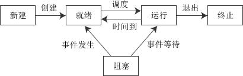
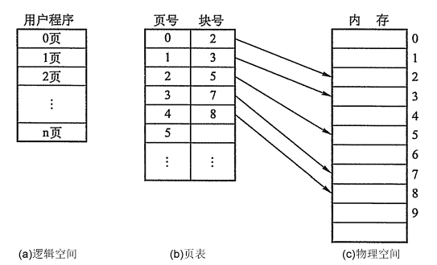
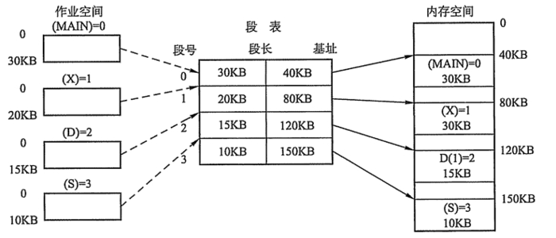

# 1. 操作系统引论

## 1.1  操作系统的四个特性

* 并发：同一段时间内多个程序执行(注意区别并行和并发，前者是同一时刻的多个事件，后者是同一时间段内的多个事件)
* 共享：系统中的资源可以被内存中多个并发执行的进线程共同使用
* 虚拟：通过时分复用（如分时系统）以及空分复用（如虚拟内存）技术实现把一个物理实体虚拟为多个
* 异步：系统中的进程是以走走停停的方式执行的，且以一种不可预知的速度推进

## 1.2 操作系统的主要功能

* 处理机管理：处理机分配都是以进程为单位，所以处理机管理也被看做是进程管理。包括进程控制，进程同步，进程通信和进程调度
* 存储器管理（或者内存管理）：内存分配，内存保护，地址映射，内存扩充
*  设备管理：管理所有外围设备，包括完成用户的IO请求；为用户进程分配IO设备；提高IO设备利用率；提高IO速度；方便IO的使用
*  文件管理：管理用户文件和系统文件，方便使用同时保证安全性。包括：磁盘存储空间管理，目录管理，文件读写管理以及文件共享和保护
*  提供用户接口：程序接口（如API）和用户接口（如GUI）

## 1.3 操作系统目标

1：方面性，2：有效性，3：可扩展性，4：开放性

##1.4 描述多道批处理、分时、实时操作系统的特点各是什么?

* 批处理操作系统：多道性、无序性、调度性，系统利用率高、吞吐量大、平均周转时间长、但无交互能力。
* 分时操作系统：有多路性、独立性、及时性和交互性。 有较好的人机交互的特性，并且可以实现共享主机
* 实时系统：有多路性、独立性、及时性、交互性和可靠性。实际上是指操作系统工作时，其各种资源可以根据需要随时进行动态分配。由于各种资源可以进行动态分配，因此，其处理事务的能力较强、速度较快。
* 总结：从可靠性：实时系统更强，从交互性：分时系统更强

## 1.5 用户态和核心态的区别

用户态--->内核态：唯一途径是通过中断（外设）、异常、陷入机制（访管指令,系统调用）

内核态--->用户态：设置程序状态字PSW

**用户态切换到内核态的3种方式**

1. 系统调用：这是用户态进程主动要求切换到内核态的一种方式，用户态进程通过系统调用申请使用操作系统提供的服务程序完成工作。而系统调用的机制其核心还是使用了操作系统为用户特别开放的一个中断来实现，例如Linux的int 80h中断。
2. 异常：当CPU在执行运行在用户态下的程序时，发生了某些事先不可知的异常，这时会触发由当前运行进程切换到处理此异常的内核相关程序中，也就转到了内核态，比如缺页异常
3. 外围设备的中断：当外围设备完成用户请求的操作后，会向CPU发出相应的中断信号，这时CPU会暂停执行下一条即将要执行的指令转而去执行与中断信号对应的处理程序，如果先前执行的指令是用户态下的程序，那么这个转换的过程自然也就发生了由用户态到内核态的切换。比如硬盘读写操作完成，系统会切换到硬盘读写的中断处理程序中执行后续操作等。

## 1.6 作业调度

### 1.6.1 处理机调度的层次：

　1：高级调度

​        主要用于多道批处理系统中，又称长作业调度，调度队像是作业，根据某种算法决定将后备队列中的哪几个作业调入内存。

　2：低级调度

​        操作系统中最基本的一种调度方式（频率最高），在多道批处理、分时和时实三中类型的OS中都存在，又称为短作业调度。

　3：中级调度

​        又称为内存调度，目的是为了提高内存的利用率和系统的吞吐率，

### 1.6.2 调度算法

1. 先来先服务算法（FSFS）

2. 短作业优先调度算法（SJF）

   缺点：是必须知道作业的运行时间，对长作业不利，人机无法实现交互，未完全考虑作业的紧迫程度

3. 优先级调度算法（PSA）

   优先级：对于先来先服务算法，作业的等待时间就是他的优先级，等待时间越长优先级越高，对于短作业优先级作业的长短就是他的优先级。在优先级算法中，基于作业的紧迫程度。

4. 高响应比优先调度算法（HRRN）

   高响应比算法既考虑作业的等待时间又考虑作业的运行时间，

   * 优先权 =  （等待时间+要求服务时间）/要求服务时间由于等待时间与服务时间之和就是作业的相应时间，顾优先级相当于响应比：Rp
   * Rp = （等待时间+要求服务时间）/要求服务时间 = 响应时间/要求服务时间

#2  进程

## 2.1 进程描述符PCB和作用

pcb（process control block），进程控制块。是我们学习操作系统后遇到的第一个数据结构描述，它是对系统的进程进行管理的重要依据，和进程管理相关的操作全都要用到pcb中的内容。一般情况下

* 进程标识符（内部、外部）
* 处理机的信息（通用寄存器，指令计数器，psw，用户的栈指针）
* 进程调度信息（进程状态，进程的优先级，进程调度所需的其他信息，事件）
* 进程控制信息（进程的数据的地址，资源清单，进程同步和通信机制，链接指针）

## 2.2 进程的特征与三种基本状态

### 2.2.1 特征：

​    1：动态性，2：并发性，3：独立性，4：异步性。

### 2.2.2 三种基本状态转换：

​    处于就绪状态的进程，在调度程序为之分配了处理机之后便开始执行， 就绪 -> 执行

​    正在执行的进程如果因为分配他的时间片已经用完，而被剥夺处理剂， 执行 -> 就绪

​    如果因为某种原因致使当前的进程执行受阻，使之不能执行。               执行 -> 阻塞

 

### 2.2.3 程序和进程的区别

　　程序：计算机指令的集合，它以文件的形式存储在磁盘上。程序是静态实体（passive Entity），在多道程序系统中，它是不能独立运行的，更不能与其他程序并发执行。

使用系统资源情况：不使用（程序不能申请系统资源，不能被系统调度，也不能作为独立运行的单位，它不占用系统的运行资源）。

　　进程：进程是进程实体（包括：程序段、相关的数据段、进程控制块PCB）的运行过程，是一个程序在其自身的地址空间中的一次执行活动。是系统进行资源分配和调度的一个独立单位。

使用系统资源情况：使用（进程是资源申请、调度和独立运行的单位，因此，它使用系统中的运行资源）

### 2.2.4 用户栈和内核栈的区别 

内核在创建进程时，会同时创建task_struct和进程相应堆栈。每个进程都会有两个堆栈，一个用户栈，存在于用户空间，一个内核栈，存在于内核空间。当进程在用户空间运行时，CPU堆栈寄存器的内容是用户堆栈地址，使用用户栈。当进程在内核空间时，CPU堆栈寄存器的内容是内核栈地址空间，使用的是内核栈。

## 2.3 进程调度算法

### 2.3.1先来先服务 

### 2.3.2 优先级调度

1. 静态调度 优先级不变

2. 动态调度 优先级改变

   1. 不剥夺
   2. 剥夺
### 2.3.3 时间片轮转

### 2.3.4 多级队列
   在采用 FB 的系统中，设置了多个不同优先级的就绪队列，并赋予各个队列大小不同的时间片，使优先级越高的时间片越小。

## 2.4 进程间的通信

　　早期的属于低级通信：原因：1：效率低，生产者每次只能向缓冲池投放一个信息  2：通信对用户不透明，隐藏了通信的具体细节。现在发展为高级通信：用户可以利用操作系统所提供的一组通信命令传送大量数据。操作系统隐藏了进程通信的实现细节。或者说，通信过程对用户是透明的。

#### 1. 管道通信

1.1 **匿名管道( pipe )：**管道是一种半双工的通信方式，数据只能**单向流动**，而且只能在具有亲缘关系的进程间使用。进程的亲缘关系通常是指**父子进程关系**。

   通过匿名管道实现进程间通信的步骤如下：

- 父进程创建管道，得到两个⽂件描述符指向管道的两端
- 父进程fork出子进程，⼦进程也有两个⽂件描述符指向同⼀管道。
- 父进程关闭fd[0],子进程关闭fd[1]，即⽗进程关闭管道读端,⼦进程关闭管道写端（因为管道只支持单向通信）。⽗进程可以往管道⾥写,⼦进程可以从管道⾥读,管道是⽤环形队列实现的,数据从写端流⼊从读端流出,这样就实现了进程间通信。

1.2 流管道s_pipe: 去除了第一种限制,可以双向传输

1.3 命名管道:name_pipe克服了管道没有名字的限制，因此，除具有管道所具有的功能外，它还允许无亲缘关系进程间的通信；

#### 2. 信号量

信号量是一个计数器，可以用来控制多个进程对共享资源的访问。它常作为一种锁机制，防止某进程正在访问共享资源时，其他进程也访问该资源。因此，主要作为进程间以及同一进程内不同线程之间的同步手段。

#### 3. 消息队列( message queue)

消息队列是由消息的链表，存放在内核中并由消息队列标识符标识。消息队列克服了信号传递信息少、管道只能承载无格式字节流以及缓冲区大小受限等缺点。

#### 4. 共享内存( shared memory)

共享内存就是映射一段能被其他进程所访问的内存，这段共享内存由一个进程创建，但多个进程都可以访问。

使得多个进程可以访问同一块内存空间，是最快的可用IPC形式。是针对其他通信机制运行效率较低而设计的。往往与其它通信机制，如信号量结合使用，来达到进程间的同步及互斥。

#### 5. 套接字( socket )

套解口也是一种进程间通信机制，与其他通信机制不同的是，它可用于不同机器间的进程通信

更为一般的进程间通信机制，可用于不同机器之间的进程间通信。起初是由Unix系统的BSD分支开发出来的，但现在一般可以移植到其它类Unix系统上：Linux和System V的变种都支持套接字。

#### 6. 进程间通信各种方式效率比较

| 类型             | 无连接 | 可靠 | 流控制 | 记录消息类型 | 优先级 |
| ---------------- | ------ | ---- | ------ | ------------ | ------ |
| 普通PIPE         | N      | Y    | Y      |              | N      |
| 流PIPE           | N      | Y    | Y      |              | N      |
| 命名PIPE(FIFO)   | N      | Y    | Y      |              | N      |
| 消息队列         | N      | Y    | Y      |              | Y      |
| 信号量           | N      | Y    | Y      |              | Y      |
| 共享存储         | N      | Y    | Y      |              | Y      |
| UNIX流SOCKET     | N      | Y    | Y      |              | N      |
| UNIX数据包SOCKET | Y      | Y    | N      |              | N      |

#### 8. 各种通信方式的比较和优缺点

1. 管道：速度慢，容量有限，只有父子进程能通讯
2. FIFO：任何进程间都能通讯，但速度慢
3. 消息队列：容量受到系统限制，且要注意第一次读的时候，要考虑上一次没有读完数据的问题
4. 信号量：不能传递复杂消息，只能用来同步
5. 共享内存区：能够很容易控制容量，速度快，但要保持同步，比如一个进程在写的时候，另一个进程要注意读写的问题，相当于线程中的线程安全，当然，共享内存区同样可以用作线程间通讯，不过没这个必要，线程间本来就已经共享了同一进程内的一块内存

# 3 线程 

## 3.1 线程与进程的区别联系

* 进程：进程是具有一定独立功能的程序关于某个数据集合上的一次运行活动，是系统进行资源分配和调度的一个独立单位。（包括程序段，相关数据段，和进程控制块PCB）
* 线程：线程是进程的一个实体，是CPU调度和分派的基本单位，它是比进程更小的能独立运行的基本单位。线程自己基本上不拥有系统资源,只拥有一点在运行中必不可少的资源(如程序计数器,一组寄存器和栈),但是它可与同属一个进程的其他的线程共享进程所拥有的全部资源.
* 关系：一个线程可以创建和撤销另一个线程;同一个进程中的多个线程之间可以并发执行.相对进程而言，线程是一个更加接近于执行体的概念，它可以与同进程中的其他线程共享数据，但拥有自己的栈空间，拥有独立的执行序列。
* 区别：主要差别在于它们是不同的操作系统资源管理方式。进程有独立的地址空间，一个进程崩溃后，在保护模式下不会对其它进程产生影响，而线程只是一个进程中的不同执行路径。线程有自己的堆栈和局部变量，但线程之间没有单独的地址空间，一个线程死掉就等于整个进程死掉，所以多进程的程序要比多线程的程序健壮，但在进程切换时，耗费资源较大，效率要差一些。但对于一些要求同时进行并且又要共享某些变量的并发操作，只能用线程，不能用进程。
* 优缺点
  * 线程和进程在使用上各有优缺点：线程执行开销小，但不利于资源的管理和保护；
  * 进程正相反。同时，线程适合于在SMP机器上运行，而进程则可以跨机器迁移。

 # 4. 并发

## 4.1 程序并发执行的特征

1：间断性：程序在并发执行的时候，因为是共享资源，以及完成同一项任务而相互合作，致使在这些并发执行的程序之间形成了相互制约的关系，导致程序执行呈现：执行--暂停--执行

2：失去封闭性：当系统中有多个并发执行的程序时，各个资源是他们所共享的，这些资源的状态也由这些程序所改变，所以摸一个程序的运行环境会受到其他程序的影响。

3：不可再生性

## 4.2 临界区

### 4.2.1 定义

每个进程中访问临界资源的那段程序称为临界区，每次只准许一个进程进入临界区，进入后不允许其他进程进入。

　1：如果有若干进程要求进入空闲的临界区，一次仅允许一个进程进入；

　2：任何时候，处于临界区内的进程不可多于一个。如已有进程进入自己的临界区，则其它所有试图进入临界区的进程必须等待；

　3：进入临界区的进程要在有限时间内退出，以便其它进程能及时进入自己的临界区；

　4：如果进程不能进入自己的临界区，则应让出CPU，避免进程出现“忙等”现象。

### 4.2.2 死锁

#### 4.2.2.1 定义：

​	在两个或多个并发进程中，如果每个进程持有某种资源而又都等待别的进程释放它或它们现在保持着的资源，在未改变这种状态之前都不能向前推进，称这一组进程产生了死锁。通俗地讲，就是两个或多个进程被无限期地阻塞、相互等待的一种状态。

#### 4.2.2.2 产生条件：

1：互斥条件        -- 一个资源一次只能被一个进程使用

2：请求保持条件 -- 一个进程因请求资源而阻塞时，对已经获得资源保持不放 

3：不可抢占条件 -- 进程已获得的资源在未使用完之前不能强行剥夺

4：循环等待条件 -- 若干进程之间形成一种头尾相接的循环等待资源的关系

#### 4.2.2.3 预防避免死锁的方法

银行家算法是一种最有代表性的避免死锁的算法。又被称为“资源分配拒绝”法。在避免死锁方法中允许进程动态地申请资源，但系统在进行资源分配之前，应先计算此次分配资源的安全性，若分配不会导致系统进入不安全状态，则分配，否则等待。为实现银行家算法，系统必须设置若干数据结构。

| 破坏条件   | 过程                                                         | 优点       | 缺点                                                         |
| ---------- | ------------------------------------------------------------ | ---------- | ------------------------------------------------------------ |
| 请求和保持 | 必须一次性的申请其在整个运行过程所需要的全部资源             | 简单，安全 | 资源严重浪费，恶化了系统的利用率                             |
| 不剥夺     | 已保资源的进程，提出新请求而不能立即得到满足时，必须释放它已经保持了的所有资源，待以后需要时再重新申请 |            | 延长了进程的周转时间增加系统开销、降低系统吞吐量。           |
| 环路等待   | 将所有的资源按类型进行线性排队，并赋予不同的序号。所有进程请求资源必须按照资源递增的次序提出，防止出现环路。 |            | 1、序号必须相对稳定，限制了新设备类型的增加2、作业（进程）使用资源顺序和系统规定的顺序不同而造成资源的浪费3、限制了用户编程 |

### 4.2.3 进程同步原则

　　进程同步的主要任务：是对多个相关进程在执行次序上进行协调，以使并发执行的诸进程之间能有效地共享资源和相互合作，从而使程序的执行具有可再现性。同步机制遵循的原则：

　　1：空闲让进；

　　2：忙则等待（保证对临界区的互斥访问）；

　　3：有限等待（有限代表有限的时间，避免死等）；

　　4：让权等待，（当进程不能进入自己的临界区时，应该释放处理机，以免陷入忙等状态）。

　　由于进程同步产生了一系列经典的同步问题“生产者-消费者”问题，“哲学家进餐”问题，“读者-写者”问题。

什么是死锁，死锁产生的4个条件

　　

 

# 5 存储器管理    

## 5.1 连续分配存储管理方式

### 5.1.1 单一连续分配

内存在此方式下分为系统区和用户区 ，用户区是为用户提供的、除系统区之外的内存空间。这种方式无需进行内存保护 

### 5.1.2：固定分区分配

分为若干个固定大小的区域，每个分区只装入一道作业

### 5.1.3：动态分区分配

1. 首次适应算法（FF）：    

   要求地址空间递增的顺序链接，再分配内存时从链首开始查找，知道有一个满足的空间为止。该算法优先利用内存中低址空间，保留了高址空间，缺点是低址部分不断被划分，留下许多内存碎片

2. 循环首次适应算法(NF)：

   为了防止留下碎片，减少低址空间开销，NF算法每次从上一次分配的地方继续分配，该算法需要一个起始查询的指针用于指示下一次查询的空间地址。缺点是：缺乏大的空间分区

3. 最佳适应算法（BF）：

   每次作业分配时，总是把满足要求，又是最小的空间分配给作业，该算法把空间分区按其容量大小从小到大排列成空闲区链，缺点是：留下许多内存碎片，

4. 伙伴算法

   Linux 便是采用这著名的伙伴系统算法来解决外部碎片的问题。把所有的空闲页框分组为 11 块链表，每一块链表分别包含大小为1，2，4，8，16，32，64，128，256，512 和 1024 个连续的页框。对1024 个页框的最大请求对应着 4MB 大小的连续RAM 块。每一块的第一个页框的物理地址是该块大小的整数倍。例如，大小为 16个页框的块，其起始地址是 16 * 2^12 （2^12 = 4096，这是一个常规页的大小）的倍数。 

## 5.2 基本分页、请求分页储存管理方式

### 5.2.1页式存储管理 

访问分页系统中内存数据需要**两次的内存访问**(一次是从内存中访问页表，从中找到指定的物理块号，加上页内偏移得到实际物理地址；第二次就是根据第一次得到的物理地址访问内存取出数据)。

1. 内存空间划分 : 内存空间被静态的划分为若干个等长的区域。每个区域被称为一个**物理页**框。

2. 进程空间划分 : 进程空间也被静态的划分为若干个等长的区域，每个区域称为一个**逻辑页**面，其长度与页框的长度相等。

3. 进程空间与内存空间的对应关系：当进程运行时，需要将它的各个逻辑页面保存到存储空间的物理页框中，即需要确定逻辑页面与页框的对应关系，**进程的逻辑页面是连续的，但是物理页面却不一定是连续的。**

4. 特点：允许一个进程占用内存空间中多个连续的区域，而这些区域的长度相等，因而采用静态等长存储分配的方法，不会产生碎片。

5. 快表机制

   在某些计算机中如果内存的逻辑地址很大，将会导致程序的页表项会很多，而页表在内存中是连续存放的，所以相应的就需要较大的连续内存空间。为了解决这个问题，可以采用**两级页表或者多级页表的方法**，其中外层页表一次性调入内存且连续存放，内层页表离散存放。相应的访问内存页表的时候需要一次地址变换，访问逻辑地址对应的物理地址的时候也需要一次地址变换，而且一共需要访问内存3次才可以读取一次数据。

### 5.2.2 段式存储管理

分页是为了提高内存利用率，而分段是为了满足程序员在编写代码的时候的一些逻辑需求(比如数据共享，数据保护，动态链接等)。

分段内存管理当中，**地址是二维的，下标是段号，一维是段长，二维是段内地址；其中每个段的长度是不一样的，而且每个段内部都是从0开始编址的**。由于分段管理中，每个段内部是连续内存分配，但是段和段之间是离散分配的，因此也存在一个逻辑地址到物理地址的映射关系，相应的就是段表机制。段表中的每一个表项记录了该段在内存中的起始地址和该段的长度。段表可以放在内存中也可以放在寄存器中。

1. 内存空间划分 : 内存空间被**动态**的划分为若干个长度各异的区域，每个区域称为一个**物理段**。
2. 进程空间划分 : 进程空间被静态的划分为若干个长度各异的区域，每个区域称为一个**逻辑段**。一个逻辑段通常对应一个程序段，各个程序断的长度使不等的。
3. 进程空间与内存空间的对应关系：进程的一个逻辑段与内存的一个物理段相对应。一个进程的多个逻辑段可存放在内存的若干个不相连的物理段中。
4. 特点：会产生碎片，但是便于实现共享。

### 5.2.3 段页式存储管理

1. 内存空间划分 : 与页式存储管理相同。
2. 进程空间划分 :与段式存储管理相同。
3. 进程空进与内存空间的对应关系：进程空间的一个逻辑页面对应内存空间的一个页框。同一段内的逻辑地址是连续的，而对应的页框却未必是连续。
4. 特点：既不会产生碎片，又便于共享。

 ## 5.3 页面置换算法

1. **最佳置换算法：**只具有理论意义的算法，用来评价其他页面置换算法。置换策略是将当前页面中在未来最长时间内不会被访问的页置换出去。
2. **先进先出置换算法：**简单粗暴的一种置换算法，没有考虑页面访问频率信息。每次淘汰最早调入的页面。
3. **最近最久未使用算法LRU：**算法赋予每个页面一个访问字段，用来记录上次页面被访问到现在所经历的时间t，每次置换的时候把t值最大的页面置换出去(实现方面可以采用寄存器或者栈的方式实现)。
4. **时钟算法clock(也被称为是最近未使用算法NRU)：**页面设置一个访问位，并将页面链接为一个环形队列，页面被访问的时候访问位设置为1。页面置换的时候，如果当前指针所指页面访问为为0，那么置换，否则将其置为0，循环直到遇到一个访问为位0的页面。
5. **改进型Clock算法：**在Clock算法的基础上添加一个修改位，替换时根究访问位和修改位综合判断。优先替换访问位和修改位都是0的页面，其次是访问位为0修改位为1的页面。
6. **最少使用算法LFU：**设置寄存器记录页面被访问次数，每次置换的时候置换当前访问次数最少的。

## 5.4 虚拟内存的定义及实现方式

基于局部性原理，**在程序装入时，可以将程序的一部分装入内存，而将其余部分留在外存**，就可以启动程序执行。在程序执行过程中，**当所访问的信息不在内存时，由操作系统将所需要的部分调入内存,然后继续执行程序**。另一方面，操作系统将内存中**暂时不使用的内容换出到外存上，从而腾出空间存放将要调入内存的信息**。这样，系统好像为用户提供了一个比实际内存大得多的存储器，称为虚拟存储器。

1. 多次性，是指无需在作业运行时一次性地全部装入内存，而是允许被分成多次调入内存运行。
2. 对换性，是指无需在作业运行时一直常驻内存，而是允许在作业的运行过程中，进行换进和换出。
3. 虚拟性，是指从逻辑上扩充内存的容量，使用户所看到的内存容量，远大于实际的内存容量。
4. 系统支持
5. 一定容量的内存和外存。
   1. 页表机制（或段表机制），作为主要的数据结构。
   2. 中断机构，当用户程序要访问的部分尚未调入内存，则产生中断。
   3. 地址变换机构，逻辑地址到物理地址的变换。

### 5。5 Windows下的内存管理

Windows操纵内存可以分两个层面：物理内存和虚拟内存。其中物理内存由系统管理，不允许应用程序直接访问

​    1：虚拟内存，最适合用来管理大型对象或者结构数组；

​    2：内存映射文件，最适合用来管理大型数据流（通常来自文件）以及在单个计算机上运行多个进程之间共享数据；

​    3：内存堆栈，最适合用来管理大量的小对象。

# 6 输入输出系统

## 6.1 IO软件的层次结构

　　1：用户层IO软件，2：设备独立性软件，3：设备驱动程序，4：中断处理程序

## 6.2 对IO设备的控制方式

　1：使用轮询的可编程方式

　　　cpu不停地检查设备的状态，以字节为单位，非中断方式，利用率低

　2：使用中断可编程的Io方式

　　　添加CPU中断，提高了CPU的利用率

　3：直接存储方式

　　　以数据块为单位，放宽响应时间

　4：IO通道的方式

　　　以数据块组成的一组数据块为单位，大幅度提高CPU的利用率

 ## 6.3 设备分配

### 6.3.1 设备分配中的数据结构

1. 设备分配表DCT2：控制器控制表，通道控制表，系统设备设备表
2. 设备分配需要考虑的因素
   1. 设备的固有属性
   2. 独占设备得分配策略
   3. 设备的分配算法
   4. 设备分配中的安全性
3. 独占设备的分配程序

### 6.3.2 SpooLing系统的构成

　　1：输入井和输出井

　　2：输入缓冲区和输出缓冲区

　　3：输入进程和输出进程

　　4：井管理程序

### 6.3.3 缓冲区

 　　1：单缓冲区，处理时间是：max(c,T)+M

　　 2：双缓冲区，处理时间是:max(C+T);

 

### 6.3.4 DMA。

控制器是一种在系统内部转移数据的独特外设，可以将其视为一种能够通过一组专用总线将内部和外部存储器与每个具有DMA能力的外设连接起来的控制器。它之所以属于外设，是因为它是在处理器的编程控制下来 执行传输的。 

### 6.3.5 Spooling。

1. 提高了I/O速度.从对低速I/O设备进行的I/O操作变为对输入井或输出井的操作,如同脱机操作一样,提高了I/O速度,缓和了CPU与低速I/O设备速度不匹配的矛盾. 
2. 设备并没有分配给任何进程.在输入井或输出井中,分配给进程的是一存储区和建立一张I/O请求表
3. 实现了虚拟设备功能.多个进程同时使用一独享设备,而对每一进程而言,都认为自己独占这一设备,不过,该设备是逻辑上的设备.   

# 7. 文件管理（外存）

 ## 7.1 文件逻辑结构分类 

　　按文件的有无结构分：

　　　　1：有结构文件（记录式文件） 2：无结构文件（流式文件）

　　按文件组织方式分：

　　　　1：顺序文件，2：索引文件，3：索引顺序文件

## 7.2 磁盘存储器管理

