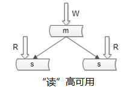

https://my.oschina.net/xianggao/blog/524943

## 秒杀业务的特性

（1）低廉价格；（2）大幅推广；（3）瞬时售空；（4）一般是定时上架；（5）时间短、瞬时并发量高；

## 相关问题

| 问题                                                         | 解决方案                                                     |
| ------------------------------------------------------------ | ------------------------------------------------------------ |
| 对现有网站业务造成冲击                                       | 独立部署，完全独立                                           |
| 高并发下的应用                                               | 页面内容静态化，用户请求不需要情况应用服务                   |
| 突然增加网络的带宽                                           | 将秒杀页面缓存在CDN，增加出口带宽                            |
| 秒杀产品URL只在特定时间有效                                  | 动态URL                                                      |
| 秒杀按钮                                                     | 静态页面中加入一个JS文件引用，JS作为标记文件                 |
| 第一个提交的订单有效                                         | 可以控制进入下单页面的入口，只有少数用户能进入下单页面，其他用户直接进入秒杀结束页面。可以考虑通过cookie的方式来应对，符合一致性原则 |
| 如何进行下单前置检查                                         | 如果超过10条，直接返回已结束页面给用户                       |
| 秒杀一般是定时上架。人可以绕过前端的限制，直接通过URL的方式发起购买 | 需要在前台商品页面，以及bug页面到后端的数据库，都要进行时钟同步。越在后端控制，安全性越高。 |
| 并发， 库存会带来“超卖”的问题                                | 尝试扣减库存，扣减库存成功才会进行下单逻辑                   |

## 构建原则

1. 尽可能将请求拦截在系统上游，避免后端读写锁冲突严重

2. 读多写少，多使用缓存

   一趟火车其实只有2000张票，200w个人来买，最多2000个人下单成功，其他人都是查询库存，写比例只有0.1%，读比例占99.9% 缓存

3. 前端设计

   1. 秒杀页面

      1. 各个静态资源首先分开存放
      2. cdn节点上分散压力

   2. 倒计时

      用于同步时间的接口由于不涉及到后端逻辑，只需要将当前web服务器的时间发送给客户端就可以了，因此速度很快

4. 浏览器请求拦截

   1. web页面， 用户点击购买后，按钮置灰，禁止用户重复提交
   2. JS层面， 限制用户请求频率
   3. 站点层，页面缓存，同一个uid 限制访问频度，x秒内的请求返回原始页面
   4. 服务器层
      1. 请求队列
      2. 读请求，cache，redus

5. 总设计

   1. 用户请求分发模块，请求分发到不同机器上
   2. 用户请求预处理，判断商品是不是还有剩余
   3. 预处理模块，提交事务给数据库，返回是否成功
   4. 数据库结构模块 直接与数据库相连，提供查询服务
   5. 返回用户请求结果

## 数据库设计

### 冗余读库：

写仍然是单点，不能保证写高可用。

### 冗余写库：

采用双主互备的方式，可以冗余写库带来的副作用？双写同步，数据可能冲突（例如“自增id”同步冲突）,如何解决同步冲突，有两种常见解决方案：

1. 两个写库使用不同的初始值，相同的步长来增加id：1写库的id为0,2,4,6...；2写库的id为1,3,5,7...；
2. 不使用数据的id，业务层自己生成唯一的id，保证数据不冲突；

### 扩展读

提高读性能的方式大致有三种，第一种是建立索引。这种方式不展开，要提到的一点是，不同的库可以建立不同的索引。

`第二种扩充读性能的方式是，增加从库`，这种方法大家用的比较多，但是，存在两个缺点：

1. 从库越多，同步越慢；
2. 同步越慢，数据不一致窗口越大（不一致后面说，还是先说读性能的提高）；

