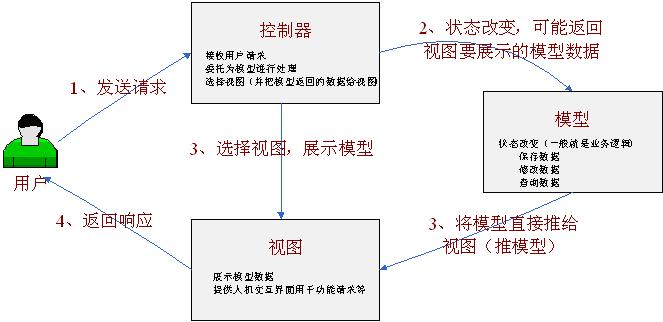

二分法查找次数，100个数最多查找多少次？  [log(n)] - 1

### 区分端口

支持多进程不行，多进程可以多路IO复用

来自 松阳 的CSDN 博客 ，全文地址请点击：https://blog.csdn.net/fansongy/article/details/7767129?utm_source=copy  

主要有3个参数：通信的目的IP地址、使用的传输层协议(TCP 或 UDP)和使用的端口号。

我们还知道如下几个事实： 1. 一个指定的端口号不能被多个应用程序共用。比如，如果IIS占用了80端口，那么Apache就不能也用80端口了； 2. 很多防火墙只允许特定目标端口的数据包通过。 3. 服务程序在listen某个端口并accept某个连接请求后，会生成一个新的socket来对请求进行处理。

所谓的端口，是为了区分不同的应用的，以在不同的IP包来到的时候能够正确转发。

如果一个程序创建了一个socket，并让其监听80端口，其实是向TCP/IP协议栈声明了其对80端口的占有。以后，所有目标是80端口的TCP数据包都会转发给该程序(这里的程序，因为使用的是Socket编程接口，所以首先由Socekt层来处理)。所谓的accept函数，其实抽象的是TCP的连接建立过程。accept函数返回的新socket其实指代的是本次创建的连接，而一个连接是包括两部分信息的，一个是源IP和源端口，另一个宿IP和宿端口。这样的话，这些socket宿端口就可以都是80！

### 查看端口占用

lsof -i 

### 外排序

多路归并，败者树

### 三次握手中accept函数处于第几次，拥塞控制。 

 accept/connect这两个socket调用完全是基于TCP三次握手状态机的，即只要本地TCP状态机进入ESTABLISH状态，就会成功返回。而我们知道，TCP的三次握手本身就是一次权衡的结果

https://blog.csdn.net/cheng_fangang/article/details/23183173


因式分解数字组合最小


### post、put和get的区别什么 

 **GET操作是安全的**。所谓安全是指不管进行多少次操作，资源的状态都不会改变。 

**PUT，DELETE **操作是幂等的。所谓幂等是指不管进行多少次操作，结果都一样。 一次请求只执行一次

**POST操作既不是安全的，也不是幂等的**，比如常见的POST重复加载问题：当我们多次发出同样的POST请求后，其结果是创建出了若干的资源。 


### 页面加载速度很慢，如何加速页面的渲染  条件请求

来自 猴小新 的CSDN 博客 ，全文地址请点击：https://blog.csdn.net/mysouling/article/details/51210297?utm_source=copy  

网页发者工具看network瀑布图，串行序列中最慢的请求，多次请求，

这种情况一般是因为下载的内容太重了，例如大图片、大脚本等。这类问题可以使用GZIP压缩、图片压缩或者JS/CSS的minify等手段来解决。

a)资源在第三方站点上，他们很慢；b)这个资源太大了；c)这个资源使用的域名有问题。

条件请求， 设置缓存

* 减少请求 导航栏上有五幅图片 5 次请求 -> 一张图片 用\<area coords 截取一段> 或者 csss sprites
* CDN（内容发布网络）是一组分布在多个不同地理位置的Web服务器，用于更加有效地向用户发布内容。 
* 压缩组件，http请求中 accept-encoding
* 将样式放在头部，内容循序渐进，防止白屏
* 使用外部 js css 方便浏览器缓存
* 减少DNS查找，避免重定向
* Ajax 异步更新，仅向服务器发送并取回必须的数据

cookie和session有什么区别  服务器和客户端

图片很大，如何进行优化 压缩，分片

你对迅雷了解多少？ 

### websocket和http的区别是什么？

相同点

1. 都是一样基于TCP的，都是可靠性传输协议。
2. 都是应用层协议。

不同点

 1. WebSocket是双向通信协议，模拟Socket协议，可以双向发送或接受信息。HTTP是单向的。
 2. WebSocket是需要浏览器和服务器握手进行建立连接的。而http是浏览器发起向服务器的连接，服务器预先并不知道这个连接。

联系

WebSocket在建立握手时，数据是通过HTTP传输的。但是建立之后，在真正传输时候是不需要HTTP协议的。

cookie和localStorage区别，如何把cookie写在一个对象中，其属性就是键值对 

### COOKIE和SESSION有什么区别？

https://www.zhihu.com/question/19786827

cookie保存在客户端，session保存在服务器端

cookie目的可以跟踪会话，也可以保存用户喜好或者保存用户名密码 偏好设置 不安全。

session用来跟踪会话 某些网站中网页有不同的访问权限，有只能登录的用户访问的网页

session是以cookie或URL重写为基础的，默认使用cookie来实现，系统会创造一个名为JSESSIONID的输出cookie

注意session cookie是存储于浏览器内存中的。当我们把浏览器的cookie禁止后，web服务器会采用URL重写的方式传递Sessionid，我们就可以在地址栏看到 sessionid=KWJHUG6JJM65HS2K6之类的字符串。 


### 条件请求

条件请求指的是请求的执行结果会因特定首部的值不同而不同。这些首部规定了请求的前置条件，请求结果则视条件匹配与否而有所不同。 

* 验证器 匹配用

  * 文件最后修改时间
  * 实体标签 etag 意义模糊的字符串
  * 类型
    * 强检验 断点续传
    * 弱检验 相似即可，侧面广告

* 条件首部

  * 匹配
  * 更早时间匹配
  * 时间区间匹配

* 应用场景

  * 缓存更新

  * 增量下载，断点续传

    

### http1.1中的keep-alive是怎么理解的？ 

keep-alive是http1.0与http1.1的特性之一，意在提供长效的HTTP会话，以避免客户端频繁建立tcp连接的消耗。

同时，Server不释放tcp连接，在Client收到response后，认定为长连接，同样也不释放tcp连接。这样就实现了会话的保持。

### HTTP2.0和HTTP1.X相比的新特性

- **新的二进制格式**（Binary Format），HTTP1.x的解析是基于文本。基于文本协议的格式解析存在天然缺陷，文本的表现形式有多样性，要做到健壮性考虑的场景必然很多，二进制则不同，只认0和1的组合。基于这种考虑HTTP2.0的协议解析决定采用二进制格式，实现方便且健壮。
- **多路复用**（MultiPlexing），即连接共享，即每一个request都是是用作连接共享机制的。一个request对应一个id，这样一个连接上可以有多个request，每个连接的request可以随机的混杂在一起，接收方可以根据request的 id将request再归属到各自不同的服务端请求里面。
- **header压缩**，如上文中所言，对前面提到过HTTP1.x的header带有大量信息，而且每次都要重复发送，HTTP2.0使用encoder来减少需要传输的header大小，通讯双方各自cache一份header fields表，既避免了重复header的传输，又减小了需要传输的大小。
- **服务端推送**（server push），同SPDY一样，HTTP2.0也具有server push功能。

区块链 

### malloc 和 new

new 自由存储器、完整类型指针、不足抛异常、允许重载、调用构造，析构函数

malloc 堆，void*, 不足返回nullptr, 不允许重载

###stl remove 和erase 区别

vector中的remove的作用是将等于value的元素放到vector的尾部，但并不减少vector的size

vector中erase的作用是删除掉某个位置position或一段区域（begin, end)中的元素，减少其size

### 运行时类型信息

RTTI（Run-Time Type Identification，运行时类型识别）

dynamic_cast允许运行时刻进行类型转换，从而使程序能够在一个类层次结构中安全地转化类型，与之相对应的还有一个非安全的转换操作符static_cast

它使程序能够获取由基指针或引用所指向的对象的实际派生类型，即允许“用指向基类的指针或引用能够获取到对应“对象”的实际派生类型。

### mysql支持事务吗？ 

，mvc模式的优缺

### DB存储引擎

来自 zgrgfr 的CSDN 博客 ，全文地址请点击：https://blog.csdn.net/zgrgfr/article/details/74455547?utm_source=copy  

MyISAM基于ISAM存储引擎，并对其进行扩展。它是在Web、数据仓储和其他应用环境下最常使用的存储引擎之一。MyISAM拥有较高的插入、查询速度，但不支持事务

MyISAM主要特性有：  1、大文件（达到63位文件长度）在支持大文件的文件系统和操作系统上被支持。  2、当把删除和更新及插入操作混合使用的时候，动态尺寸的行产生更少碎片。这要通过合并相邻被删除的块，以及若下一个块被删除，就扩展到下一块自动完成。  3、每个MyISAM表最大索引数是64，这可以通过重新编译来改变。每个索引最大的列数是16  4、NULL被允许在索引的列中，这个值占每个键的0~1个字节  5、可以把数据文件和索引文件放在不同目录（InnoDB是放在一个目录里面的）


InnoDB存储引擎 InnoDB是事务型数据库的首选引擎，支持事务安全表（ACID），支持行锁定和外键，上图也看到了，InnoDB是默认的MySQL引擎。 InnoDB主要特性有： 1、InnoDB给MySQL提供了具有提交、回滚和崩溃恢复能力的事物安全（ACID兼容）存储引擎。InnoDB锁定在行级并且也在SELECT语句中提供一个类似Oracle的非锁定读。这些功能增加了多用户部署和性能。在SQL查询中，可以自由地将InnoDB类型的表和其他MySQL的表类型混合起来，甚至在同一个查询中也可以混合 2、InnoDB是为处理巨大数据量的最大性能设计。它的CPU效率可能是任何其他基于磁盘的关系型数据库引擎锁不能匹敌的 3、InnoDB存储引擎完全与MySQL服务器整合，InnoDB存储引擎为在主内存中缓存数据和索引而维持它自己的缓冲池。InnoDB将它的表和索引在一个逻辑表空间中，表空间可以包含数个文件（或原始磁盘文件）。这与MyISAM表不同，比如在MyISAM表中每个表被存放在分离的文件中。InnoDB表可以是任何尺寸，即使在文件尺寸被限制为2GB的操作系统上 4、InnoDB支持外键完整性约束，存储表中的数据时，每张表的存储都按主键顺序存放，如果没有显示在表定义时指定主键，InnoDB会为每一行生成一个6字节的ROWID，并以此作为主键。 虽然InnoDB也使用B+Tree作为索引结构，但具体实现方式却与MyISAM截然不同。  第一个重大区别是InnoDB的数据文件本身就是索引文件。从 上文知道，MyISAM索引文件和数据文件是分离的，索引文件仅保存数据记录的地址。而在InnoDB中，表数据文件本身就是按B+Tree组织的一个索 引结构，这棵树的叶节点data域保存了完整的数据记录。这个索引的key是数据表的主键，因此InnoDB表数据文件本身就是主索引。

### 有三个线程ID分别是A、B、C,请有多线编程实现，在屏幕上循环打印10次ABCABC…  

```
pthread_cond_signal()的一个简单的例子。
pthread_mutex_t mlock;
pthread_cond_t cond;
unsigned count;
printCHAR (char* p, flag=0) {
    pthread_mutex_lock (&mlock);
    while(count != flag) 
        pthread_cond_wait( &cond, &count_lock);
        
    cout<< p <<endl;
    count= (count+1)%3;
    pthread_mutex_unlock (&count_lock);
}
```

### 最少编辑距离

那么我们分析怎么能让步数最少呢，是不是知道两个单词最长的相同子序列的长度，并乘以2，被两个单词的长度之和减，就是最少步数了。 其实这道题就转换成求Longest Common Subsequence最长相同子序列的问题 

```cpp
class Solution {
public:
    int minDistance(string word1, string word2) {
        int n1 = word1.size(), n2 = word2.size();
        vector<vector<int>> dp(n1 + 1, vector<int>(n2 + 1, 0));
        for (int i = 1; i <= n1; ++i) {
            for (int j = 1; j <= n2; ++j) {
                if (word1[i - 1] == word2[j - 1]) {
                    dp[i][j] = dp[i - 1][j - 1] + 1;
                } else {
                    dp[i][j] = max(dp[i - 1][j], dp[i][j - 1]);
                }
            }
        }
        return n1 + n2 - 2 * dp[n1][n2];
    }
};
```


### 迅雷下载快

P2SP是迅雷首创的一种下载技术，并于2003年在美国申请了专利。 

P2SP是指Peer to Server&Peer 点对服务器和点(用户对服务器和用户)，而P2P网络只有用户（既是客户端也是服务端）。 

C盘生成一个cid_store.dat文件。这个文件会记录你下你曾用迅雷来下载过什么文件（无论是P2P、FTP还是http文件下载），只要有任何风吹草动这个文件就会更新。 

P2P协议中上传的东西都是通过P2P下载出来的。而迅雷在后台上传的文件包括其他协议（如ftp和http）下载下来的东西。 

「用户使用迅雷打开一个URL下载地址时，迅雷会将该URL来源上传给迅雷服务器并储存，将目标文件数据发送至迅雷服务器进行比对检索，并在短时间内返回大量拥有该文件的目标来源。 

这种情况会让一些内容下载服务提供商很受伤，例如华军软件园等网站。因为很可能用户没有去到软件下载网站去看他们的广告，却通过迅雷的服务器和软件下载网站和他们建立链接下载软件。结果就是那些网站白白浪费的服务器的性能和资源却没有得到任何回报。由于这样的情况，2006年曾发生过下载网站联合抵制迅雷的事件。 


### 下载速度超过带宽

如果长期稳定超过，检查一下此文件你是不是你或者你基友下载过，在硬盘上或者局域网内同hash的文件被迅雷索引到了的话会直接传输。这样速度就取决于你局域网或者硬盘的传输瓶颈。 


还有可能是迅雷的显示有误。迅雷在下载时，会将东西先存入内存中缓存，再写进硬盘，中间可能存在卡顿。比方说，0-1s内没有往硬盘写，内存存了10M了。1s-2s，内存又存了10M，连同之前的10M一起写到硬盘就，就造成了下载速度到了20M/s的假象。


### 区块链

区块链是什么？一句话，它是一种特殊的分布式数据库。 

**区块链没有管理员，它是彻底无中心的。**其他的数据库都有管理员，但是区块链没有。如果有人想对区块链添加审核，也实现不了，因为它的设计目标就是防止出现居于中心地位的管理当局。 

所谓"哈希"就是计算机可以对任意内容，计算出一个长度相同的特征值。区块链的 哈希长度是256位，这就是说，不管原始内容是什么，最后都会计算出一个256位的二进制数字 

其中有当前区块体的哈希，还有上一个区块的哈希。这意味着，如果当前区块体的内容变了，或者上一个区块的哈希变了，一定会引起当前区块的哈希改变。 


这一点对区块链有重大意义。如果有人修改了一个区块，该区块的哈希就变了。为了让后面的区块还能连到它（因为下一个区块包含上一个区块的哈希），该人必须依次修改后面所有的区块，否则被改掉的区块就脱离区块链了。由于后面要提到的原因，哈希的计算很耗时，短时间内修改多个区块几乎不可能发生，除非有人掌握了全网51%以上的计算能力。

正是通过这种联动机制，区块链保证了自身的可靠性，数据一旦写入，就无法被篡改。这就像历史一样，发生了就是发生了，从此再无法改变。


现在的规则是，新节点总是采用最长的那条区块链。如果区块链有分叉，将看哪个分支在分叉点后面，先达到6个新区块（称为"六次确认"）。按照10分钟一个区块计算，一小时就可以确认。 

但是，为了保证数据的可靠性，区块链也有自己的代价。一是效率，数据写入区块链，最少要等待十分钟，所有节点都同步数据，则需要更多的时间；二是能耗，区块的生成需要矿工进行无数无意义的计算，这是非常耗费能源的。

因此，区块链的适用场景，其实非常有限。

> 1. 不存在所有成员都信任的管理当局
> 2. 写入的数据不要求实时使用
> 3. 挖矿的收益能够弥补本身的成本

### 字符串匹配

作者：海纳
链接：https://www.zhihu.com/question/21923021/answer/281346746
来源：知乎
著作权归作者所有。商业转载请联系作者获得授权，非商业转载请注明出处。

```cpp
void getNext(char * p, int * next){
	next[0] = -1;
	int i = 0, j = -1;

	while (i < strlen(p))
	{
		if (j == -1 || p[i] == p[j])
		{
			++i;
			++j;
			next[i] = j;
		}	
		else
			j = next[j];
	}
}
```

```cpp
int KMP(char * t, char * p) {
	int i = 0; 
	int j = 0;

	while (i < strlen(t) && j < strlen(p)){
		if (j == -1 || t[i] == p[j]) {
			i++;
			j++;
		}
	 	else 
           	 j = next[j];
    	}

    if (j == strlen(p))
       return i - j;
    else 
       return -1;
}
```

### 