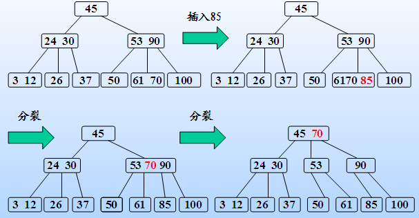
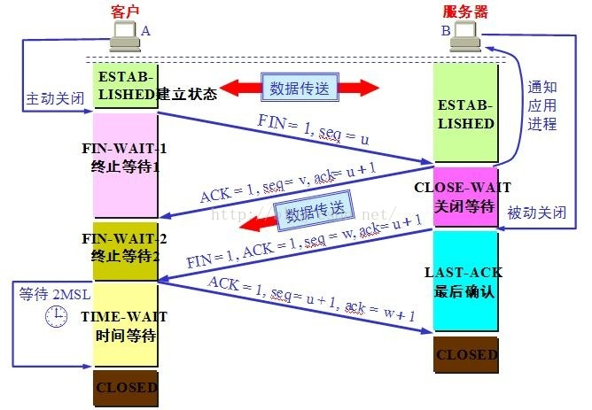

# 编程题

* 最短路径代码；
* 连续子数组最大和问题
* 求一个数开根号（二分） 
* 标志列的如AA,AZZ ,BS，求这些列到底是第几列。 
* 判断能不能将所有的微信用户分为两组， 组内的微信用户互相不为好友关系 （二分图）
* 用栈设计一个getmax，剑指offer有 
* 给一个二叉树，先念出中序遍历，然后问用非递归中序遍历怎么遍历，最后手写此代码念给面试官听 
* 另一道是在N个数中求前M大个数，其实也很简单，思路就是使用快速排序的思想，每一次当把一个数字放在正确的位置上的时候跟M进行比较，其实在剑指offer上有原题。
* 手写一个线程安全的单例模式
* kmeans 代码； 
* 二叉树迭代遍历

# 开放题

实现一个功能，能检测内存泄漏问题，通过一个指令输出整个进程中哪一行哪个函数申请了多少内存，按照顺序排列出来，还有总的内存数

# c++ 

## sizeof

https://blog.csdn.net/skyroben/article/details/53207795

```
#include <stdio.h>
int main()
{
  char arr[] = { 'a', 'b', 'c', 'd', 'e', 'f', 'g', 'h' };
    printf("%d ", sizeof(arr) / sizeof(arr[0]));       //8   （1）
    printf("%d ", sizeof(arr));                       //8    （2）
    printf("%d ", sizeof(arr+0));                    //4     （3）
    printf("%d ", sizeof(*arr));                    //1      （4）
    printf("%d ", sizeof(arr+1));                  //4       （5）
    printf("%d ", sizeof(arr[0]));                //1        （6） 
    printf("%d ", sizeof(&arr));                 //4         （7）
    printf("%d ", sizeof(&arr+1));              //4          （8）
    printf("%d ", sizeof(&arr[0]+1));          //4           （9）
    printf("%d ", sizeof(*&arr));             //8           （10）
    return 0;
}
```

（1）求数组元素的个数  

（2）数组名arr代表整个数组;整个数组占用的内存空间大小为8,一个字符占一个字节  

（3）此时arr+常量;数组名arr表示为数组首元素的地址,所以此时还是数组首元素的地址,地址的大小为4.  

（4）此时的数组名arr为数组首元素的地址,然后再对其*,代表为首元素,首元素为字符型,占1个字节  

（5）第二个元素的地址,解释同(2)  

（6）数组中第一个元素,第一个元素为字符型,占1个字节  

（7）数组的地址,地址在32位系统占4个字节.  

（8）跳过整个数组,依然为地址.  

（9）第二个元素的地址,地址所占内存大小依然为4个字节  

（10）&arr表示数组地址,再对其*,表示访问整个数组,整个数组所占内存空间大小为8个字节. 


## 迭代器

vector越界访问下标 	

 map越界访问下标 	

 如何删除map中的奇数节点 	

## 指针

### 1. 指针和引用的区别 

**共性：**指针和引用常常被放一起比较的原因是它们都定向到另一个对象， 大部分场景下可以改变定向的对象的值， 都是实现了对其目标对象的间接访问。但是它们不同的地方更多。

 区别：

1.  指针是指向一个对象。 一般情况下， 指针指向的对象是可以发生变化的。 而引用，是绑定到一个对象上面。一旦定义的时候绑定了，引用的对象就不再发生改变。 
2.   指针无需赋初值。 但是引用必须要这么做。

	## 2. new和malloc的区别 	

| 特征                 | new/delete                            | malloc/free                          |
| -------------------- | ------------------------------------- | ------------------------------------ |
| 分配内存的位置       | 自由存储区                            | 堆                                   |
| 内存分配成功的返回值 | 完整类型指针                          | void*                                |
| 内存分配失败的返回值 | 默认抛出异常                          | 返回NULL                             |
| 分配内存的大小       | 由编译器根据类型计算得出              | 必须显式指定字节数                   |
| 处理数组             | 有处理数组的new版本new[]              | 需要用户计算数组的大小后进行内存分配 |
| 已分配内存的扩充     | 无法直观地处理                        | 使用realloc简单完成                  |
| 是否相互调用         | 可以，看具体的operator new/delete实现 | 不可调用new                          |
| 分配内存时内存不足   | 客户能够指定处理函数或重新制定分配器  | 无法通过用户代码进行处理             |
| 函数重载             | 允许                                  | 不允许                               |
| 构造函数与析构函数   | 调用                                  | 不调用                               |

### 3. RAII

RAII（**R**esource **A**cquisition **I**s **I**nitialization） 资源主要是指操作系统中有限的东西如内存、网络套接字等等，局部对象是指存储在栈的对象，它的生命周期是由操作系统来管理的，无需人工介入。

经历三个步骤a.获取资源 b.使用资源 c.销毁资源。利用了C++语言局部对象自动销毁的特性来控制资源的生命周期。

在C++中，如果在这个程序段结束时需要完成一些资源释放工作，那么正常情况下自然是没有什么问题，但是当一个异常抛出时，释放资源的语句就不会被执行。 于是 [Bjarne Stroustrup] 就想到确保能运行资源释放代码的地方就是在这个程序段（栈帧）中放置的对象的析构函数了，因为 stack winding 会保证它们的析构函数都会被执行。

**好处**

保证了资源的正常释放
省去了在异常处理中冗长而重复甚至有些还不一定执行到的清理逻辑，进而确保了代码的异常安全。
简化代码体积。

**场景：**

1. 文件操作异常，在析构函数中关闭文件
2. 智能指针 一个对象在离开一个域中会调用析构函数的特性，在构造函数中完成初始化，在析构函数中完成清理工作 
3. 对于互斥资源的访问，可以在构造函数加锁，析构函数解锁。

缺点

RAII 机制保证了异常安全，并且也为程序员在编写动态分配内存的程序时提供了安全保证。

缺点是有些操作可能会抛出异常，如果放在析构函数中进行则不能将错误传递出去，那么此时析构函数就必须自己处理异常。这在某些时候是很繁琐的。


### 4.智能指针

https://blog.csdn.net/zhuziyu1157817544/article/details/64927834

* 智能指针：自动负责释放所指向的对象，实际上它利用了栈的机制，每一个智能指针都是一个模板类，调用智能指针实际上是创建了一个智能指针的对象，对象生命周期到达尽头的时候，会自动调用智能指针的析构函数，在析构函数里，释放掉它管理的内存，从而避免手动delete。 
* 不能混合使用普通指针和智能指针，因为智能指针不是单纯的赤裸裸的指针

| 指针       | 简要描述                   |
| ---------- | -------------------------- |
| shared_ptr | 允许多个指针指向同一个对象 |
| unique_ptr | 独占所指向的对象           |
| weak_ptr   | shared_ptr的弱引用         |

#### shared
```cpp
shared_ptr<int> p1;
//被初始化成为一个空指针
shared_ptr<int> p2 (new int(4));
//指向一个值是4的int类型数据
shared_ptr<int> p3 = new int(4);
//错误，必须直接初始化
```
#### weak

weak_ptr是一种不控制所指向对象生存期的智能指针，指向shared_ptr管理的对象，但是不影响shared_ptr的引用计数。它像shared_ptr的助手，一旦最后一个shared_ptr被销毁,对象就被释放，weak_ptr不影响这个过程。

```
weak_ptr<T> w(sp);
//定义一个和shared_ptr sp指向相同对象的weak_ptr w,T必须能转化成sp指向的类型
w = p;
//p是shared_ptr或者weak_ptr，w和p共享对象
w.reset();
//w置为空
w.use_count();
//计算与w共享对象的shared_ptr个数
w.expired();
//w.use_count()为0，返回true
w.lock();
//w.expired()为true，返回空shared_ptr,否则返回w指向对象的shared_ptr
```


## 类

- 声明为私有的，编译时错误

- C++中struct和class区别

  最本质的一个区别就是默认的访问控制，默认的继承和访问权限都是public

- 多重继承的问题，详解，对比一些开源框架中使用的多重继承来说？ 拓扑排序

- inline相关，虚函数可以声明为inline吗？

  内联函数是个静态行为，而虚函数是个动态行为，他们之间是有矛盾的

### 1 C++拷贝构造函数为什么传引用 ：

https://blog.csdn.net/tunsanty/article/details/4264738

不仅仅为了减少一次内存拷贝， 而是避免拷贝构造函数无限制的递归下去。 

拷贝构造函数是必须要带引用类型的参数的， 而且这也是编译器强制性要求的

```
#include <iostream.h>  
class CExample  {  
    int m_nTest;  
public:  
    CExample(int x):m_nTest(x){ //带参数构造函数   
       cout << "constructor with argument/n";  
    }    
    CExample(const CExample & ex){ //拷贝构造函数  
        m_nTest = ex.m_nTest;  
        cout << "copy constructor/n";  
    }  
    CExample& operator = (const CExample &ex){//赋值函数(赋值运算符重载)  
        cout << "assignment operator/n";  
        m_nTest = ex.m_nTest;  
        return *this;  
    }  
    void myTestFunc(CExample ex)  {}
};  
  
int main()  {  
    CExample aaa(2);    //带参数构造函数   
    CExample bbb(3);    //带参数构造函数   
    bbb = aaa;          //赋值函数(赋值运算符重载) 
    CExample ccc = aaa; //拷贝构造函数  
    bbb.myTestFunc(aaa);//拷贝构造函数(形参)
    return 0;     
}  
```

### 2. C语言struct和C++struct区别

**C 的 struct**

结构：C语言中的结构体非空，只能定义成员变量，但是不能定义成员函数

函数：可以定义函数指针，不过函数指针本质上不是函数而是指针。

定义：若为struct 结构体名 变量名定义的时候，struct不能省略 

类型：struct是值类型，class是引用类型，因此它们具有所有值类型和引用类型之间的差异。

效率：由于堆栈的执行效率要比堆的执行效率高，但是堆栈资源却很有限，不适合处理逻辑复杂的大对象，因此struct常用来处理作为基类型对待的小对象，而class来处理某个商业逻辑。

**c++ 的struct**

C++中既可以定义成员变量又可以定义成员函数， C++中的结构体和类体现了数据结构和算法的结合。 

class还可以用于表示模板类型，struct则不行。 


### 3.如何用C语言实现C++的继承和多态 

https://blog.csdn.net/mm_hh/article/details/70199359

```c
typedef void(*FUNC)();//定义一个函数指针
void FA(){
    printf("A_::F()\n");
}
void FB(){
    printf("B_::F()\n");
}
struct A_{
    FUNC F;//创建函数名
    int a_;
};
struct B_{
    int b_;
    A_ a;//在B_类创建A_类的对象相当于继承了A_类的所有成员
};
void testC(){
    A_ a1;//创建A_类对象
    B_ b1;//创建B_类对象
    a1.F = FA; //(函数名就相当于一个原生指针)
    b1.a.F = FB;

    A_*p;//创建A_指针
    p = &a1;//A_类指针指针指向A_类对象
    p->F();//调用的是类似父类的A_::F()
    p=(A_*)&b1;//A_类指针指针指向B_类对象
    p->F();//调用的是类似子类的B_::F()
}
int main(){
    testC();
    system("pause");
    return 0;
}
```


### 4.C++多态 

静多态是依靠函数重载（function overloading）实现的 编译阶段就已经完成了 

动多态（动态联编、动态关联）是在运行阶段才会确定的，是依靠虚函数来实现的 并且动多态是在有父子类才会产生的多态 


**总结（基类有虚函数的情况下）：**  

1. 每一个派生类都有虚表。  
2. 虚表可以继承，如果子类没有重写虚函数，那么子类虚表中仍然会有该函数的地址，只不过这个地址指向的是基类的虚函数实现。如果基类有3个虚函数，那么基类的虚表中就有三项（虚函数地址），派生类也会有虚表，至少有三项，如果重写了相应的虚函数，那么虚表中的地址就会改变，指向自身的虚函数实现。如果派生类有自己的虚函数，那么虚表中就会添加该项。  
3. 派生类的虚表中虚函数地址的排列顺序和基类的虚表中虚函数地址排列顺序相同。 

## STL

STL库的容器底层实现 	

vector, set, map, list, string

 哈希表的哈希冲突，解决哈希冲突的几种方法 	

红黑树的插入效率，为什么相对平衡的红黑树比绝对平衡的AVL适用广 	

# 操作系统

## 进程、线程、携程的区别

　1、进程

进程是具有一定独立功能的程序关于某个数据集合上的一次运行活动,进程是系统进行资源分配和调度的一个独立单位。每个进程都有自己的独立内存空间，不同进程通过进程间通信来通信。由于进程比较重量，占据独立的内存，所以上下文进程间的切换开销（栈、寄存器、虚拟内存、文件句柄等）比较大，但相对比较稳定安全。

　　2、线程

线程是进程的一个实体,是CPU调度和分派的基本单位,它是比进程更小的能独立运行的基本单位.线程自己基本上不拥有系统资源,只拥有一点在运行中必不可少的资源(如程序计数器,一组寄存器和栈),但是它可与同属一个进程的其他的线程共享进程所拥有的全部资源。线程间通信主要通过共享内存，上下文切换很快，资源开销较少，但相比进程不够稳定容易丢失数据。

　　3、协程

**协程是一种用户态的轻量级线程， 协程通过在线程中实现调度，避免了陷入内核级别的上下文切换造成的性能损失，进而突破了线程在IO上的性能瓶颈**  协程的调度完全由用户控制。协程拥有自己的寄存器上下文和栈。协程调度切换时，将寄存器上下文和栈保存到其他地方，在切回来的时候，恢复先前保存的寄存器上下文和栈，直接操作栈则基本没有内核切换的开销，可以不加锁的访问全局变量，所以上下文的切换非常快。

## 进程间通信方式 	

原子操作

FIFO 匿名通道

socket

共享内存

##volatile 有什么作用

阻止编译器优化，每次使用都需要从原地址重新加载

sychronized和lock有什么区别


## 同步和异步阻塞

作者：愚抄
链接：https://www.zhihu.com/question/19732473/answer/23434554
来源：知乎

水壶两把（普通水壶，简称水壶；会响的水壶，简称响水壶） 

1 老张把水壶放到火上，立等水开。（同步阻塞）
老张觉得自己有点傻
2 老张把水壶放到火上，去客厅看电视，时不时去厨房看看水开没有。（同步非阻塞）
老张还是觉得自己有点傻，于是变高端了，买了把会响笛的那种水壶。水开之后，能大声发出嘀~~~~的噪音。
3 老张把响水壶放到火上，立等水开。（异步阻塞）
老张觉得这样傻等意义不大
4 老张把响水壶放到火上，去客厅看电视，水壶响之前不再去看它了，响了再去拿壶。（异步非阻塞）


## 线程安全性问题有哪些？

如果一个资源的创建，使用，销毁都在同一个线程内完成，且永远不会脱离该线程的控制，则该资源的使用就是线程安全的。 

数据库连接

不可变的共享资源 

### 解决方法

1使用线程安全的类 

 2使用synchronized同步代码块，或者用Lock锁  

3多线程并发情况下，线程共享的变量改为方法局部级变量 

## 造成死锁的原因

产生死锁的原因主要是：

（1） 因为系统资源不足。

（2） 进程运行推进的顺序不合适。

（3） 资源分配不当等。

## 加锁

**自旋锁**：

对象锁的锁定状态只会持续很短的一段时间，例如一个线程切换周期。所以引入了自旋锁概念。 所谓“自旋”，就monitor并不把线程阻塞放入排队队列，而是去执行一个无意义的循环，循环结束后看看是否锁已释放并直接进行竞争上岗步骤**自适应自旋锁**，就是自旋的次数是通过JVM在运行时收集的统计信息，动态调整自旋锁的自旋次数上界。 

synchronized的锁机制会根据线程竞争情况在运行会有对象锁，自旋锁（或自适应自旋锁）等，总之，synchronized可以认为是一个几种锁过程的封装。


1.同步方法： 

  即有synchronized    (同步，美   ['sɪŋkrənaɪzd]   ) 修饰符修饰的方法。 

   由于java的每个对象都有一个内置锁，当用此关键字修饰方法时，内置锁会保护整个方法。在调用给方法前，要获取内置锁，否则处于阻塞状态。 

  例：public synchronized getMoney(){} 

  注：synchronized修饰静态方法，如果调用该静态方法，将锁住整个类。 

  2.同步代码块 

  即有synchronized修饰符修饰的语句块，被该关键词修饰的语句块，将加上内置锁。实现同步。 

  例：synchronized(Object o ){} 

  同步是高开销的操作，因此尽量减少同步的内容。通常没有必要同步整个方法，同步部分代码块即可。 

  同步方法默认用this或者当前类class对象作为锁。 

  同步代码块可以选择以什么来加锁，比同步方法要更颗粒化，我们可以选择只同步会发生问题的部分代码而不是整个方法。

### 优化

缩小锁的粒度，只在需要竞争的区域加锁

拆分业务，减少竞争区域

对于频发切换的线程采用自旋锁

## 多路IO复用

### select

select 设置或者检查存放fd标志位.用户通过3个参数分别传入感兴趣的可读，可写及异常等事件

缺点是：
1.单个进程可监视的fd数量被限制
2.需要维护一个用来存放大量fd的数据结构，这样会使得用户空间和内核空间在传递该结构时复制开销大 o(n)
3.对socket进行扫描时是线性扫描

### poll

统一处理所有事件类型，因此只需要一个事件集参数。 其他与select一样.

## epoll

内核通过一个事件表直接管理用户感兴趣的所有事件。内核只将准备的IO回传给用户态就绪队列，用户只需检查就绪队列就好O(1)

# 数据库

- ACID

  atomicity，原子性；consistency，一致性；isolation，隔离性；durability，持久性。

- 事务隔离级别

  https://blog.csdn.net/u011296485/article/details/77675781

  1. 读未提交（Read Uncommitted） 
     含义解释：只限制同一数据写事务禁止其他写事务。解决”更新丢失” 
     名称解释：可读取未提交数据 
     所需的锁：排他写锁
  2. 读提交（Read Committed） 
     含义解释：只限制同一数据写事务禁止其它读写事务。解决”脏读”和”更新丢失” 
     名称解释：必须提交以后的数据才能被读取 
     所需的锁：排他写锁、瞬间共享读锁
  3. 可重复读（Repeatable Read） 
     含义解释：限制同一数据写事务禁止其他读写事务，读事务禁止其它写事务(允许读)。解决”不可重复读”、”更新丢失”和”脏读”。 注意：没有解决幻读，解决幻读的方法是增加范围锁（range lock）或者表锁。 
     名称解释：能够重复读取 
     所需的锁：排他写锁、共享读锁
  4. 序列化（Serializable） 
     含义解释：提供严格的事务隔离。它要求事务序列化执行，事务只能一个接着一个地执行，但不能并发执行。如果仅仅通过“行级锁”是无法实现事务序列化的，必须通过其他机制保证新插入的数据不会被刚执行查询操作的事务访问到。 
     名称解释：限制所有读写事务都必须串行化实行。

- 脏读、幻读、不可重复读

  - 脏读：一个事务还未提交，另外一个事务访问此事务修改的数据，并使用，读取了事务中间状态数据。
  - 幻读：一个事务读取2次，得到的记录条数不一致，由于2次读取之间另外一个事务对数据进行了增删。
  - 不可重复读：一个事务读取同一条记录2次，得到的结果不一致，由于在2次读取之间另外一个事务对此行数据进行了修改。

- MVCC

  - 悲观锁，独占
  - 互斥锁 自己独占，他人等待
  - 共享锁 自己只读，他人也可以只读
  - 两阶段锁，增长阶段，只加锁不释放，缩减阶段，只释放不加锁
  - 死锁
    - 事务回滚，时间戳小的让步
    - 抢占式，先来先服务，其他事务回滚。
    - 死锁环形等待，

- 数据库分表

  **垂直分表**在日常开发和设计中比较常见，通俗的说法叫做“大表拆小表”，拆分是基于关系型数据库中的“列”（字段）进行的。通常情况，某个表中的**字段**比较多，可以新建立一张“扩展表 

- **水平分表**也称为横向分表，比较容易理解，就是将表中不同的数据行按照一定规律分布到不同的数据库表中（这些表保存在同一个数据库中），这样来降低单表**数据量**

- 分表和分区的区别

  1，实现方式上 

  mysql的分表是真正的分表，一张表分成很多表后，每一个小表都是完正的一张表，都对应三个文件（MyISAM引擎：一个.MYD数据文件，.MYI索引文件，.frm表结构文件）。

  2，数据处理上 

  分表后数据都是存放在分表里，总表只是一个外壳，存取数据发生在一个一个的分表里面。分区则不存在分表的概念，分区只不过把存放数据的文件分成了许多小块，分区后的表还是一张表，数据处理还是由自己来完成。

  3，提高性能上 

   分表后，单表的并发能力提高了，磁盘I/O性能也提高了。分区突破了磁盘I/O瓶颈，想提高磁盘的读写能力，来增加mysql性能。 

  在这一点上，分区和分表的测重点不同，分表重点是存取数据时，如何提高mysql并发能力上；而分区呢，如何突破磁盘的读写能力，从而达到提高mysql性能的目的。 

- 缓存一致性

## B+ 树实现索引

https://my.oschina.net/weiweiblog/blog/1832708

###B树

这里的B树，也就是英文中的B-Tree，一个 m 阶的B树满足以下条件：

1. 每个结点至多拥有m棵子树；
2. 根结点至少拥有两颗子树（存在子树的情况下）；
3. 除了根结点以外，其余每个分支结点至少拥有 m/2 棵子树；
4. 有 k 棵子树的分支结点则存在 k-1 个关键码，关键码按照递增次序进行排列；
5. 关键字数量需要满足ceil(m/2)-1 <= n <= m-1；
6. 输入，使得节点多余n-1 导致分裂， 删除，使得节点小于ceil(n/2)-1 合并




同样的，以一个m阶树为例：

1. 根结点只有一个，分支数量范围为[2，m]；
2. 分支结点，每个结点包含分支数范围为[ceil(m/2), m]；
3. 分支结点的关键字数量等于其子分支的数量减一，关键字的数量范围为[ceil(m/2)-1, m-1]，关键字顺序递增；
4. 所有叶子结点都在同一层；

### B+树

这都是由于B+树和B具有这不同的存储结构所造成的区别，以一个m阶树为例。

1. 关键字的数量不同；B+树中分支结点有m个关键字，其叶子结点也有m个，其关键字只是起到了一个索引的作用，但是B树虽然也有m个子结点，但是其只拥有m-1个关键字。
2. 存储的位置不同；B+树中的数据都存储在叶子结点上，也就是其所有叶子结点的数据组合起来就是完整的数据，但是B树的数据存储在每一个结点中，并不仅仅存储在叶子结点上。
3. 分支结点的构造不同；B+树的分支结点仅仅存储着关键字信息和儿子的指针（这里的指针指的是磁盘块的偏移量），也就是说内部结点仅仅包含着索引信息。
4. 查询不同；B树在找到具体的数值以后，则结束，而B+树则需要通过索引找到叶子结点中的数据才结束，也就是说B+树的搜索过程中走了一条从根结点到叶子结点的路径。


数据库的ACID特性

数据库索引相关

知道那些非关系型数据库？


了解那些分布式组件？说下Zookeeper和HDFS，说下CAP理论

了解哪些一致性算法

## mysql两大索引

### MyISAM

* 索引文件与数据文件是分离的

* MyISAM的索引文件采用B+Tree索引
* 叶子节点data域记录的是数据存放的地址
* 主索引（唯一）与辅助索引（可重复）在结构上没有任何区别
* 有连续聚集的区域单独存储行记录
* 主键索引的叶子节点，存储主键，与对应行记录的指针
* 普通索引的叶子结点，存储索引列，与对应行记录的指针
* 主键索引与普通索引是两棵独立的索引B+树，通过索引列查找时，先定位到B+树的叶子节点，再通过指针定位到行记录。

### InnoDB

* 数据文件本身是按照B+Tree组织的索引结构（主索引:Primary Index或聚集索引:Clustered Index），而叶子节点data域记录的是**完整的数据信息**，聚簇索引就是数据的存储方式（所有的用户记录都存储在了叶子节点），也就是所谓的索引即数据。
* InnoDB必须有主键，如果没有显式定义主键或非NULL的唯一索引，InnoDB会自动生成6 Bytes的ROWID作为主键
* 辅助索引（Secondary Index）也是按B+Tree组织，叶子节点data域记录的是主键值，因此主键不宜定义太大
* 搜索辅助索引需要遍历两遍索引，首先通过辅助索引获得主键值，再用主键值在主索引中获取实际数据
* InnoDB的主键索引与行记录是存储在一起的，故叫做聚集索引（Clustered Index）：
* 没有单独区域存储行记录
* 主键索引的叶子节点，存储主键，与对应行记录（而不是指针）


## 实践中如何优化MySQL

我当时是按以下四条依次回答的，他们四条从效果上第一条影响最大，后面越来越小。

① SQL语句及索引的优化

order by，通过指定待索引的列作为数据排序的对象，或者建立索引

alter尽量将多次合并为一次 ，延迟修改

 insert和delete也需要合并 

用exist 代替 in：exist存在则返回，in需要构建集合

② 数据库表结构的优化

第一范式（1NF）无重复的列

第二范式（2NF）属性完全依赖于主键 [ 消除部分子函数依赖 ] 姓和名

第三范式（3NF）属性不依赖于其它非主属性 [ 消除传递依赖 ]

每个部门有部门编号、名称、简介等信息。那么在的员工信息表中列出部门编号后就不能再将部门名称、部门简介等与部门有关的信息再加入员工信息表中

③ 系统配置的优化

修改打开文件的最大数量，

增加tcp队列数

配置换重置

④ 硬件的优化

加大带宽，改用ssd，增大内存，多线程换多核CPU

分布式

### 什么情况下设置了索引但无法使用 

  ① 以“%”开头的LIKE语句，模糊匹配 

  ② OR语句前后没有同时使用索引 

  ③ 数据类型出现隐式转化（如varchar不加单引号的话可能会自动转换为int型） 


## 锁的优化策略

  ① 读写分离 

  ② 分段加锁 

  ③ 减少锁持有的时间 

  ④ 多个线程尽量以相同的顺序去获取资源 

​     等等，这些都不是绝对原则，都要根据情况，比如不能将锁的粒度过于细化，不然可能会出现线程的加锁和释放次数过多，反而效率不如一次加一把大锁。这部分跟面试官谈了很久

## 如何设计一个高并发的系统

① 数据库的优化，包括合理的事务隔离级别、SQL语句优化、索引的优化

② 使用缓存，尽量减少数据库 IO

③ 分布式数据库、分布式缓存

④ 服务器的负载均衡

# spark

 spark （ rdd 计算模型， scala 开发）

https://blog.csdn.net/qq_16365849/article/details/50642681

# python

GIL的全称是Global Interpreter Lock(全局解释器锁) ，而每次释放GIL锁，线程进行锁竞争、切换线程，会消耗资源。并且由于GIL锁存在，python里一个进程永远只能同时执行一个线程 **python下的多线程对CPU密集型代码并不友好。** 

多进程 

```
processes = multiprocessing.Process(target=worker, args=param)
processes.start()   # 启动
processes.join()    # 主进程等待
```


# 网络

 ## TCP断开连接过程，timewait解释 	



通信双方建立TCP连接后，主动关闭连接的一方就会进入TIME_WAIT状态。

客户端主动关闭连接时，会发送最后一个ack后，然后会进入TIME_WAIT状态，再停留2个MSL时间(后有MSL的解释)，进入CLOSED状态。

## get 和 post

get用于信息的获取，应该是安全的和幂等的。它仅仅是获取资源信息，就像数据库查询一样，不会修改，增加数据，不会影响资源的状态。 条件 GET 是 HTTP 协议为了减少不必要的带宽浪费，

post 服务端通常是根据请求头（headers）中的 Content-Type 字段来获知请求中的消息主体是用何种方式编码，再对主体进行解析。 POST 提交数据方案，包含了 Content-Type 和消息主体编码方式两部分 x-www-form-urlencoded 和 form-data


##  HTTP中状态码 

1 响应，2成功，3重定向，4超时找不到，5内部错误

302 (临时移动) 服务器目前从不同位置的网页响应请求，但请求者应继续使用原有位置来进行以后的请求。

400 (错误请求) 服务器不理解请求的语法。 

403 (禁止) 服务器拒绝请求。 

500 (服务器内部错误) 服务器遇到错误，无法完成请求。 

502 (错误网关) 服务器作为网关或代理，从上游服务器收到无效响应。 

 ## https

HTTPS其实就是建构在SSL/TLS之上的 HTTP协议 .HTTPS除了TCP的三个包，还要加上ssl握手需要的9个包，所以一共是12个包。SSL 非对称加密，HTTPS报文对称加密。心跳机制可以减少SSL重建，减少CPU负担。


HTTPS和HTTP的区别主要如下：

1、https协议需要到ca申请证书，一般免费证书较少，因而需要一定费用。

2、http是超文本传输协议，信息是明文传输，https则是具有安全性的ssl加密传输协议。

3、http和https使用的是完全不同的连接方式，用的端口也不一样，前者是80，后者是443。

4、http的连接很简单，是无状态的；HTTPS协议是由SSL+HTTP协议构建的可进行加密传输、身份认证的网络协议，比http协议安全。


## 对称加密和非对称加密

#### 对称加密

加密（encryption）与解密（decryption）用的是同样的密钥 

#### 非对称加密

使用“一对”密钥来分别完成加密和解密操作。一个公开发布，即公开密钥，另一个由用户自己秘密保存，即私用密钥。信息发送者用公开密钥去加密，而信息接收者则用私用密钥去解密

### 改进

（1） 对称加密加密与解密使用的是同样的密钥，所以速度快，但由于需要将密钥在网络传输，所以安全性不高。
（2） 非对称加密使用了一对密钥，公钥与私钥，所以安全性高，但加密与解密速度慢。
（3） 解决的办法是将对称加密的密钥使用非对称加密的公钥进行加密，然后发送出去，接收方使用私钥进行解密得到对称加密的密钥，然后双方可以使用对称加密来进行沟通。

## socket 过程

 初始化socket对象，bing端口，服务器listen监听，客户端connect请求，  服务器accept接受。read/write传数据。close关闭。

## cgi 

CGI是一种通信协议，它把用户传递过来的数据转变成一个k－v的字典。这个字典中不光有用户的数据，还有HTTP协议的参数。它做的就是把数据，组织成一个固定结构形式的数据。方便任何符合CGI协议的程序都可以调用！但是CGI不是负责通信（传输数据）的，通信的话是通过socket，也就是`server`，例如上面例子中，是通过Apache进行通信。之后调用CGI脚本，把数据转变成符合CGI协议的数据结构，用于后面的数据处理！ 

get和post的区别 


浏览器中输入一个网址到浏览器展现页面的全过程 

 ##  CDN

尽可能避开互联网上有可能影响数据传输速度和稳定性的瓶颈和环节，使内容传输的更快、更稳定。通过在网络各处放置节点服务器所构成的在现有的互联网基础之上的一层智能虚拟网络，CDN系统能够实时地根据网络流量和各节点的连接、负载状况以及到用户的距离和响应时间等综合信息将用户的请求重新导向离用户最近的服务节点上。

CDN的DNS服务器将CDN的全局负载均衡设备IP地址返回用户。 

# 设计模式

mvc设计模式 

单例模式、简单工厂模式、工厂模式、抽象工厂模式、策略模式、观察者模式、组合模式、适配器模式、装饰模式、代理模式、外观模式。 

# 机器学习？

主成分分析方法的原理，会不会推导


SVM的原理，怎么确定超平面？svm的缺点 

常见分类模型（ svm ，决策树，贝叶斯等）的优缺点，适用场景以及如何选型； 

kmeans初始点怎么确定？k如何让算法自己定义 kmeans++

L1 与 L2 的区别以及如何解决 L1 求导困难； 

 em 与 kmeans 的关系； 

GBDT和RF的不同点

LR与SVM的不同点

衡量特征与目标label之间关系的方法，如皮尔逊相关系数（公式），各种模型的feature importance 

随机森林得到的feature importance的原理
5.Batch Normalization的优缺点
6.介绍树的分叉原则，ID3，C4.5
7.介绍随机梯度下降法以及牛顿法的优缺点
8.介绍逻辑回归，并写出损失函数并推导随机梯度下降
9.gbdt与xgboost的相同点和不同点
10.冒泡排序
11.讲述一下xgboost的基本原理