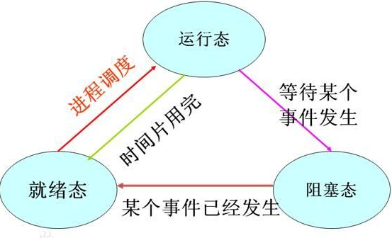
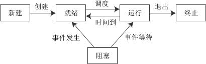
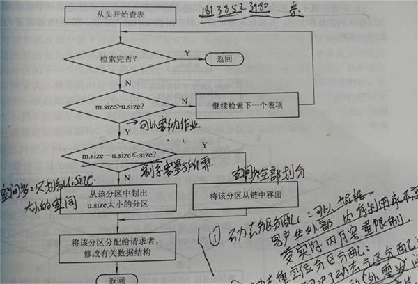

---

typora-copy-images-to: ../img
typora-root-url: ./
---

操作系统引论

操作系统目标

1：方面性，2：有效性，3：可扩展性，4：开放性

 

操作系统基本特性

1：并发、2：共享、3：虚拟、4：异步

 

描述多道批处理、分时、实时操作系统的特点各是什么?

   批处理操作系统：多道性、无序性、调度性，系统利用率高、吞吐量大、平均周转时间长、但无交互能力。

   分时操作系统：有多路性、独立性、及时性和交互性。 有较好的人机交互的特性，并且可以实现共享主机

   实时系统：有多路性、独立性、及时性、交互性和可靠性。实际上是指操作系统工作时，其各种资源可以根据需要随时进行动态分配。由于各种资源可以进行动态分配，因此，其处理事务的能力较强、速度较快。

　 总结：从可靠性：实时系统更强，从交互性：分时系统更强

 

二、进程的描述与控制 

程序并发执行的特征

1：间断性：程序在并发执行的时候，因为是共享资源，以及完成同一项任务而相互合作，致使在这些并发执行的程序之间形成了相互制约的关系，导致程序执行呈现：执行--暂停--执行

2：失去封闭性：当系统中有多个并发执行的程序时，各个资源是他们所共享的，这些资源的状态也由这些程序所改变，所以摸一个程序的运行环境会受到其他程序的影响。

3：不可再生性

 

进程的特征与三种基本状态

1、特征：

​    1：动态性，2：并发性，3：独立性，4：异步性。

2、状态：

​    1：就绪状态，2：执行状态，3：阻塞状态

3、三种基本状态转换：

​    处于就绪状态的进程，在调度程序为之分配了处理机之后便开始执行， 就绪 -> 执行

​    正在执行的进程如果因为分配他的时间片已经用完，而被剥夺处理剂， 执行 -> 就绪

​    如果因为某种原因致使当前的进程执行受阻，使之不能执行。               执行 -> 阻塞

 

 

4、创建状态和终止状态图

 

进程控制块PCB的作用

　　1：作为独立运行基本单位的标志

　　2：能实现间断性运行方式

　　3：提供进程通信管理所需要的信息

　　4：提供进程调度所需要的信息

 

线程与进程的区别联系

　　1、定义：

　　　　进程：进程是具有一定独立功能的程序关于某个数据集合上的一次运行活动，是系统进行资源分配和调度的一个独立单位。（包括程序段，相关数据段，和进程控制块PCB）

​    　　线程：线程是进程的一个实体，是CPU调度和分派的基本单位，它是比进程更小的能独立运行的基本单位。线程自己基本上不拥有系统资源,只拥有一点在运行中必不可少的资源(如程序计数器,一组寄存器和栈),但是它可与同属一个进程的其他的线程共享进程所拥有的全部资源.

 

2、关系：一个线程可以创建和撤销另一个线程;同一个进程中的多个线程之间可以并发执行.相对进程而言，线程是一个更加接近于执行体的概念，它可以与同进程中的其他线程共享数据，但拥有自己的栈空间，拥有独立的执行序列。

　　3、区别：主要差别在于它们是不同的操作系统资源管理方式。进程有独立的地址空间，一个进程崩溃后，在保护模式下不会对其它进程产生影响，而线程只是一个进程中的不同执行路径。线程有自己的堆栈和局部变量，但线程之间没有单独的地址空间，一个线程死掉就等于整个进程死掉，所以多进程的程序要比多线程的程序健壮，但在进程切换时，耗费资源较大，效率要差一些。但对于一些要求同时进行并且又要共享某些变量的并发操作，只能用线程，不能用进程。

　　4.优缺点

：线程和进程在使用上各有优缺点：线程执行开销小，但不利于资源的管理和保护；而进程正相反。同时，线程适合于在SMP机器上运行，而进程则可以跨机器迁移。

 

进程间的通信是如何实现的？

　　早期的属于低级通信：原因：1：效率低，生产者每次只能向缓冲池投放一个信息  2：通信对用户不透明，隐藏了通信的具体细节。现在发展为高级通信：用户可以利用操作系统所提供的一组通信命令传送大量数据。操作系统隐藏了进程通信的实现细节。或者说，通信过程对用户是透明的。

高级通信机制：

1：共享存储器系统（存储器中划分的共享存储区）

　　实际操作中对应的是“剪贴板”（剪贴板实际上是系统维护管理的一块内存区域）的通信方式。

2：消息传递系统（进程间的数据交换以消息（message）为单位）

　　当今最流行的微内核操作系统中，微内核与服务器之间的通信，都采用 了消息传递机制

3：管道通信系统（连接读写进程实现他们之间通信的共享文件（pipe文件，类似先进先出的队列，由一个进程写，另一进程读））

　　管道分为匿名管道、命名管道。匿名管道是未命名的、单向管道，通过父进程和一个子进程之间传输数据。匿名管道只能实现本地机器上两个进程之间的通信，不能实现跨网络的通信。命名管道不仅可以在本机上实现两个进程间的通信，还可以跨网络实现进程间的通信。

 

4：客户机-服务器系统

​    包括：套接字（socket），远程过程调用和远程方法调用

 

什么是临界区？如何解决冲突？

　　每个进程中访问临界资源的那段程序称为临界区，每次只准许一个进程进入临界区，进入后不允许其他进程进入。

　　1：如果有若干进程要求进入空闲的临界区，一次仅允许一个进程进入；

　　2：任何时候，处于临界区内的进程不可多于一个。如已有进程进入自己的临界区，则其它所有试图进入临界区的进程必须等待；

　　3：进入临界区的进程要在有限时间内退出，以便其它进程能及时进入自己的临界区；

　　4：如果进程不能进入自己的临界区，则应让出CPU，避免进程出现“忙等”现象。

进程同步原则

　　进程同步的主要任务：是对多个相关进程在执行次序上进行协调，以使并发执行的诸进程之间能有效地共享资源和相互合作，从而使程序的执行具有可再现性。同步机制遵循的原则：

　　1：空闲让进；

　　2：忙则等待（保证对临界区的互斥访问）；

　　3：有限等待（有限代表有限的时间，避免死等）；

　　4：让权等待，（当进程不能进入自己的临界区时，应该释放处理机，以免陷入忙等状态）。

 

进程同步

　　由于进程同步产生了一系列经典的同步问题“生产者-消费者”问题，“哲学家进餐”问题，“读者-写者”问题。

 

程序和进程的区别

　　程序：计算机指令的集合，它以文件的形式存储在磁盘上。程序是静态实体（passive Entity），在多道程序系统中，它是不能独立运行的，更不能与其他程序并发执行。

使用系统资源情况：不使用（程序不能申请系统资源，不能被系统调度，也不能作为独立运行的单位，它不占用系统的运行资源）。

　　进程：进程是进程实体（包括：程序段、相关的数据段、进程控制块PCB）的运行过程，是一个程序在其自身的地址空间中的一次执行活动。是系统进行资源分配和调度的一个独立单位。

使用系统资源情况：使用（进程是资源申请、调度和独立运行的单位，因此，它使用系统中的运行资源）

 

三、处理机调度与死锁

处理机调度的层次：

　　1：高级调度

​        主要用于多道批处理系统中，又称长作业调度，调度队像是作业，根据某种算法决定将后备队列中的哪几个作业调入内存。

　　2：低级调度

​        操作系统中最基本的一种调度方式（频率最高），在多道批处理、分时和时实三中类型的OS中都存在，又称为短作业调度。

　　3：中级调度

​        又称为内存调度，目的是为了提高内存的利用率和系统的吞吐率，

 

作业调度的算法：

　　1：先来先服务算法（FSFS）

​    　　最简单的调度算法，既可用于作业调度也可用于进程调度，系统按照作业到达的先后顺序进行调度，或者是优先考虑在系统中等待时间最长的作业

　　2：短作业优先调度算法（SJF）

​    　　实际情况短作业占有比例很大，为了使他们比长作业优先执行，而产生了短作业优先的调度算法 ，作业越短优先级越高，

​    　　缺点：是必须知道作业的运行时间，对长作业不利，人机无法实现交互，未完全考虑作业的紧迫程度

 

　　3：优先级调度算法（PSA）

　　　　优先级：对于先来先服务算法，作业的等待时间就是他的优先级，等待时间越长优先级越高，对于短作业优先级作业的长短就是他的优先级。在优先级算法中，基于作业的紧迫程度。

　　4：高响应比优先调度算法（HRRN）

　　　　在FSFS中只是考虑作业的等待时间而忽略作业的运行时间，SJF算法正好相反，高响应比算法既考虑作业的等待时间有考虑作业的运行时间，

　　　　优先权 =  （等待时间+要求服务时间）/要求服务时间

　　　　由于等待时间与服务时间之和就是作业的相应时间，顾优先级相当于响应比：Rp

　　　　Rp = （等待时间+要求服务时间）/要求服务时间 = 响应时间/要求服务时间

 

什么是死锁，死锁产生的4个条件

　　死锁定义：

　　　　在两个或多个并发进程中，如果每个进程持有某种资源而又都等待别的进程释放它或它们现在保持着的资源，在未改变这种状态之前都不能向前推进，称这一组进程产生了死锁。通俗地讲，就是两个或多个进程被无限期地阻塞、相互等待的一种状态。

　　产生条件：

　　　　1：互斥条件        -- 一个资源一次只能被一个进程使用

　　　　2：请求保持条件 -- 一个进程因请求资源而阻塞时，对已经获得资源保持不放 

　　　　3：不可抢占条件 -- 进程已获得的资源在未使用完之前不能强行剥夺

　　　　4：循环等待条件 -- 若干进程之间形成一种头尾相接的循环等待资源的关系

 

预防避免死锁的方法

1：破坏“请求和保持”条件：规定所有进程在开始运行之前，都必须一次性的申请其在整个运行过程所需要的全部资源。

​     　　优点：简单，安全。  缺点：资源严重浪费，恶化了系统的利用率；

　　2：破坏“不剥夺”条件：进程逐个的提出资源请求，当一个已经保持了某些资源的进程，再提出新的资源请求而不能立即得到满足时，必须释放它已经保持了的所有资源，待以后需要时再重新申请。

　　　　缺点：实现复杂，代价大，反复地申请和释放资源，而使进程的执行无限的推迟、延长了进程的周转时间增加系统开销、降低系统吞吐量。

　　3：破坏“环路等待”条件：将所有的资源按类型进行线性排队，并赋予不同的序号。所有进程请求资源必须按照资源递增的次序提出，防止出现环路。

　　　　缺点：1、序号必须相对稳定，限制了新设备类型的增加2、作业（进程）使用资源顺序和系统规定的顺序不同而造成资源的浪费3、限制了用户编程

　　注意：由于互斥条件是非共享设备所必需的，不能改变

 

四、存储器管理    

连续分配存储管理方式

1：单一连续分配

　　2：固定分区分配

　　3：动态分区分配

​     　　其中动态分区分配将涉及到分区分配中实际需要的数据结构，分区分配算法和分区的分配与回收操作

　　内存分配的流程：

 

 

动态分区分配算法

　　1：首次适应算法（FF）：    

​        要求地址空间递增的顺序链接，再分配内存时从链首开始查找，知道有一个满足的空间为止。该算法优先利用内存中低址空间，保留了高址空间，缺点是低址部分不断被划分，留下许多内存碎片，

　　2：循环首次适应算法(NF)：

​        为了防止留下碎片，减少低址空间开销，NF算法每次从上一次分配的地方继续分配，该算法需要一个起始查询的指针用于指示下一次查询的空间地址。缺点是：缺乏大的空间分区

　　3：最加适应算法（BF）：

​        每次作业分配时，总是把满足要求，又是最小的空间分配给作业，该算法把空间分区按其容量大小从小到大排列成空闲区链，缺点是：留下许多内存碎片，

　　4：最坏适应算法（WF）：

​        总是挑选最大的空闲区域分配给作业使用，优点是不至于使空闲区间太小，产生碎片的可能性小，缺点是：缺乏大的空间分区

分页存储管理方式

​    分页存储的基本方法：

​        1：页面和物理快   页面：分页存储管理将进程的逻辑地址空间分成若干页，并从0开始编号，把内存的物理地址分成若干块（物理快）

​        2：地址结构：   页号P ----- 偏移量W（包括页号P和偏移量W），对于特定的机器其地址结构一定，给定逻辑地址A，页面的大小为

​                                   L，则页号P和页内地址D有一下关系：P = int[A/L]; d=[A] MOD L  例如：页面大小1kb A=2170B 得：p=2 d=122

​        3：页表：记录相应页在内存中对应的物理块号

​        4：地址转换机构：将用户逻辑空间的地址，转变为空间中的物理地址

 

分段存储管理方式

​        分段是管理不会产生内存碎片（短号 ， 段内地址）

​        分段管理方式的引入原因：

​        1：一般程序分为若干段，如：主程序段、数据段、栈段等，每个段大多是一个相对独立的单位

​        2：实现满足信息共享、信息保护、动态链接、以及信息动态增长等需要

 

分页和分段的区别：

　　共同点：两者都采用离散分配方式，且都地址映射机构来实现地址的转换    

　　不同点：

​        1：页是信息的物理单位采用分页存储管理方式是为了实现离散分配方法。提高内存的利用率，采用分段目的主要在于能更好的满足用户的需求

​        2：页的大小固定且有系统决定，在采用分页存储管理方式中直接由硬件实现。而段的大小不固定，决定于用户所编写的程序

​        3：分页的地址空间是一维的，分页完全是系统完全是行为，分段系统中是二维的。

 

段页式存储管理方式

 　　基本原理是分段和分页相结合，其地址结构由：段号、段内页号、页内地址三部分组成。在段页式系统中获得一条指令需要三次访问内存，第一次访问内存中的段表，第二次访问内存中的页表，第三次访问内存中的数据。

 

Windows下的内存是如何管理的？

　Windows提供了3种方法来进行内存管理：

​    1：虚拟内存，最适合用来管理大型对象或者结构数组；

​    2：内存映射文件，最适合用来管理大型数据流（通常来自文件）以及在单个计算机上运行多个进程之间共享数据；

​    3：内存堆栈，最适合用来管理大量的小对象。

　Windows操纵内存可以分两个层面：物理内存和虚拟内存。

　其中物理内存由系统管理，不允许应用程序直接访问

五、虚拟存储器 

操作系统的内容分为几块？什么叫做虚拟内存？他和主存的关系如何？内存管理属于操作系统的内容吗？

​    操作系统的主要组成部分：进程和线程的管理，存储管理，设备管理，文件管理。虚拟内存是一些系统页文件，存放在磁盘上，每个系统页文件大小为4K，物 理内存也被分页，每个页大小也为4K，这样虚拟页文件和物理内存页就可以对应，实际上虚拟内存就是用于物理内存的临时存放的磁盘空间。页文件就是内存页， 物理内存中每页叫物理页，磁盘上的页文件叫虚拟页，物理页+虚拟页就是系统所有使用的页文件的总和。

 

请求分页存储管理方式   

请求页表机制：作用是吧用户的逻辑地址映射为内存空间中的物理地址。

结构

| 页号 | 物理块号 | 状态位P | 访问字段A | 修改位M | 外存地址 |
| ---- | -------- | ------- | --------- | ------- | -------- |
|      |          |         |           |         |          |

 

1：状态位P：指示页面是否调入内存，供程序访问时参考

2：访问字段A：用于记录本也在一段时间内被访问的次数，供换出页面时参考

3：修改位M：标识页面调入内存是否被修改过，供置换页面时参考

4：外存地址：用于指示该页在外存上指示地址

内存分配：

​    最小物理块数：若采用单地址指令，且采用直接寻址，需要物理块数是2，一块用于存放指令页面，另一块用于存放数据页面

​                            若采用间接寻址至少需要3块

 

虚拟存储器页面置换算法

1：最佳置换算法（Optimal）：一种理论的算法，选着淘汰的页面是以后一定不再使用的页面（理想化的），该算法无法实现，只能作为其他算法好坏的一个评价对比。

2：先进先出（FIFO）算法：总是最先淘汰最先进去的页面，该算法容易实现。缺点：通常程序调入内存的先后顺序和程序执行的先后顺序不一致，导致缺页率高。

3：最近最久未使用（LEU）：FIFO算法性能差，LRU算法根据页面调入内存的先后孙旭决定，因为违法预测未来的使用情况，就是用过去的使用情况作为将来的使用情况的近似。

4：最少使用算法（LFU）：在每个页面设置一个移位寄存器记录该页面的访问频率，最近时期最少使用的页面被淘汰

 

六、输入输出系统

　IO软件的层次结构

　　1：用户层IO软件，2：设备独立性软件，3：设备驱动程序，4：中断处理程序

　

　对IO设备的控制方式

　　1：使用轮询的可编程方式

　　　　cpu不停地检查设备的状态，以字节为单位，非中断方式，利用率低

　　2：使用中断可编程的Io方式

　　　　添加CPU中断，提高了CPU的利用率

　　3：直接存储方式

　　　　以数据块为单位，放宽响应时间

　　4：IO通道的方式

　　　　以数据块组成的一组数据块为单位，大幅度提高CPU的利用率

 

   设备分配1

　　1：设备分配中的数据结构

　　　　1：设备分配表DCT，2：控制器控制表，通道控制表，系统设备设备表

　　2：设备分配需要考虑的因素

　　　　1：设备的固有属性，2：独占设备得分配策略，3：设备的分配算法，4：设备分配中的安全性

　　3：独占设备的分配程序

 

　SpooLing系统的构成

　　1：输入井和输出井

　　2：输入缓冲区和输出缓冲区

　　3：输入进程和输出进程

　　4：井管理程序

   缓冲区

 　　1：单缓冲区，处理时间是：max(c,T)+M

　　 2：双缓冲区，处理时间是:max(C+T);

 

七、文件管理

 文件逻辑结构分类 

　　按文件的有无结构分：

　　　　1：有结构文件（记录式文件） 2：无结构文件（流式文件）

　　按文件组织方式分：

　　　　1：顺序文件，2：索引文件，3：索引顺序文件

八、磁盘存储器管理

外存的组织方式    

​     1：连续组织方式，

​            又称为连续分配方式，要求每一个文件分配一个相邻的盘快

​            优点：顺序访问容易：访问连续文件非常容易，访问速度非常快

​            缺点：要求为文件分配连续的空间，必须事先知道文件的长度，不能灵活的删除插入记录动态增长的文件难分配空间

​    2：链接组织方式（分为隐式链接和显示链接）

​           采用链接组织的方式可以为文件分配多个不连续的盘快

　　　 优点：1：消除磁盘的外部碎片，提高内存的利用率 。2：对插入删除修改非常容易。3：可以适应文件的动态增长

​    3：索引组织方式

　　　分为单索引和多索引组织方式。