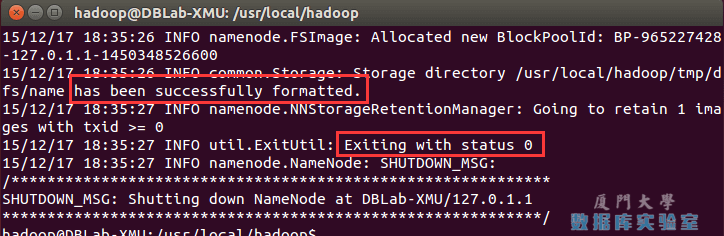
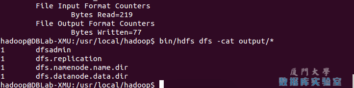
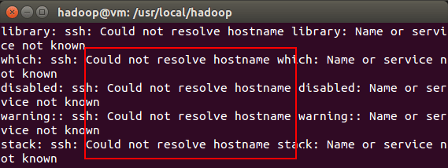

参考教程：厦门大学数据库实验室 http://dblab.xmu.edu.cn/blog/1689-2/ （基本是搬过来的）

环境： ubuntu18 

## 1. 添加新用户

1. ### 创建新的用户

   > 1. sudo useradd -m hadoop -s /bin/bash
   > 2. sudo passwd hadoop #change the passwords

2. ### 给用户添加权限

   > sudo vim  /etc/sudoers.d/hadoop
   >
   > #file context
   >
   > hadoop ALL=(ALL) ALL

3. ### 安装ssh

   > sudo apt-get install openssh-server

4. ### 配置远程登录

   > #input pwd 
   >
   > ssh localhost
   >
   > // rsa authorized load
   >
   > cd ~/.ssh/                     # 若没有该目录，请先执行一次ssh localhost
   > ssh-keygen -t rsa              # 会有提示，都按回车就可以
   > cat ./id_rsa.pub >> ./authorized_keys

## 2. 安装 JAVA

> 1. sudo apt-get install openjdk-8-jre openjdk-8-jdk
>
>    // find the path of java home
>
> 2. dpkg -L openjdk-8-jdk | grep '/bin'
>
>    locate java | grep "/bin/java"
>
>    // export the path to sys path
>
> 3. echo "export JAVA=/usr/lib/jvm/java-8-openjdk-amd64">> ~/.bashrc
>
>    //take effect immedidately
>
> 4. source ~/.bashrc

## 3. 安装Hadoop

> download from http://mirrors.cnnic.cn/apache/hadoop/common/
>
> install it into /usr/local
>
> sudo tar -zxf ~/下载/hadoop-2.9.1.tar.gz -C /usr/local    # 解压到/usr/local中
> cd /usr/local/
> sudo mv ./hadoop-2.1.0/ ./hadoop            # 将文件夹名改为hadoop
> sudo chown -R hadoop ./hadoop 
>
> // Verify installation results
>
> 1. cd /usr/local/hadoop
> 2. ./bin/hadoop version

### 3.1 执行样例 (单机模式)

​	在此我们选择运行 grep 例子，我们将 input 文件夹中的所有文件作为输入，筛选当中符合正则表达式 dfs[a-z.]+ 的单词并统计出现的次数，最后输出结果到 output 文件夹中。

​	**注意**，Hadoop 默认不会覆盖结果文件，因此再次运行上面实例会提示出错，需要先将 `./output` 删除。

> 1. cd /usr/local/hadoop
> 2. mkdir ./input
> 3. cp ./etc/hadoop/*.xml ./input   # 将配置文件作为输入文件
> 4. ./bin/hadoop jar ./share/hadoop/mapreduce/hadoop-mapreduce-examples-*.jar grep ./input ./output 'dfs[a-z.]+'
> 5. cat ./output/*   

### 3.2 Hadoop伪分布式配置

​	Hadoop 可以在单节点上以伪分布式的方式运行，Hadoop 进程以分离的 Java 进程来运行，节点既作为 NameNode 也作为 DataNode，同时，读取的是 HDFS 中的文件。

​	Hadoop 的配置文件位于 /usr/local/hadoop/etc/hadoop/ 中，伪分布式需要修改2个配置文件 core-site.xml 和 hdfs-site.xml 。Hadoop的配置文件是 xml 格式，每个配置以声明 property 的 name 和 value 的方式来实现。gedit ./etc/hadoop/core-site.xml

#### 3.2.1 修改配置文件 core-site.xml 

> <configuration>
>     <property>
>         <name>hadoop.tmp.dir</name>
>         <value>file:/usr/local/hadoop/tmp</value>
>         <description>Abase for other temporary directories.</description>
>     </property>
>     <property>
>         <name>fs.defaultFS</name>
>         <value>hdfs://localhost:9000</value>
>     </property>
> </configuration>

#### 3.2.2 修改配置文件 **hdfs-site.xml**

> <configuration>
>     <property>
>         <name>dfs.replication</name>
>         <value>1</value>
>     </property>
>     <property>
>         <name>dfs.namenode.name.dir</name>
>         <value>file:/usr/local/hadoop/tmp/dfs/name</value>
>     </property>
>     <property>
>         <name>dfs.datanode.data.dir</name>
>         <value>file:/usr/local/hadoop/tmp/dfs/data</value>
>     </property>
> </configuration>

#### 3.3.3 Hadoop配置文件说明

​	Hadoop 的运行方式是由配置文件决定的（运行 Hadoop 时会读取配置文件），因此如果需要从伪分布式模式切换回非分布式模式，需要删除 core-site.xml 中的配置项。

此外，伪分布式虽然只需要配置 fs.defaultFS 和 dfs.replication 就可以运行（官方教程如此），不过若没有配置 hadoop.tmp.dir 参数，则默认使用的临时目录为 /tmp/hadoo-hadoop，而这个目录在重启时有可能被系统清理掉，导致必须重新执行 format 才行。所以我们进行了设置，同时也指定 dfs.namenode.name.dir 和 dfs.datanode.data.dir，否则在接下来的步骤中可能会出错。

#### 3.3.4 NameNode 格式化

> ./bin/hdfs namenode -format

​	成功的话，会看到 “successfully formatted” 和 “Exitting with status 0” 的提示，若为 “Exitting with status 1” 则是出错。

​	如果在这一步时提示 **Error: JAVA_HOME is not set and could not be found.** 的错误，则说明之前设置 JAVA_HOME 环境变量那边就没设置好，请按教程先设置好 JAVA_HOME 变量，否则后面的过程都是进行不下去的。如果已经按照前面教程在.bashrc文件中设置了JAVA_HOME，还是出现 **Error: JAVA_HOME is not set and could not be found.** 的错误，那么，请到hadoop的安装目录修改配置文件“/usr/local/hadoop/etc/hadoop/hadoop-env.sh”，在里面找到“export JAVA_HOME=${JAVA_HOME}”这行，然后，把它修改成JAVA安装路径的具体地址，比如，“export JAVA_HOME=/usr/lib/jvm/default-java”，然后，再次启动Hadoop。

#### 3.3.5 开启 NameNode 和 DataNode 守护进程

> ./sbin/start-dfs.sh  #start-dfs.sh是个完整的可执行文件，中间没有空格

​	

* 启动完成后，可以通过命令 `jps` 来判断是否成功启动，若成功启动则会列出如下进程: “NameNode”、”DataNode” 和 “SecondaryNameNode”（如果 SecondaryNameNode 没有启动，请运行 sbin/stop-dfs.sh 关闭进程，然后再次尝试启动尝试）。如果没有 NameNode 或 DataNode ，那就是配置不成功，请仔细检查之前步骤，或通过查看启动日志排查原因。

* 成功启动后，可以访问 Web 界面 [http://localhost:50070](http://localhost:50070/) 查看 NameNode 和 Datanode 信息，还可以在线查看 HDFS 中的文件。

### 3.4 Hadoop伪分布式实例

​	首先，要使用 HDFS，首先需要在 HDFS 中创建用户目录：

> ./bin/hdfs dfs -mkdir -p /user/hadoop

​	然后，将 ./etc/hadoop 中的 xml 文件作为输入文件复制到分布式文件系统中，即将 /usr/local/hadoop/etc/hadoop 复制到分布式文件系统中的 /user/hadoop/input 中。我们使用的是 hadoop 用户，并且已创建相应的用户目录 /user/hadoop ，因此在命令中就可以使用相对路径如 input，其对应的绝对路径就是 /user/hadoop/input:

|          | 输入               | 容器                       |
| -------- | ------------------ | -------------------------- |
| 性质     | 磁盘文件           | 分布式文件系统             |
| 实例     | ./etc/hadoop/*.xml | input                      |
| 新建命令 | mkdir folder       | hadoop fs -mkdir -p folder |

>// create a new hdfs folder called input
>
>./bin/hdfs fs -mkdir input
>
>// move the disk data into the hdfs file-system
>
>./bin/hdfs fs -put ./etc/hadoop/*.xml input
>
>// list the files in hdfs
>
>./bin/hdfs dfs -ls input

​	最后，伪分布式运行 MapReduce 作业的方式跟单机模式相同，区别在于伪分布式读取的是HDFS中的文件（可以将单机步骤中创建的本地 input 文件夹，输出结果 output 文件夹都删掉来验证这一点）。

> // run the example
>
> ./bin/hadoop jar ./share/hadoop/mapreduce/hadoop-mapreduce-examples-*.jar grep input output 'dfs[a-z.]+'
>
> // view the running results
>
> ./bin/hdfs dfs -cat output/*

我们也可以将运行结果取回到本地：

> rm -r ./output    # 先删除本地的 output 文件夹（如果存在）
>
> ./bin/hdfs dfs -get output ./output     # 将 HDFS 上的 output 文件夹拷贝到本机
>
> cat ./output/*

### 3.5 关闭hadoop

> ./sbin/stop-dfs.sh

## 4常见错误

1. 如果启动 Hadoop 时遇到输出非常多“ssh: Could not resolve hostname xxx”的异常情况，如下图所示：

   

   首先按键盘的 ctrl + c 中断启动，然后在 ~/.bashrc 中，增加如下两行内容（设置过程与 JAVA_HOME 变量一样，其中 HADOOP_HOME 为 Hadoop 的安装目录）：

   > export HADOOP_HOME=/usr/local/hadoop
   > export HADOOP_COMMON_LIB_NATIVE_DIR=$HADOOP_HOME/lib/native

2. Hadoop无法正常启动的解决方法

   一般可以查看启动日志来排查原因，注意几点：

   * 启动时会提示形如 “DBLab-XMU: starting namenode, logging to /usr/local/hadoop/logs/hadoop-hadoop-namenode-DBLab-XMU.out”，其中 DBLab-XMU 对应你的机器名，但其实启动日志信息是记录在 /usr/local/hadoop/logs/hadoop-hadoop-namenode-DBLab-XMU.log 中，所以应该查看这个后缀为 .log 的文件；

   * 每一次的启动日志都是追加在日志文件之后，所以得拉到最后面看，对比下记录的时间就知道了。

   * 一般出错的提示在最后面，通常是写着 Fatal、Error、Warning 或者 Java Exception 的地方。

   * 可以在网上搜索一下出错信息，看能否找到一些相关的解决方法。

   * 此外，若是 DataNode 没有启动，可尝试如下的方法（注意这会删除 HDFS 中原有的所有数据，如果原有的数据很重要请不要这样做）：

     > 针对 DataNode 没法启动的解决方法
     >
     > ./sbin/stop-dfs.sh   # 关闭
     >
     > rm -r ./tmp     # 删除 tmp 文件，注意这会删除 HDFS 中原有的所有数据
     >
     > ./bin/hdfs namenode -format   # 重新格式化 NameNode
     >
     > ./sbin/start-dfs.sh  # 重启
