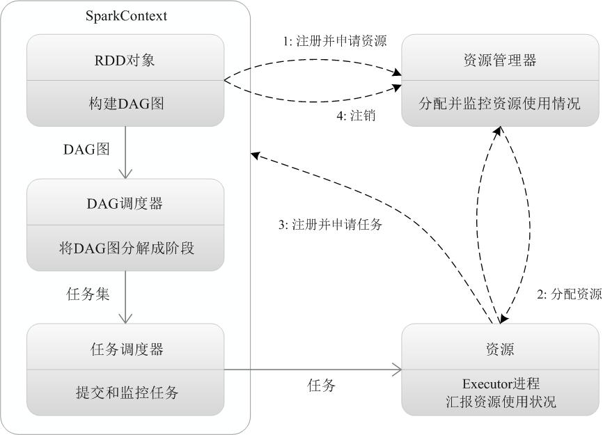

# 1. 基本概念

**RDD**：是弹性分布式数据集（Resilient Distributed Dataset）的简称，是分布式内存的一个抽象概念，提供了一种高度受限的共享内存模型；

**DAG**：是Directed Acyclic Graph（有向无环图）的简称，反映RDD之间的依赖关系；

**Executor**：是运行在工作节点（Worker Node）上的一个进程，负责运行任务，并为应用程序存储数据；

**应用**：用户编写的Spark应用程序；

**任务**：运行在Executor上的工作单元；

**作业**：一个作业包含多个RDD及作用于相应RDD上的各种操作；

**阶段**：是作业的基本调度单位，一个作业会分为多组任务，每组任务被称为“阶段”，或者也被称为“任务集”。

# 2. 构架设计

## 2.1  Spark运行架构包括:

* 集群资源管理器（Cluster Manager）可以是Spark自带的资源管理器，也可以是YARN或Mesos等资源管理框架。

* 运行作业任务的工作节点（Worker Node）

* 每个应用的任务控制节点（Driver）

* 每个工作节点上负责具体任务的执行进程（Executor）

  

## 2.2 相比Hadoop的两个优点：

* 一是利用多线程来执行具体的任务（Hadoop MapReduce采用的是进程模型），减少任务的启动开销
* 二是Executor中有一个BlockManager存储模块，会将内存和磁盘共同作为存储设备，当需要多轮迭代计算时，可以将中间结果存储到这个存储模块里，而不需要读写到HDFS等文件系统里，因而有效减少了IO开销；或者在交互式查询场景下，预先将表缓存到该存储系统上，从而可以提高读写IO性能。

## 2.3 一个应用的组成成分

* 在Spark中，一个应用（Application）包含：
  * 一个任务控制节点（Driver）
  * 若干个作业（Job）构成
  * 一个作业由多个阶段（Stage）构成
  * 一个阶段由多个任务（Task）组成。
* 当执行一个应用时，**任务控制节点**会向**集群管理器**（Cluster Manager）申请资源，启动Executor，**并向Executor发送应用程序代码和文件**，然后在Executor上执行任务，运行结束后，执行结果会返回给任务控制节点，或者写到HDFS或者其他数据库中。

# 3. Spark 运行基本流程

## 3.1 运行流程： 

### 3.1.1 为任务创建运行环境SparkContext

当一个Spark应用被提交时，首先需要为这个应用构建起基本的运行环境，即由任务控制节点（Driver）创建一个SparkContext，由SparkContext负责和资源管理器（Cluster Manager）的通信以及进行资源的申请、任务的分配和监控等。SparkContext会向资源管理器注册并申请运行Executor的资源； 

### 3.1.2 构建DAG图 

SparkContext根据RDD的依赖关系，DAG图提交给DAG调度器（DAGScheduler）进行解析，将DAG图分解成多个“阶段”（每个阶段都是一个任务集），并且计算出各个阶段之间的依赖关系，然后把一个个“任务集”提交给底层的任务调度器（TaskScheduler）进行处理；Executor向SparkContext申请任务，任务调度器将任务分发给Executor运行，同时，SparkContext将应用程序代码发放给Executor； 

### 3.1.3 资源管理器为Executor分配资源

并启动Executor进程，Executor运行情况将随着“心跳”发送到资源管理器上； （在上一步之前初始化）

### 3.1.3 Executor将结果给调度器 

任务在Executor上运行，把执行结果反馈给任务调度器，然后反馈给DAG调度器，运行完毕后写入数据并释放所有资源。

## 3.2 构架特点

### 3.2.1 Executor进程

每个应用都有自己专属的Executor进程，并且该进程在应用运行期间一直驻留。Executor进程以**多线程**的方式运行任务，减少了多进程任务频繁的启动开销，使得任务执行变得非常高效和可靠； 

### 3.2.2 Spark运行过程与资源管理器无关

只要能够获取Executor进程并保持通信即可；

### 3.2.3 BlockManager存储模块

Executor上有一个BlockManager存储模块，类似于**键值存储系统**（把内存和磁盘共同作为存储设备），在处理迭代计算任务时，不需要把中间结果写入到HDFS等文件系统，在交互式查询场景下，也可以把表提前缓存到这个存储系统上，提高读写IO性能；

### 3.2.4优化机制

* **数据本地性**数据本地性是尽量将计算移到数据所在的节点上进行，即“**计算向数据靠拢**”，因为移动计算比移动数据所占的网络资源要少得多。
* **延时调度机制**，可以在更大的程度上实现执行过程优化。比如，拥有数据的节点当前正被其他的任务占用，那么，在这种情况下是否需要将数据移动到其他的空闲节点呢？答案是不一定。因为，如果经过预测发现当前节点结束当前任务的时间要比移动数据的时间还要少，那么，调度就会等待，直到当前节点可用。