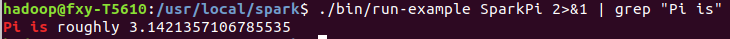

# 1. 安装Hadoop

[安装教程](Hadoop安装教程.md)

# 2. 配置Spark（单机模式）

> sudo tar -zxf ~/下载/spark-2.3.1-bin-without-hadoop.tgz -C /usr/local/
> cd /usr/local
> sudo mv ./spark-2.3.1-bin-without-hadoop/ ./spark
> sudo chown -R hadoop:hadoop ./spark          # 此处的 hadoop 为你的用户名

### 部署Spark的四种模式

1. Local模式（单机模式）
2. Standalone模式（使用Spark自带的简单集群管理器）、
3. YARN模式（使用YARN作为集群管理器）
4. Mesos模式（使用Mesos作为集群管理器）

# 3. 环境变量

## 3.1 系统环境变量

~/.bashrc

> export JAVA_HOME=/usr/lib/jvm/default-java
> export HADOOP_HOME=/usr/local/hadoop
> export SPARK_HOME=/usr/local/spark
> export PYTHONPATH=$SPARK_HOME/python:$SPARK_HOME/python/lib/py4j-0.10.4-src.zip:$PYTHONPATH
> export PYSPARK_PYTHON=python3
> export PATH=$HADOOP_HOME/bin:$SPARK_HOME/bin:$PATH

## 3.2 Spark 环境变量

[spark_home]/conf/spark-env.sh

> // copy from the template
>
> cp ./conf/spark-env.sh.template ./conf/spark-env.sh
>
> // add the path
>
> export SPARK_DIST_CLASSPATH=$(/usr/local/hadoop/bin/hadoop classpath)
>
> //spark单机配置出错，端口不能绑定
>
> export  SPARK_MASTER_IP=127.0.0.1
>
> export  SPARK_LOCAL_IP=127.0.0.1

source ~/.bashrc

# 4. 实例

通过运行Spark自带的示例，验证Spark是否安装成功。

>cd /usr/local/spark
>
>./bin/run-example SparkPi

执行时会输出非常多的运行信息，输出结果不容易找到，可以通过 grep 命令进行过滤（命令中的 2>&1 可以将所有的信息都输出到 stdout 中，否则由于输出日志的性质，还是会输出到屏幕中）:

> bin/run-example SparkPi 2>&1 | grep "Pi is"

# 5. 在pyspark中运行代码

pyspark提供了简单的方式来学习 API，并且提供了交互的方式来分析数据。你可以输入一条语句，pyspark会立即执行语句并返回结果，这就是我们所说的REPL（Read-Eval-Print Loop，交互式解释器）

如果没有设置PYSPARK_PYTHON环境变量，则使用如下命令启动pyspark

> PYSPARK_PYTHON=python3 ./bin/pyspark

## 5.1 命令及其常用参数

> ./bin/pyspark --master <master-url>

Spark的运行模式取决于传递给SparkContext的Master URL的值。Master URL可以是以下任一种形式： 

* local 使用一个Worker线程本地化运行SPARK(完全不并行) 
* local[*] 使用逻辑CPU个数数量的线程来本地化运行Spark 
* local[K] 使用K个Worker线程本地化运行Spark（理想情况下，K应该根据运行机器的CPU核数设定） 
* spark://HOST:PORT 连接到指定的Spark standalone master。默认端口是7077. 
* yarn-client 以客户端模式连接YARN集群。集群的位置可以在HADOOP_CONF_DIR 环境变量中找到。 
* yarn-cluster 以集群模式连接YARN集群。集群的位置可以在HADOOP_CONF_DIR 环境变量中找到。 
* mesos://HOST:PORT 连接到指定的Mesos集群。默认接口是5050。

## 5.1 本地模式命令主要参数

* –master：这个参数表示当前的pyspark要连接到哪个master
* local[*]，就是使用本地模式启动pyspark，其中，中括号内的星号表示需要使用几个CPU核心(core)
* –jars： 这个参数用于把相关的JAR包添加到CLASSPATH中；如果有多个jar包，可以使用逗号分隔符连接它们；

系统默认是“bin/pyspark–master local[*]”，也就是说，是采用本地模式运行，并且使用本地所有的CPU核心。

## 5.2 独立应用编程

在进行Python编程前，请先确定是否已经.bashrc中添加PYTHONPATH环境变量。

在test.py中添加如下代码：

> from pyspark import SparkContext
> sc = SparkContext( 'local', 'test')
> logFile = "file:///usr/local/spark/README.md"
> logData = sc.textFile(logFile, 2).cache()
> numAs = logData.filter(lambda line: 'a' in line).count()
> numBs = logData.filter(lambda line: 'b' in line).count()
> print('Lines with a: %s, Lines with b: %s' % (numAs, numBs))

