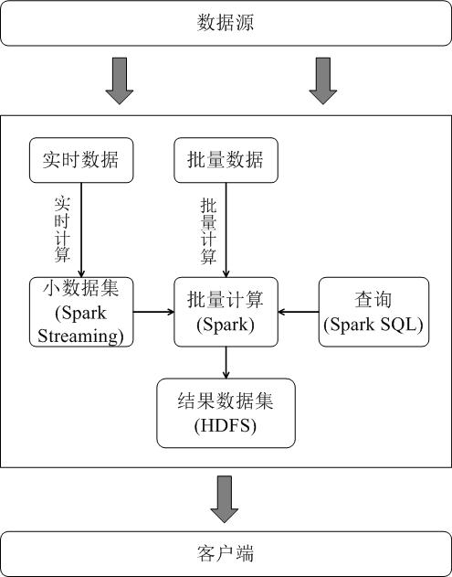
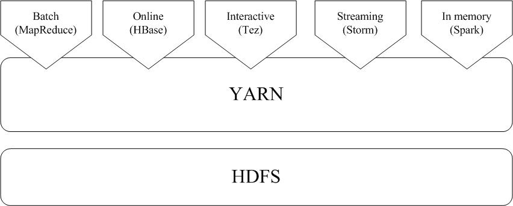

原网址：http://dblab.xmu.edu.cn/blog/1713-2/

作者：[阮榕城](http://dblab.xmu.edu.cn/blog/author/ruanrongcheng/)

联系方式：[www.nekomiao.me](http://www.nekomiao.me/) | moc.qq@crnaur

# 1. Spark三种部署方式

Spark应用程序在集群上部署运行时，可以由不同的组件为其提供资源管理调度服务（资源包括CPU、内存等）。比如，可以使用自带的独立集群管理器（standalone），或者使用YARN，也可以使用Mesos。因此，Spark包括三种不同类型的集群部署方式，包括standalone、Spark on Mesos和Spark on YARN。

### 1. standalong 模式

* Spark与MapReduce1.0完全一致，都是由一个Master和若干个Slave构成，并且以槽（slot）作为资源分配单位
* 不同的是，Spark中的槽不再像MapReduce1.0那样分为Map 槽和Reduce槽，而是只设计了统一的一种槽提供给各种任务来使用。

### 2. Spark on Mesos 模式

* Mesos是一种资源调度管理框架，可以为运行在它上面的Spark提供服务。Spark on Mesos模式中，Spark程序所需要的各种资源，都由Mesos负责调度。
* 相对YARN而言，Spark运行在Mesos上更加灵活、自然。目前，Spark官方推荐采用这种模式

### 3. Spark on YARN 

Spark可运行于YARN之上，与Hadoop进行统一部署，即“Spark on YARN”，其架构如图9-13所示，资源管理和调度依赖YARN，分布式存储则依赖HDFS。

# 2. 从“Hadoop+Storm”转向Spark

## 2. Hadoop + Storm 构架

为了能同时进行批处理与流处理，企业应用中通常会采用“Hadoop+Storm”的架构（也称为Lambda架构）

但是，上面这种架构部署较为繁琐。

由于Spark同时支持批处理与流处理，因此，对于一些类型的企业应用而言，从“Hadoop+Storm”架构转向Spark架构（如图9-15所示）就成为一种很自然的选择。

采用Spark架构具有如下优点： 

* 实现一键式安装和配置、线程级别的任务监控和告警； 
* 降低硬件集群、软件维护、任务监控和应用开发的难度； 
* 便于做成统一的硬件、计算平台资源池。

需要说明的是，Spark Streaming的原理是将流数据分解成一系列短小的批处理作业，每个短小的批处理作业使用面向批处理的Spark Core进行处理，通过这种方式变相实现流计算，而不是真正实时的流计算，因而通常无法实现毫秒级的响应。因此，对于需要毫秒级实时响应的企业应用而言，仍然需要采用流计算框架（如Storm）。

 

## 3. Hadoop和Spark的统一部署

Spark无法代替Hadoop生态系统中的一些组件所实现的功能，比如，Storm可以实现毫秒级响应的流计算，

因此，在许多企业实际应用中，Hadoop和Spark的统一部署是一种比较现实合理的选择。 

由于Hadoop MapReduce、HBase、Storm和Spark等，都可以运行在资源管理框架YARN之上，

这些不同的计算框架统一运行在YARN中，可以带来如下好处： 

* 计算资源按需伸缩； 
* 不用负载应用混搭，集群利用率高； 
* 共享底层存储，避免数据跨集群迁移。

