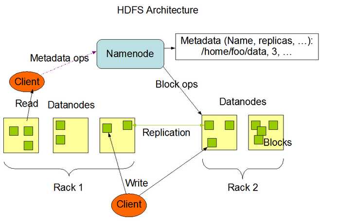
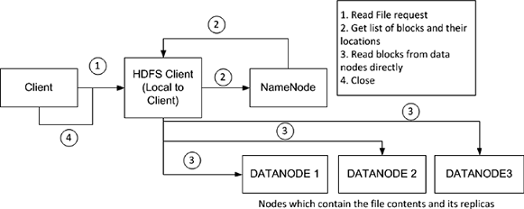

搬运： https://blog.csdn.net/suifeng3051/article/details/48548341

作者：Heaven-Wang

# 1. 设计前提和目标

1. **专为存储超大文件而设计**：hdfs应该能够支持GB级别大小的文件；它应该能够提供很大的数据带宽并且能够在集群中拓展到成百上千个节点；它的一个实例应该能够支持千万数量级别的文件。
2. **适用于流式的数据访问**：hdfs适用于批处理的情况而不是交互式处理；它的重点是保证高吞吐量而不是低延迟的用户响应
3. **容错性**：完善的冗余备份机制
4. **支持简单的一致性模型**：HDFS需要支持一次写入多次读取的模型，而且写入过程文件不会经常变化
5. **移动计算优于移动数据**：HDFS提供了使应用计算移动到离它最近数据位置的接口
6. **兼容各种硬件和软件平台**

# 2. 不适合的场景

1. 大量   小文件：文件的元数据都存储在NameNode内存中，大量小文件会占用大量内存。
2. 低延迟数据访问：hdfs是专门针对高数据吞吐量而设计的
3. 多用户写入，任意修改文件

# 3. hdfs架构设计

HDFS主要由3个组件构成，分别是**NameNode**、**SecondaryNameNode**和**DataNode**，HSFS是以master/slave模式运行的，其中NameNode、SecondaryNameNode 运行在master节点，DataNode运行slave节点。

## 3.1 数据块

### 3.1.1 定义（基本数据单元）

磁盘数据块是磁盘读写的基本单位，与普通文件系统类似，hdfs也会把文件分块来存储。hdfs默认数据块大小为64MB，磁盘块一般为512B，hdfs块为何如此之大呢？块增大可以减少寻址时间与文件传输时间的比例.

### 3.1.2 备份

​	数据块是存储在DataNode中的，为了能够容错数据块是以多个副本的形式分布在集群中的，副本数量默认为3，后面会专门介绍数据块的复制机制。\

### 3.1.3 按块存储的优势

1. 文件可以任意大，也不用担心单个结点磁盘容量小于文件的情况
2. 简化了文件子系统的设计，子系统只存储文件块数据，而文件元数据则交由其它系统（NameNode）管理
3. 有利于备份和提高系统可用性，因为可以以块为单位进行备份，hdfs默认备份数量为3。
4. 有利于负载均衡

## 3.2 NameNode

### 3.2.1 定义

​	当一个客户端请求一个文件或者存储一个文件时，它需要先知道具体到哪个DataNode上存取

​	NameNode管理着文件系统命名空间，它维护这文件系统树及树中的所有文件和目录。NameNode也负责维护所有这些文件或目录的打开、关闭、移动、重命名等操作。对于实际文件数据的保存与操作，都是由DataNode负责。当一个客户端请求数据时，它仅仅是从NameNode中获取文件的元信息，而具体的数据传输不需要经过NameNode，是由客户端直接与相应的DataNode进行交互。

### 3.2.2 NameNode结构

NameNode保存元信息的种类有：

- 文件名目录名及它们之间的层级关系
- 文件目录的所有者及其权限
- 每个文件块的名及文件有哪些块组成

**注意事项**

1. NameNode元信息**不包含**每个块的位置信息，这些信息会在NameNode启动时从各个DataNode获取并保存在内存中，因为这些信息会在系统启动时由数据节点重建。
2. 把块位置信息放在内存中，在读取数据时会减少查询时间，增加读取效率。
3. NameNode也会实时通过心跳机制和DataNode进行交互，实时检查文件系统是否运行正常。
4. 一般来说，一条元信息记录会占用200byte内存空间。假设块大小为64MB，备份数量是3 ，那么一个1GB大小的文件将占用16*3=48个文件块。如果现在有1000个1MB大小的文件，则会占用1000*3=3000个文件块（多个文件不能放到一个块中）。我们可以发现，如果文件越小，存储同等大小文件所需要的元信息就越多，所以，Hadoop更喜欢大文件。

## 3.3 元信息持久化和节点冗余

### 3.3.2 元信息持久化

在NameNode中存放元信息的文件是 fsimage。（不执行操作）

对元信息的操作都保存在内存中并被持久化到另一个文件edits中。

并且edits文件和fsimage文件会被SecondaryNameNode周期性的合并

### 3.3.3  NameNode冗余

为了简化系统的设计，Hadoop只有一个NameNode，

这也就导致了hadoop集群的单点故障问题。

NameNode节点的两种容错机制：

1. **远程实时同步**将hadoop元数据写入到本地文件系统的同时再实时同步到一个远程挂载的网络文件系统（NFS）。
2. **守护定期镜像**运行一个secondary NameNode，它的作用是与NameNode进行交互，定期通过编辑日志文件合并命名空间镜像，当NameNode发生故障时它会通过自己合并的命名空间镜像副本来恢复。需要注意的是secondaryNameNode保存的状态总是滞后于NameNode，所以这种方式难免会导致丢失部分数据（后面会详细介绍）。

## 3.4 DataNode

* DataNode是hdfs中的**worker节点**

* 它负责存储数据块，也负责为系统客户端提供**数据块的读写服务**，根据NameNode的指示来进行创建、删除、和复制等操作。

* 通过**心跳**定期向NameNode发送所存储文件块列表信息。

* 当对hdfs文件系统进行读写时，**NameNode告知客户端**每个数据驻留在哪个DataNode，**客户端直接与DataNode进行通信**

* DataNode还会**与其它DataNode通信**，复制这些块以实现**冗余**。

  

  

## 3.5. SecondaryNameNode

SecondaryNameNode的角色就是定期的合并edits和fsimage文件

#### 文件功能

- fsimage ：保存的是上个检查点的HDFS的元信息
- edits ：保存的是从上个检查点开始发生的HDFS元信息状态改变信息
- fstime：保存了最后一个检查点的时间戳

#### 合并的步骤：

1. 合并之前告知NameNode把所有的操作写到新的edites文件并将其命名为edits.new。
2. SecondaryNameNode从NameNode请求fsimage和edits文件
3. SecondaryNameNode把fsimage和edits文件合并成新的fsimage文件
4. NameNode从SecondaryNameNode获取合并好的新的fsimage并将旧的替换掉，并把edits用第一步创建的edits.new文件替换掉
5. 更新fstime文件中的检查点

# 4. hdfs 文件读取

​	hdfs会返回一个FSDataInputStream对象，FSDataInputStream类转而封装成DFSDataInputStream对象,这个对象管理着与DataNode和NameNode的I/O，具体过程是：

1. 客户端发起读请求 
2. 客户端与NameNode得到文件的块及位置信息列表 
3. 客户端直接和DataNode交互读取数据 
4. 读取完成关闭连接

​	当FSDataInputStream与DataNode通信时遇到错误，它会选取另一个较近的DataNode，并为出故障的DataNode做标记以免重复向其读取数据。FSDataInputStream还会对读取的数据块进行校验和确认，发现块损坏时也会重新读取并通知NameNode。

1. 让客户端直接联系DataNode检索数据，可以使hdfs扩展到大量的并发客户端，因为数据流就是分散在集群的每个节点上的，在运行MapReduce任务时，每个客户端就是一个DataNode节点。
2. NameNode仅需相应块的位置信息请求（位置信息在内存中，速度极快），否则随着客户端的增加，NameNode会很快成为瓶颈。

# 5. 关于hadoop与网络拓扑

在海量数据处理过程中，主要限制因素是节点之间的带宽。衡量两个节点之间的带宽往往很难实现，在这里hadoop采取了一个简单的方法，它把网络拓扑看成是一棵树，连个节点的距离=它们到最近共同祖先距离的总和，而树的层次可以这么划分：

- 同一节点中的进程
- 同一机架上的不同节点
- 同一数据中心不同机架
- 不同数据中心的节点

若数据中心d1中一个机架r1中一个节点n1表示为d1/r1/n1,则：

>  distance(d1/r1/n1,d1/r1/n1)=0;
>  distance(d1/r1/n1,d1/r1/n2)=2;
>  distance(d1/r1/n1,d1/r2/n3)=4;
>  distance(d1/r1/n1,d2/r3/n4)=6;

# 6. hdfs 文件修改

## 6.1 文件写入

同读文件过程一样，FSDataOutputStream类转而封装成DFSDataOutputStream对象,这个对象管理着与DataNode和NameNode的I/O，具体过程是：

1. 客户端在向NameNode请求之前先写入文件数据到本地文件系统的一个临时文件 
2. 待临时文件达到块大小时开始向NameNode请求DataNode信息 
3. NameNode在文件系统中创建文件并返回给客户端一个数据块及其对应DataNode的地址列表（列表中包含副本存放的地址）
4. 客户端通过上一步得到的信息把创建临时文件块flush到列表中的第一个DataNode 
5. 当文件关闭，NameNode会提交这次文件创建，此时，文件在文件系统中可见

## 6.2 文件存入DataNode

1. 首先，第一个DataNode是以数据包(数据包一般4KB)的形式从客户端接收数据的，DataNode在把数据包写入到本地磁盘的同时会向第二个DataNode（作为副本节点）传送数据。 
2. 在第二个DataNode把接收到的数据包写入本地磁盘时会向第三个DataNode发送数据包 
3. 第三个DataNode开始向本地磁盘写入数据包。此时，数据包以流水线的形式被写入和备份到所有DataNode节点 
4. 传送管道中的每个DataNode节点在收到数据后都会向前面那个DataNode发送一个ACK,最终，第一个DataNode会向客户端发回一个ACK 
5. 当客户端收到数据块的确认之后，数据块被认为已经持久化到所有节点。然后，客户端会向NameNode发送一个确认 
6. 如果管道中的任何一个DataNode失败，管道会被关闭。数据将会继续写到剩余的DataNode中。同时NameNode会被告知待备份状态，NameNode会继续备份数据到新的可用的节点 
7. 数据块都会通过计算校验和来检测数据的完整性，校验和以隐藏文件的形式被单独存放在hdfs中，供读取时进行完整性校验

## 6.3 hdfs文件删除过程

1. 一开始删除文件，NameNode只是重命名被删除的文件到/trash目录，因为重命名操作只是元信息的变动，所以整个过程非常快。在/trash中文件会被保留一定间隔的时间（可配置，默认是6小时），在这期间，文件可以很容易的恢复，恢复只需要将文件从/trash移出即可。 
2. 当指定的时间到达，NameNode将会把文件从命名空间中删除 
3. 标记删除的文件块释放空间，HDFS文件系统显示空间增加