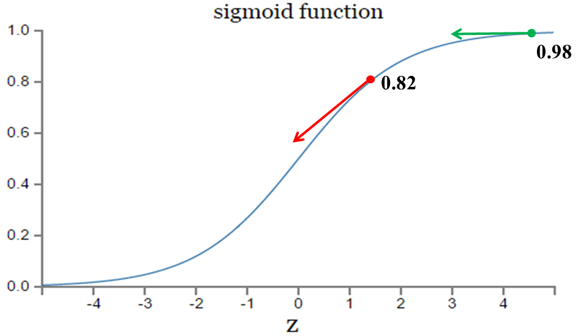

转载CSDN [__鸿](https://blog.csdn.net/u014313009)   https://blog.csdn.net/u014313009/article/details/51043064

#1 奇怪的rmse

在使用sigmoid作为激活函数，rmse为损失函数，用反向传播算法训练时，初始的误差越大，收敛得越缓慢。
$$
Cost = \frac{1}{2n} \sum_x||y(x) - a^L(x)||^2 其中 a^L是最后一层的输出 \\
利用反向传播算法，此时w和b的梯度推导如下：\\
z = \sigma(a)\ 其中\ \ sigma = sigmoid \\
a = w^Tx + b \\
\frac{\partial Cost}{\partial w} = (a-y)*\sigma'(z)*x \\
\frac{\partial Cost}{\partial b} = (a-y)*\sigma'(z) \\
梯度与损失函数的导数成正比，so
$$

**实验2的初始输出值（0.98）对应的梯度明显小于实验1的输出值（0.82），因此实验2的参数梯度下降得比实验1慢。这就是初始的代价（误差）越大，导致训练越慢的原因。** 

# 2. 交叉熵代价函数

##2.1 Logistic regression 二分类 

$$ c = -\frac{1}{n}\sum_x[ylna + (1-y)ln(1-a)] $$
重新计算梯度 
$$
\begin{eqnarray*}
\frac{\partial c}{\partial w_j} &=&  -\frac{1}{n}\sum_x (\frac{y}{\sigma(z)} - \frac{(1-y)}{1- \delta(z)}) * \frac{\partial \sigma}{\partial W_j} \\
&=&  -\frac{1}{n}\sum_x(\frac{y}{\sigma(z)} - \frac{(1-y)}{1- \sigma(z)}) * \sigma '(z) * x_j\\
&=&  -\frac{1}{n}\sum_x\frac{y - \sigma(z)}{\sigma(z)(1-\sigma(z))} * \sigma '(z) * x_j\\
&=&  \frac{1}{n}\sum_x x_j * (\sigma(z) - y )
\end{eqnarray*}
$$
可以看到损失函数的梯度已经不受 $\delta’(z)$的影响，解决的rmse的问题

## 2.2 softmax多分类

这里假设在进入softmax函数之前，已经有模型输出值，其中是要预测的类别数，模型可以是全连接网络的输出，其输出个数为，即输出为。

所以对每个样本，它属于类别的概率为：
$$
y_{i} = \frac{e^{a_i}}{\sum_{k=1}^{C}e^{a_k}} \ \ \ \forall i \in 1...C
$$
通过上式可以保证
$$
\sum_{i=1}^{C}y_i = 1
$$
即属于各个类别的概率和为1。

## 导数

转载来自 知乎 [杀手XIII](https://www.zhihu.com/people/superhan)  https://zhuanlan.zhihu.com/p/27223959

对softmax函数进行求导，即求
$$
\frac{\part y_i}{\part a_j} 
$$
第 $i$项的输出对第 $j$项输入的偏导。代入softmax函数表达式，可以得到：
$$
\frac{\partial{y_{i}}}{\partial{a_{j}}} = \frac{\partial{ \frac{e^{a_i}}{\sum_{k=1}^{C}e^{a_k}} }}{\partial{a_{j}}}
$$

用我们高中就知道的求导规则：对于$$f(x) = \frac{g(x)}{h(x)}$$ 。它的导数为
$$
f'(x) = \frac{g'(x)h(x) - g(x)h'(x)}{[h(x)]^2}
$$
所以在我们这个例子中，
$$
g(x) = e^{a_i} \\ h(x) = \sum_{k=1}^{C}e^{a_k}
$$
上面两个式子只是代表直接进行替换，而非真的等式。

$ e^{a_i}$（即g(x)）对$a_j$进行求导，要分情况讨论：

1. 如果$i = j$，则求导结果为$ e^{a_i}$
2. 如果$i \ne j$，则求导结果为0

再来看$\sum_{k=1}^{C}e^{a_k}$对$a_j$求导，结果为$e^{a_j}$

所以，当$i = j$时：
$$
\frac{\partial{y_{i}}}{\partial{a_{j}}} = \frac{\partial{ \frac{e^{a_i}}{\sum_{k=1}^{C}e^{a_k}} }}{\partial{a_{j}}}= \frac{ e^{a_i}\Sigma - e^{a_i}e^{a_j}}{\Sigma^2}=\frac{e^{a_i}}{\Sigma}\frac{\Sigma - e^{a_j}}{\Sigma}=y_i(1 - y_j)
$$
$i \ne j$时：
$$
\frac{\partial{y_{i}}}{\partial{a_{j}}} = \frac{\partial{ \frac{e^{a_i}}{\sum_{k=1}^{C}e^{a_k}} }}{\partial{a_{j}}}= \frac{ 0 - e^{a_i}e^{a_j}}{\Sigma^2}=-\frac{e^{a_i}}{\Sigma}\frac{e^{a_j}}{\Sigma}=-y_iy_j
$$

其中，为了方便，令$ \Sigma = \sum_{k=1}^{C}e^{a_k} $

对softmax函数的求导，我在两年前微信校招面试基础研究岗位一面的时候，就遇到过，这个属于比较基础的问题。

一种简单有效避免该问题的方法就是让exp(x)中的x值不要那么大或那么小，在softmax函数的分式上下分别乘以一个非零常数：  

$$
y_{i} = \frac{e^{a_i}}{\sum_{k=1}^{C}e^{a_k}}= \frac{Ee^{a_i}}{\sum_{k=1}^{C}Ee^{a_k}}= \frac{e^{a_i+log(E)}}{\sum_{k=1}^{C}e^{a_k+log(E)}}= \frac{e^{a_i+F}}{\sum_{k=1}^{C}e^{a_k+F}}
$$

这里log(E)是个常数，所以可以令它等于F。加上常数F之后，等式与原来还是相等的，所以我们可以考虑怎么选取常数F。我们的想法是让所有的输入在0附近，这样$e^{a_i}$的值不会太大，所以可以让F的值为：
$$
F = -max(a_1, a_2, ..., a_C)
$$
这样子将所有的输入平移到0附近（当然需要假设所有输入之间的数值上较为接近），同时，除了最大值，其他输入值都被平移成负数，$e^{a_i}$为底的指数函数，越小越接近0，这种方式比得到nan的结果更好。 