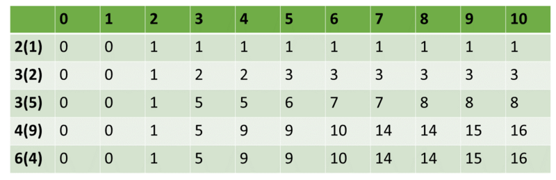

#  背包九讲的个人学习笔记

背包九讲 作者：崔添翼 (Tianyi Cui)    

源作者网址： https://github.com/tianyicui/pack    

# 1 01背包问题    

## 1.1 问题

有 N 件物品和一个容量为 V 的背包。放入第 i 件物品耗费的费用是 $C_i^1$，得到的 价值是 $W_i$。**一个物品只能用一次**求解将哪些物品装入背包可使价值总和最大。    

## 1.2 基本思路

通用问题：如何正确的描述子问题和问题的关系

性质：每个物品只有一件，可以选择放或者不放。

**子问题**：$F[i, v]$ 表示前  $i$ 件物品恰好放入一个容量为 $v$ 的背包可以获得的最大价值

状态转移： $F[i, v] = max\{F[i-1, v], F[i-1, v-C_i] + W_i\}$

时间复杂度： O(NV)

解释：

**只考虑放入还是不放入，而且物品只能用一次。所以前 $i$ 的物品的背包问题的子问题包含前 $i-1$ 物品的.**

 	1. 如果不放，此时最大值与$F[i-1, v]$ 一样。
		2. 如果放：直接放入物品 i 可能导致背包溢出，所以稳妥的方式就是从比容量$v - C_i$ 小于等于的那些背包问题中找最优解。由于定义，F非递减，所以 $F[i-1, v-C_i]$ 就是 小于等于$v - C_i$ 中最优解。

伪代码

```python
F = [0] * (V+1)
for i in range(1, N+1):
	for v in range(C[i], V+1):
		F[i][v] = max(F[i-1][v], F[i-1][v-C[i]] + W[i])
```

e.g

实例输入：背包承重量10，5件物品，重量[2,3,3,4,6], 价值[1,2,5,9,4]. 



```cpp
int maxValue(int n, int volume, vector<int> cost, vector<int> weight){
    if(n<=0 or n != cost.size() or n!= weight.size()){
        return 0;
    }
    vector<vector<int>> dp(n, vector<int>(volume+1, 0));
    int i,j;
    for(j = cost[0]; j <= volume; j++){
        dp[0][j] = weight[0];
    }
    for(i = 1; i < n; i++){
        for(j=0; j<cost[i]; j++)
            dp[i][j] = dp[i-1][j];
        for(j = cost[i]; j <= volume; j++){
            dp[i][j] = max(dp[i-1][j], dp[i-1][j-cost[i]] + weight[i]);
        }
    }
    return dp[n-1][volume];
}
```

## 1.3 优化空间复杂度

以上方法的时间和空间复杂度均为 O(V N)，其中时间复杂度应该已经不能再优化 了，但空间复杂度却可以优化到 O(V )。    

由于$F[i, j] 只需要 F[i-1, j]和F[i-1, j-C_i] $ , 更进一步只需要上一行中 $F[i, 1...v]$ 这些值，而不考虑$F[i, j...volume]$这些值。所以n行可以简化为一行，但是除第一行外需要从后向前更新。

```cpp
//ZeroOnePack
int maxValue_ops_one(int n, int volume, vector<int> cost, vector<int> weight){
    if(n<=0 or n != cost.size() or n!= weight.size()){
        return 0;
    }
    vector<int> dp(volume+1, 0);
    for(int j = cost[0]; j <= volume; j++){
        dp[j] = weight[0];
    }
    for(int i = 1; i < n; i++){
        for(int j = volume; j >= cost[i]; j--){
            dp[j] = max(dp[j], dp[j-cost[i]] + weight[i]);
        }
        cout<< dp <<endl;
    }
    return dp[volume];
}
```

# 2 完全背包问题

## 2.1 题目

有 N 件物品和一个容量为 V 的背包。放入第 i 件物品耗费的费用是 $C_i^1$，得到的 价值是 $W_i$。**一个物品可用多次**求解将哪些物品装入背包可使价值总和最大。    

## 2.2 基本思路

性质：每个物品可以放多次，可以放$0, 1,2,...,[V/C_i]$件。

**子问题**：$F[i, v]$ 表示前  $i$ 件物品恰好放入一个容量为 $v$ 的背包可以获得的最大价值

状态转移： $F[i, j] = max\{F[i-1, j], F[i-1, j-k*C_i] + k*W_i\} 其中 0 \leq k \leq V$

时间复杂度： $O(NV \sum(V/C_i))$

## 2.3 优化

### 2.3.1 去掉价小费高的物品

若存在两个物品 i,j 满足 $C_i \leq C_j$ 且 $W_i \ge W_j$ 用于物品可以使用多次，所以 j 永远也不会被选到。直接去除。

### 2.3.2 转成01背包

* 由于一个物品最多出现 $[V / C_i]$ 次，所以将每一个物品都复制 $[V / C_i]$ 次然后直接用01背包去解决就行了。但是时间复杂度没有变。
* 更高效的转化，将物品的价格拆分为$C_i * 2^k$和价值为$W_i * 2^k$的若干件物品，其中 k 满足$C_i * 2^k \leq V$。利用2的0,1,...,k次幂求和能表示$0 到 [V / C_i]$ 所有数字的特点，将物品的副本数量从 $[V / C_i]$ 降到$log([V / C_i])$

### 2.3.3 O(VN)的算法

```
F = [0] * (V+1)
for i in range(1, N+1):
	for v in range(C[i], V+1):
		F[i][v] = max(F[v], F[v-C[i]] + W[i])
```

这个代码与ZeroOnePick的算法只有v的循环顺序不同。

ZeroOnePick 中 v 按照递减的顺序（从后向前）进行遍历，这样可以保证$F[i, j] 是从 F[i-1, j]和F[i-1, j-C_i] $推出，而且保证第 i 件物品只能选一次。在完全背包中，没有数量限制，所以$F[i, j] 可以从 F[i-1, j]和F[i, j-C_i] $推出，既在前 i 个物品中可以选择不加 i，也可以选择再加一次 i 物品。

此时与1.3空间简化原理相似，只不过顺序相反，既可以得到2.3.3 的优化算法了。

 