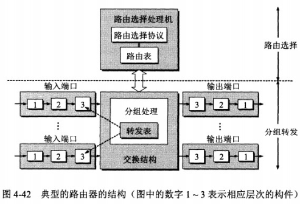
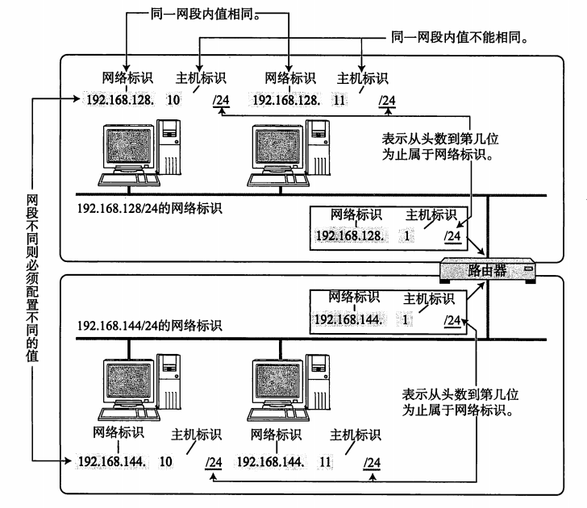
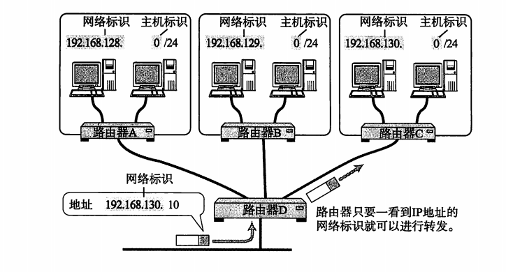
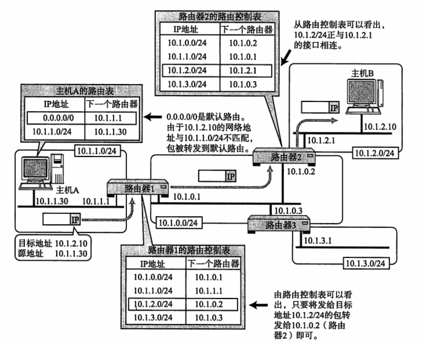
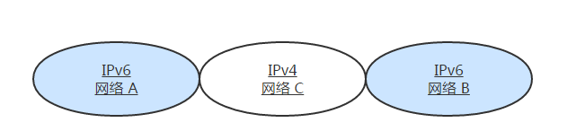
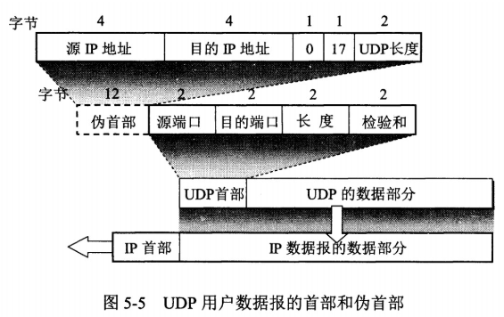
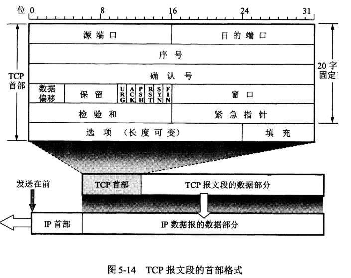
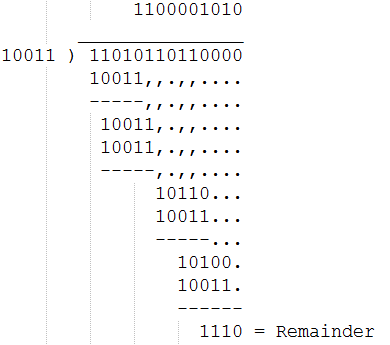
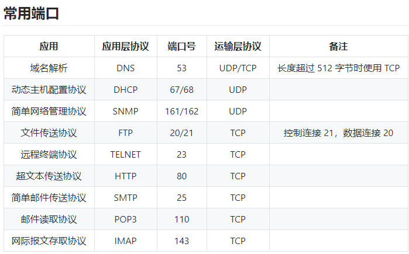

# 1 电路交换与分组交换的区别？ 优劣对比。

电路交换：以电路联接为目的的交换方式是电路交换方式。（1）建立连接	（2）通信	（3）释放连接
分组交换：分组交换也称为包交换，数据划分等长数据段，每数据段前加上必要的控制信息作为数据段的首部，首部指明了该分组发送的地址，当交换机收到分组之后，将根据首部中的地址信息将分组转发到目的地，这个过程就是分组交换。能够进行分组交换的通信网被称为分组交换网。

|      | 电路交换                           | 分组交换                                   |
| ---- | ---------------------------------- | ------------------------------------------ |
| 优点 | 通信线路专用，数据直达，时延小     | 不需要为专用的通信线路                     |
|      | 一旦建立，实时性强                 | 存储转发方式， 提高了传输的可靠性          |
|      | 发送顺序传送数据                   | 提高了通信线路的利用率                     |
|      | 传输模拟信号，也适用于传输数字信号 | 流水线式传输方式减少了传输时间             |
|      | 交换设备及控制简单                 | 分组长度固定，简化了交换节点中存储器的管理 |
|      |                                    | 分组较短，出错几率减少                     |
| 缺点 | 建立时间长                         | 数据进入交换节点后存储转发需要等待         |
|      | 信道利用率低                       | 只适用于数字信号                           |
|      | 不同速率的终端难通信               | 可能出现失序，丢失或重复分组               |

# 2 OSI和TCP/IP的划分


# 3 数据交换设备

（交换机、路由器、网关）

1. 集线器(HUB) 是一种工作在**物理层**的设备, 仅相当于一根线缆,把各个网络节点连接起来。
2. 交换机(Switch)是工作在第二层**数据链路层**的一种设备,它根据MAC地址对数据帧进行转发。 能够为任意两个网络节点之间提供一条数据通道,防止了冲突的产生,能够满足目前用户对数据高速交换的需求
3. 网桥工作在**数据链路层**，将两个LAN连起来，根据MAC地址来转发帧，可以看作一个"低层的路由器"（路由器工作在网络层，根据网络地址如IP地址进行转发）。网桥并不了解其转发帧中高层协议的信息，这使它可以同时以同种凡是处理IP、IPX等协议，它还提供了将无路由协议的网络（如NetBEUI）分段的功能。
4. 路由器router处理**网络层**的数据，因此它们更容易互连不同的数据链路层，如令牌环网段和以太网段。网桥通常比路由器难控制。像IP等协议有复杂的路由协议，使网管易于管理路由；IP等协议还提供了较多的网络如何分段的信息（即使其地址也提供了此类信息）。

路由：

* 该路由控制表的形成方式有两种：一种是管理员手动设置，另一种是路由器与其他路由器相互交换信息时自动刷新。前者也叫做静态路由控制，而后者叫做动态路由控制

* IP 协议始终认为路由表是正确的。然后，IP 本身并没有定义制作路由控制表的协议。即 IP 没有制作路由控制表的机制。该表示由一个叫做“路由协议”的协议制作而成。

* 路由器同网桥相比：路由器具有更强网络互联能力，可用于异种网络互联与多个子网互联，并且路由器具有广播包抑制和子网隔离的功能。 路由器有较高的网络适应性，性价比高，现在广泛应用于局域网间，局域网与广域网的连接上，如：园区网接入Internet。  缺点 ·它不支持非路由协议..执行多种协议TCP/IP，IPX/SPX及X.25而网桥则只用MAC地址和物理拓扑进行工作。因此网桥一般适于小型较简单的网络。

* 路由器的结构

  路由器从功能上可以划分为：路由选择和分组转发。

  分组转发结构由三个部分组成：交换结构、一组输入端口和一组输出端口。 

  

  路由器分组转发流程

  从数据报的首部提取目的主机的 IP 地址 D，得到目的网络地址 N。

  若 N 就是与此路由器直接相连的某个网络地址，则进行直接交付；

  若路由表中有目的地址为 D 的特定主机路由，则把数据报传送给表中所指明的下一跳路由器；

  若路由表中有到达网络 N 的路由，则把数据报传送给路由表中所指明的下一跳路由器；

  若路由表中有一个默认路由，则把数据报传送给路由表中所指明的默认路由器；

  报告转发分组出错。

  路由选择协议

  路由选择协议都是自适应的，能随着网络通信量和拓扑结构的变化而自适应地进行调整。

  互联网可以划分为许多较小的自治系统 AS，一个 AS 可以使用一种和别的 AS 不同的路由选择协议。

  可以把路由选择协议划分为两大类：

  自治系统内部的路由选择：RIP 和 OSPF

  自治系统间的路由选择：BGP

# 4 常见协议 

## 4.1 ARP协议

### 4.1.1 硬件(MAC)地址

MAC地址（英语：Media Access Control Address），直译为媒体访问控制地址，也称为局域网地址（LAN Address），以太网地址（Ethernet Address）或物理地址（Physical Address），

它是一个用来确认网络设备位置的地址。

第二层数据链接层则负责MAC地址。MAC地址用于在网络中唯一标示一个网卡,  用来标识同一个链路中不同计算机的一种识别码。

### 4.1.2 ARP 即地址解析协议

数据链路层的主要作用是在互连同一种数据链路的节点之间进行包传递。而一旦跨越多种数据链路，就需要借助网络层。网络层可以跨越不同的数据链路，即使是在不同的数据链路上也能实现两端节点之间的数据包传输。

**ARP，即地址解析协议**，实现通过IP地址得知其物理地址。在TCP/IP网络环境下，每个主机都分配了一个32位的IP地址，这种互联网地址是在网际范围标识主机的一种逻辑地址。为了让报文在物理网路上传送，必须知道对方目的主机的物理地址。

1. 应用程序构造数据包，该步骤是产生ICMP包，然后把它提交给内核（网卡驱动程序）；
2. 在本地的ARP缓存中查看IP-MAC对应表；存在该IP-MAC对应关系，那么跳到步骤7；
3. 内核进行ARP广播，即发送 ARP Request，向整个网络中大喊，这个IP是谁的，这个ARP Request中包含有我们计算机的MAC地址；
4. 当192.168.1.2主机接收到该ARP请求后，就发送一个ARP 回应，即ARP REPLY命令，说道：这个IP是我的，你看这是我的MAC地址（ARP Request中包含自己的MAC地址）；
5. 我们的计算机获得192.168.1.2主机的IP-MAC地址对应关系，就保存到自己的ARP缓存中；
6. 内核将把目标主机IP转化为MAC地址，然后封装在以太网头结构中，再把数据发送出去；
7. 这样主机B看到发送过来的数据包包头里有自己的MAC地址，才会识别它，噢，这个数据是发送给我的（当数据包包头里只有B的IP地址时，主机B会不认识它，不去接收这个数据包）

## 4.2 IP

- IP（IPv4、IPv6）相当于 OSI 参考模型中的第3层——网络层。
- 网络层的主要作用是“实现终端节点之间的通信”。这种终端节点之间的通信也叫“点对点通信”。
- IP 地址用于在“连接到网络中的所有主机中识别出进行通信的目标地址 

 ### 4.2.1 IP 地址的构成

> 来源 掘金   
>
> 作者：  涤生_Woo  
>
> 网址： https://juejin.im/post/5a069b6d51882509e5432656

 IP 地址由网络和主机两部分标识组成

网络标识在数据链路的每个段配置不同的值。网络标识必须保证相互连接的每个段的地址不相重复。

而相同段内相连的主机必须有相同的网络地址。

IP 地址的“主机标识”则不允许在同一个网段内重复出现。

由此，可以通过设置网络地址和主机地址，在相互连接的整个网络中保证每台主机的 IP 地址都不会相互重叠。即 IP 地址具有了唯一性



- 如下图，IP 包被转发到途中某个路由器时，正是利用目标 IP 地址的网络标识进行路由。因为即使不看主机标识，只要一见到网络标识就能判断出是否为该网段内的主机。




### 4.2.2 子网掩码（IP分类）

https://blog.csdn.net/jason314/article/details/5447743

* 现在一个 IP 地址的网络标识和主机标识已不再受限于该地址的类别，而是由一个叫做“子网掩码”的识别码通过子网网络地址细分出比 A 类、B 类、C 类更小粒度的网络 。**将主机地址的一部分用作子网地址 **

* 一个 32 位的数字。它对应 IP 地址**网络标识**部分的位全部为 “1”，对应 IP 地址**主机标识**的部分则全部为 “0” 

* **1** **）缺省子网掩码：**

  即未划分子网，对应的网络号的位都置 1 ，主机号都置 0 。

  A 类网络缺省子网掩码： 255.0.0.0

  B 类网络缺省子网掩码： 255.255.0.0

  C 类网络缺省子网掩码： 255.255.255.0

  **2** **）自定义子网掩码：**

  将一个网络划分为几个子网，需要每一段使用不同的网络号或子网号，实际上我们可以认为是将主机号分为两个部分：子网号、子网主机号。 形式如下：

  未做子网划分的 IP 地址：网络号＋主机号

  做子网划分后的 IP 地址：网络号＋子网号＋子网主机号

  也就是说 IP 地址在划分子网后，以前的主机号位置的一部分给了子网号，余下的是子网主机号。

* **子网编址技术** ，即子网划分将会有助于以下问题的解决：

  1 ）巨大的网络地址管理耗费：如果你是一个 A 类网络的管理员，你一定会为管理数量庞大的主机而头痛的；

  2 ）路由器中的选路表的急剧膨胀：当路由器与其他路由器交换选路表时，互联网的负载是很高的，所需的计算量也很高；

  3 ） IP 地址空间有限并终将枯竭：这是一个至关重要的问题，高速发展的 internet, 使原来的编址方法不能适应，而一些 IP 地址却不能被充分的利用，造成了浪费。

  因此，在配置局域网或其他网络时，根据需要划分子网是很重要的，有时也是必要的。现在，子网编址技术已经被绝大多数局域网所使用。

* **如何计算子网数量？**

  这个问题大家会常常提到，还是从子网掩码入手，主要有两个步骤：

  1. 观察子网掩码的二进制形式，确定作为子网号的位数 n ；

  2. 子网数量为 2^n － 2 。（为什么减 2 ，继续往下看）

  举个例子来说，比如有这样一个子网掩码： 255.255.255.224 其二进制为：

  11111111.11111111.11111111.11100000

  可见 n=3,2 的 3 次方为 8 ，说明子网地址可能有

  如下 8 种情况：

  000      001      010       011      100     101      110      111

  但其中代表网络自身的 000 ；代表广播地址的 111 是被保留的，所以要减 2 。

* **如何计算总主机数量，子网内主机数量？**

  总主机数量＝子网数量×子网内主机数量

  再用一个例子给大家说明，比如子网掩码为 255.255.255.224

  上面的讨论知道它最多可以划分 6 个子网，那么每个子网内最多有多少个主机呢？其实上面我已经给大家算过了，由于网络被划分为 6 个子网，占用了主机号的前 3 位，且是 C 类地址，则主机号只能用 5 位来表示主机号，因此子网内的主机数量＝（ 2 的 5 次方）－ 2 ＝ 30.

  因此通过这个子网掩码我们可以算出这个网络最多可以标识 6*30=180 个主机（可见，在化分子网后，整个网络所能标识的主机数量将减少）。

  

### 4.2.3 广播地址

- 广播地址用于在同一个链路中相互连接的主机之间发送数据包。将 IP 地址中的**主机地址**部分全部设置为 1，就成了广播地址。
- 广播分为本地广播和直接广播两种。在本网络内的广播叫做本地广播；在不同网络之间的广播叫做直接广播。

 ### 4.2.4 单播、多播、广播

https://blog.csdn.net/wangerge/article/details/3931491

1. 单播

   主机之间“一对一”的通讯模式，网络中的交换机和路由器对数据只进行转发不进行复制。 

   如果10个客户机需要相同的数据，则服务器需要逐一传送，重复10次相同的工作。 

   所以现在的网页浏览全部都是采用IP单播协议。网络中的路由器和交换机根据其目标地址选择传输路径，将IP单播数据传送到其指定的目的地。  

   

2. 广播

   主机之间“一对所有”的通讯模式，网络对其中每一台主机发出的信号都进行无条件复制并转发，所有主机都可以接收到所有信息. 网络成本可以很低廉。有线电视网就是典型的广播型网络 

3. 组播

   主机之间“一对一组”的通讯模式，也就是加入了同一个组的主机可以接受到此组内的所有数据，网络中的交换机和路由器只向有需求者复制并转发其所需数据。主机可以向路由器请求加入或退出某个组， 网络中的路由器和交换机有选择的复制并传输数据，即只将组内数据传输给那些加入组的主机。 

|      | 优点                                                         | 缺点                                                         |
| ---- | :----------------------------------------------------------- | :----------------------------------------------------------- |
| 单播 | 1.  服务器及时响应客户机的请求  <br />2.  服务器针对每个客户不通的请求发送不通的数据，容易实现个性化服务。 | 1. 服务器流量＝客户机数量×客户机流量；流媒体应用中服务器不堪重负。<br />2. 现有的网络带宽是金字塔结构，城际省际主干带宽仅仅相当于其所有用户带宽之和的5％。 |
| 广播 | 1. 网络设备简单，维护简单，布网成本低廉<br/>2.  服务器流量负载极低 | 1. 无法提供个性化服务。  <br />2.  网络允许服务器提供数据的带宽有限，客户端的最大带宽＝服务总带宽 <br />3.  广播禁止在Internet宽带网上传输。 |
| 组播 | 1. 相同数据流的同组,节省了服务器的负载。具备广播所具备的优点。 <br/>2. 由于组播协议按需复制转发数据流，服务端的服务总带宽不受客户接入端带宽的限制。IP协议允许有2亿6千多万个组播。服务丰富 | 1.  与单播协议相比没有纠错机制，发生丢包错包后难以弥补，但可以通过一定的容错机制和QOS加以弥补。  <br/>2.  现行网络虽然都支持组播的传输，但在客户认证、QOS等方面还需要完善， |

### 4.2.5 IP 的分类(过时了)

对于A、B、C类IP地址，都可以划分为网络标识和主机标识两部分。其中网络标识和主机标识的长度随地址类别的不同变化。网络标识和主机标识其实很好理解就相当于我们使用的电信的座机号码。如广州的一个座机电话号码020-66650157 其中网络标识就对应区号020,主机标识就对应号码66650157。下图就很清楚的说明了A、B、C类地址的网络标识和主机标识的长度


 **A 类 IP 地址是首位以 “0” 开头的地址。**从第 1 位到第 8 位是它的网络标识。用十进制表示的话，0.0.0.0~127.0.0.0 是 A 类的网络地址。A 类地址的后 24 位相当于主机标识。因此，一个网段内可容纳的主机地址上限为16,777,214个。2^24-2

**B 类 IP 地址是前两位 “10” 的地址。**从第 1 位到第 16 位是它的网络标识。用十进制表示的话，128.0.0.0~191.255.0.0 是 B 类的网络地址。B 类地址的后 16 位相当于主机标识。因此，一个网段内可容纳的主机地址上限为65,534个。 2^16-2

**C 类 IP 地址是前三位为 “110” 的地址。**从第 1 位到第 24 位是它的网络标识。用十进制表示的话，192.0.0.0~223.255.255.0 是 C 类的网络地址。C 类地址的后 8 位相当于主机标识。因此，一个网段内可容纳的主机地址上限为254个。

**D 类 IP 地址是前四位为 “1110” 的地址。**从第 1 位到第 32 位是它的网络标识。用十进制表示的话，224.0.0.0~239.255.255.255 是 D 类的网络地址。D 类地址没有主机标识，常用于多播。

在分配 IP 地址时关于主机标识有一点需要注意。即要用比特位表示主机地址时，不可以全部为 0 或全部为 1。因为全部为 0 只有在表示对应的网络地址或 IP 地址不可以获知的情况下才使用。而全部为 1 的主机通常作为广播地址。因此，在分配过程中，应该去掉这两种情况。这也是为什么 C 类地址每个网段最多只能有 254（ 28 - 2 = 254）个主机地址的原因。


## 4.3. IP地址和路由控制

* IP 地址的网络地址部分用于进行路由控制。
* 路由控制表中记录着网络地址与下一步应该发送至路由器的地址。
* 在发送 IP 包时，首先要确定 IP 包首部中的目标地址，再从路由控制表中找到与该地址具有相同网络地址的记录，根据该记录将 IP 包转发给相应的下一个路由器。如果路由控制表中存在多条相同网络地址的记录，就选择一个最为吻合的网络地址。



## 4.4 IP 分包与组包

* 每种数据链路的最大传输单元（MTU）都不尽相同，因为每个不同类型的数据链路的使用目的不同。使用目的不同，可承载的 MTU 也就不同。
* 任何一台主机都有必要对 IP 分片进行相应的处理。分片往往在网络上遇到比较大的报文无法一下子发送出去时才会进行处理。
* 经过分片之后的 IP 数据报在被重组的时候，只能由目标主机进行。路由器虽然做分片但不会进行重组。

  ### 4.4.1 路径 MTU 发现

- 分片机制也有它的不足。如路由器的处理负荷加重之类。因此，只要允许，是不希望由路由器进行 IP 数据包的分片处理的。
- 为了应对分片机制的不足，“路径 MTU 发现” 技术应运而生。路径 MTU 指的是，从发送端主机到接收端主机之间不需要分片是最大 MTU 的大小。即路径中存在的所有数据链路中最小的 MTU 。
- 进行路径 MTU 发现，就可以避免在中途的路由器上进行分片处理，也可以在 TCP 中发送更大的包。

 ## 4.5 IPV6

 IPv6 的地址长度则是原来的 4 倍，即 128 比特，一般写成 8 个 16 位字节。 

### 4.5.1  IPv6 的特点

- IP 得知的扩大与路由控制表的聚合。
- 性能提升。包首部长度采用固定的值（40字节），不再采用首部检验码。简化首部结构，减轻路由器负担。路由器不再做分片处理。
- 支持即插即用功能。即使没有DHCP服务器也可以实现自动分配 IP 地址。
- 采用认证与加密功能。应对伪造 IP 地址的网络安全功能以及防止线路窃听的功能。
- 多播、Mobile IP 成为扩展功能

### 4.5.2 IPv6 中 IP 地址的标记方法

- 一般人们将 128 比特 IP 地址以每 16 比特为一组，每组用冒号（“：”）隔开进行标记。
- 而且如果出现连续的 0 时还可以将这些 0 省略，并用两个冒号（“：：”）隔开。但是，一个 IP 地址中只允许出现一次两个连续的冒号。

 更多详情见 https://www.jianshu.com/p/9f3e879a4c9c


## 4.6 IP 协议相关技术

- IP 旨在让最终目标主机收到数据包，但是在这一过程中仅仅有 IP 是无法实现通信的。必须还有能够解析主机名称和 MAC 地址的功能，以及数据包在发送过程中异常情况处理的功能。

### 4.6.1 DNS

我们平常在访问某个网站时不适用 IP 地址，而是用一串由罗马字和点号组成的字符串。而一般用户在使用 TCP/IP 进行通信时也不使用 IP 地址。能够这样做是因为有了 DNS （Domain Name System）功能的支持。DNS 可以将那串字符串自动转换为具体的 IP 地址。

这种 DNS 不仅适用于 IPv4，还适用于 IPv6。

### 4.6.2 ICMP

- ICMP 的主要功能包括，确认 IP 包是否成功送达目标地址，通知在发送过程当中 IP 包被废弃的具体原因，改善网络设置等。
- IPv4 中 ICMP 仅作为一个辅助作用支持 IPv4。也就是说，在 IPv4 时期，即使没有 ICMP，仍然可以实现 IP 通信。然而，在 IPv6 中，ICMP 的作用被扩大，如果没有 ICMPv6，IPv6 就无法进行正常通信。

 **网际控制报文协议 ICMP**

ICMP 是为了更有效地转发 IP 数据报和提高交付成功的机会。它封装在 IP 数据报中，但是不属于高层协议。


ICMP 报文分为差错报告报文和询问报文。


1. Ping

Ping 是 ICMP 的一个重要应用，主要用来测试两台主机之间的连通性。

Ping 的原理是通过向目的主机发送 ICMP Echo 请求报文，目的主机收到之后会发送 Echo 回答报文。Ping 会根据时间和成功响应的次数估算出数据包往返时间以及丢包率。

2. Traceroute

Traceroute 是 ICMP 的另一个应用，用来跟踪一个分组从源点到终点的路径。

Traceroute 发送的 IP 数据报封装的是无法交付的 UDP 用户数据报，并由目的主机发送终点不可达差错报告报文。

源主机向目的主机发送一连串的 IP 数据报。第一个数据报 P1 的生存时间 TTL 设置为 1，当 P1 到达路径上的第一个路由器 R1 时，R1 收下它并把 TTL 减 1，此时 TTL 等于 0，R1 就把 P1 丢弃，并向源主机发送一个 ICMP 时间超过差错报告报文；

源主机接着发送第二个数据报 P2，并把 TTL 设置为 2。P2 先到达 R1，R1 收下后把 TTL 减 1 再转发给 R2，R2 收下后也把 TTL 减 1，由于此时 TTL 等于 0，R2 就丢弃 P2，并向源主机发送一个 ICMP 时间超过差错报文。

不断执行这样的步骤，直到最后一个数据报刚刚到达目的主机，主机不转发数据报，也不把 TTL 值减 1。但是因为数据报封装的是无法交付的 UDP，因此目的主机要向源主机发送 ICMP 终点不可达差错报告报文。

之后源主机知道了到达目的主机所经过的路由器 IP 地址以及到达每个路由器的往返时间。

### 4.6.3 DHCP

- 如果逐一为每一台主机设置 IP 地址会是非常繁琐的事情。特别是在移动使用笔记本电脑、只能终端以及平板电脑等设备时，每移动到一个新的地方，都要重新设置 IP 地址。
- 于是，为了实现自动设置 IP 地址、统一管理 IP 地址分配，就产生了 DHCP（Dynamic Host Configuration Protocol）协议。有了 DHCP，计算机只要连接到网络，就可以进行 TCP/IP 通信。也就是说，DHCP 让即插即用变得可能。
- DHCP 不仅在 IPv4 中，在 IPv6 中也可以使用。

### 4.6.6 NAT

- NAT（Network Address Translator）是用于在本地网络中使用私有地址，在连接互联网时转而使用全局 IP 地址的技术。
- 除转换 IP 地址外，还出现了可以转换 TCP、UDP 端口号的 NAPT（Network Address Ports Translator）技术，由此可以实现用一个全局 IP 地址与多个主机的通信。
- NAT（NAPT）实际上是为正在面临地址枯竭的 IPv4 而开发的技术。不过，在 IPv6 中为了提高网络安全也在使用 NAT，在 IPv4 和 IPv6 之间的相互通信当中常常使用 NAT-PT。

 

### 4.6.7 IP 隧道



夹着 IPv4 网络的两个 IPv6 网络

- 如上图的网络环境中，网络 A 与网络 B 之间无法直接进行通信，为了让它们之间正常通信，这时必须得采用 IP 隧道的功能。
- IP 隧道可以将那些从网络 A 发过来的 IPv6 的包统合为一个数据，再为之追加一个 IPv4 的首部以后转发给网络 C。
- 一般情况下，紧接着 IP 首部的是 TCP 或 UDP 的首部。然而，现在的应用当中“ IP 首部的后面还是 IP 首部”或者“ IP 首部的后面是 IPv6 的首部”等情况与日俱增。这种在网络层的首部后面追加网络层首部的通信方法就叫做“ IP 隧道”。

 

 ## 4.7 路由相关协议

路由选择协议

路由选择协议都是自适应的，能随着网络通信量和拓扑结构的变化而自适应地进行调整。

互联网可以划分为许多较小的自治系统 AS，一个 AS 可以使用一种和别的 AS 不同的路由选择协议。

可以把路由选择协议划分为两大类：

自治系统内部的路由选择：RIP 和 OSPF

自治系统间的路由选择：BGP

### 内部网关协议

### 4.7.1 距离向量算法 RIP

RIP 是一种基于距离向量的路由选择协议。距离是指跳数，直接相连的路由器跳数为 1。跳数最多为 15，超过 15 表示不可达。

RIP 按固定的时间间隔仅和相邻路由器交换自己的路由表，经过若干次交换之后，所有路由器最终会知道到达本自治系统中任何一个网络的最短距离和下一跳路由器地址。

**距离向量算法：**

对地址为 X 的相邻路由器发来的 RIP 报文，先修改报文中的所有项目，把下一跳字段中的地址改为 X，并把所有的距离字段加 1；

对修改后的 RIP 报文中的每一个项目，进行以下步骤：

若原来的路由表中没有目的网络 N，则把该项目添加到路由表中；

否则：若下一跳路由器地址是 X，则把收到的项目替换原来路由表中的项目；否则：若收到的项目中的距离 d 小于路由表中的距离，则进行更新（例如原始路由表项为 Net2, 5, P，新表项为 Net2, 4, X，则更新）；否则什么也不做。

若 3 分钟还没有收到相邻路由器的更新路由表，则把该相邻路由器标为不可达，即把距离置为 16。

RIP 协议实现简单，开销小。但是 RIP 能使用的最大距离为 15，限制了网络的规模。并且当网络出现故障时，要经过比较长的时间才能将此消息传送到所有路由器。

### 4.7.2 开放最短路径优先 OSPF

开放最短路径优先 OSPF，是为了克服 RIP 的缺点而开发出来的。

开放表示 OSPF 不受某一家厂商控制，而是公开发表的；最短路径优先表示使用了 Dijkstra 提出的最短路径算法 SPF。

OSPF 具有以下特点：

向本自治系统中的所有路由器发送信息，这种方法是洪泛法。

发送的信息就是与相邻路由器的链路状态，链路状态包括与哪些路由器相连以及链路的度量，度量用费用、距离、时延、带宽等来表示。

只有当链路状态发生变化时，路由器才会发送信息。

所有路由器都具有全网的拓扑结构图，并且是一致的。相比于 RIP，OSPF 的更新过程收敛的很快。

### 外部网关协议

### 4.7.3  边界网关协议 BGP

BGP（Border Gateway Protocol，边界网关协议）

AS 之间的路由选择很困难，主要是由于：

互联网规模很大；

各个 AS 内部使用不同的路由选择协议，无法准确定义路径的度量；

AS 之间的路由选择必须考虑有关的策略，比如有些 AS 不愿意让其它 AS 经过。

BGP 只能寻找一条比较好的路由，而不是最佳路由。

每个 AS 都必须配置 BGP 发言人，通过在两个相邻 BGP 发言人之间建立 TCP 连接来交换路由信息。

 

# 5 TCP/UDP

感谢马总的助攻

## 5.1 UDP 和 TCP 的特点

用户数据报协议 UDP（User Datagram Protocol）是无连接的，尽最大可能交付，没有拥塞控制，面向报文（对于应用程序传下来的报文不合并也不拆分，只是添加 UDP 首部），支持一对一、一对多、多对一和多对多的交互通信。

传输控制协议 TCP（Transmission Control Protocol）是面向连接的，提供可靠交付，有流量控制，拥塞控制，提供全双工通信，面向字节流（把应用层传下来的报文看成字节流，把字节流组织成大小不等的数据块），每一条 TCP 连接只能是点对点的（一对一）。

**UDP 首部格式**



首部字段只有 8 个字节，包括源端口、目的端口、长度、检验和。12 字节的伪首部是为了计算检验和临时添加的。

**TCP 首部格式**



**序号 ：**用于对字节流进行编号，例如序号为 301，表示第一个字节的编号为 301，如果携带的数据长度为 100 字节，那么下一个报文段的序号应为 401。

**确认号 ：**期望收到的下一个报文段的序号。例如 B 正确收到 A 发送来的一个报文段，序号为 501，携带的数据长度为 200 字节，因此 B 期望下一个报文段的序号为 701，B 发送给 A 的确认报文段中确认号就为 701。

**数据偏移 ：**指的是数据部分距离报文段起始处的偏移量，实际上指的是首部的长度。

**确认 ACK ：**当 ACK=1 时确认号字段有效，否则无效。TCP 规定，在连接建立后所有传送的报文段都必须把 ACK 置 1。

**同步 SYN ：**在连接建立时用来同步序号。当 SYN=1，ACK=0 时表示这是一个连接请求报文段。若对方同意建立连接，则响应报文中 SYN=1，ACK=1。

**终止 FIN ：**用来释放一个连接，当 FIN=1 时，表示此报文段的发送方的数据已发送完毕，并要求释放连接。


## 5.2 三次握手，四次断开过程。

为了保证服务端能收接受到客户端的信息并能做出正确的应答而进行前两次(第一次和第二次)握手，为了保证客户端能够接收到服务端的信息并能做出正确的应答而进行后两次(第二次和第三次)握手。


## 5.3 TCP/IP TIME_WAIT状态原理

http://elf8848.iteye.com/blog/1739571

通信双方建立TCP连接后，主动关闭连接的一方就会进入TIME_WAIT状态。

客户端主动关闭连接时，会发送最后一个ack后，然后会进入TIME_WAIT状态，再停留2个MSL时间(后有MSL的解释)，进入CLOSED状态。

下图是以客户端主动关闭连接为例，说明这一过程的。


1）可靠地实现TCP全双工连接的终止

TCP协议在关闭连接的四次握手过程中，最终的ACK是由主动关闭连接的一端（后面统称A端）发出的，如果这个ACK丢失，对方（后面统称B端）将重发出最终的FIN，因此A端必须维护状态信息（TIME_WAIT）允许它重发最终的ACK。如果A端不维持TIME_WAIT状态，而是处于CLOSED 状态，那么A端将响应RST分节，B端收到后将此分节解释成一个错误（在java中会抛出connection reset的SocketException)。

因而，要实现TCP全双工连接的正常终止，必须处理终止过程中四个分节任何一个分节的丢失情况，主动关闭连接的A端必须维持TIME_WAIT状态 。

2）允许老的重复分节在网络中消逝 

TCP分节可能由于路由器异常而“迷途”，在迷途期间，TCP发送端可能因确认超时而重发这个分节，迷途的分节在路由器修复后也会被送到最终目的地，这个迟到的迷途分节到达时可能会引起问题。在关闭“前一个连接”之后，马上又重新建立起一个相同的IP和端口之间的“新连接”，“前一个连接”的迷途重复分组在“前一个连接”终止后到达，而被“新连接”收到了。为了避免这个情况，TCP协议不允许处于TIME_WAIT状态的连接启动一个新的可用连接，因为TIME_WAIT状态持续2MSL，就可以保证当成功建立一个新TCP连接的时候，来自旧连接重复分组已经在网络中消逝。

3) MSL时间

MSL就是maximum segment lifetime(最大分节生命期），这是一个IP数据包能在互联网上生存的最长时间，超过这个时间IP数据包将在网络中消失 。MSL在RFC 1122上建议是2分钟，而源自berkeley的TCP实现传统上使用30秒。

4) TIME_WAIT状态维持时间

TIME_WAIT状态维持时间是两个MSL时间长度，也就是在1-4分钟。Windows操作系统就是4分钟。


##5.4 TCP 可靠传输

TCP 使用超时重传来实现可靠传输：如果一个已经发送的报文段在超时时间内没有收到确认，那么就重传这个报文段。四次挥手。

## 5.5 TCP 滑动窗口

窗口是缓存的一部分，用来暂时存放字节流。发送方和接收方各有一个窗口，接收方通过 TCP 报文段中的窗口字段告诉发送方自己的窗口大小，发送方根据这个值和其它信息设置自己的窗口大小。

发送窗口内的字节都允许被发送，接收窗口内的字节都允许被接收。如果发送窗口左部的字节已经发送并且收到了确认，那么就将发送窗口向右滑动一定距离，直到左部第一个字节不是已发送并且已确认的状态；接收窗口的滑动类似，接收窗口左部字节已经发送确认并交付主机，就向右滑动接收窗口。

接收窗口只会对窗口内最后一个按序到达的字节进行确认，例如接收窗口已经收到的字节为 {31, 34, 35}，其中 {31} 按序到达，而 {34, 35} 就不是，因此只对字节 31 进行确认。发送方得到一个字节的确认之后，就知道这个字节之前的所有字节都已经被接收。

## 5.6 TCP 流量控制

流量控制是为了控制发送方发送速率，保证接收方来得及接收。

接收方发送的确认报文中的窗口字段可以用来控制发送方窗口大小，从而影响发送方的发送速率。将窗口字段设置为 0，则发送方不能发送数据。

TCP 拥塞控制

如果网络出现拥塞，分组将会丢失，此时发送方会继续重传，从而导致网络拥塞程度更高。因此当出现拥塞时，应当控制发送方的速率。这一点和流量控制很像，但是出发点不同。流量控制是为了让接收方能来得及接收，而拥塞控制是为了降低整个网络的拥塞程度。

TCP 主要通过四种算法来进行拥塞控制：慢开始、拥塞避免、快重传、快恢复。

发送方需要维护一个叫做拥塞窗口（cwnd）的状态变量，注意拥塞窗口与发送方窗口的区别：拥塞窗口只是一个状态变量，实际决定发送方能发送多少数据的是发送方窗口。

为了便于讨论，做如下假设：

1接收方有足够大的接收缓存，因此不会发生流量控制；

2虽然 TCP 的窗口基于字节，但是这里设窗口的大小单位为报文段。

### 5.6.1. 慢开始与拥塞避免

发送的最初执行慢开始，令 cwnd=1，发送方只能发送 1 个报文段；当收到确认后，将 cwnd 加倍，因此之后发送方能够发送的报文段数量为：2、4、8 ...

注意到慢开始每个轮次都将 cwnd 加倍，这样会让 cwnd 增长速度非常快，从而使得发送方发送的速度增长速度过快，网络拥塞的可能也就更高。设置一个慢开始门限 ssthresh，当 cwnd >= ssthresh 时，进入拥塞避免，每个轮次只将 cwnd 加 1。

如果出现了超时，则令 ssthresh = cwnd/2，然后重新执行慢开始。

### 5.6.2 快重传与快恢复

在接收方，要求每次接收到报文段都应该对最后一个已收到的有序报文段进行确认。例如已经接收到 M1 和 M2，此时收到 M4，应当发送对 M2 的确认。

在发送方，如果收到三个重复确认，那么可以知道下一个报文段丢失，此时执行快重传，立即重传下一个报文段。例如收到三个 M2，则 M3 丢失，立即重传 M3。

在这种情况下，只是丢失个别报文段，而不是网络拥塞。因此执行快恢复，令 ssthresh = cwnd/2 ，cwnd = ssthresh，注意到此时直接进入拥塞避免。

慢开始和快恢复的快慢指的是 cwnd 的设定值，而不是 cwnd 的增长速率。慢开始 cwnd 设定为 1，而快恢复 cwnd 设定为 ssthresh。


#6 检验算法

### 6.1  checksum

checksum生成：将发送数据累加，再把累加和取反，该值就是checksum的校验码。可使用按位取反"~"来实现，即~X；或使用与0xFF按位异或“^”，即X ^ 0xFF。

```
unsigned short checksum(unsigned short *buf, int nword)
{
    unsigned long sum;
 
    for(sum = 0; nword > 0; nword--)
        sum += *buf++;              /*获取buf的累加和*/
 
    sum  = (sum>>16) + (sum&0xffff);/*获取sum高16位与低16位的和*/
    sum += (sum>>16);
 
    return ~sum;
}
```

### 6.2 校验算法

#### 6.2.1 奇偶校验

奇校验：就是让原有数据序列中（包括你要加上的一位）1的个数为奇数  

偶校验：就是让原有数据序列中（包括你要加上的一位）1的个数为偶数  

```

```

####  6.2.2 CRC冗余校验算法

  循环冗余校验CRC（Cyclical Redundancy Check）字段位于尾部，有32位，被检查的消息首先要追加n位0形成一个扩展消息（使用模2除法）除以一个n+1位生成多项式（常用5种）。放置在消息的CRC字段的值是计算中的余数的二进制码（商被丢弃）。

e.g. 1，假设信息码字为`11100011`，生成多项式G(X)=X^5+X^4+X+1，计算CRC码字。

1. G(X) = X^5+X^4+X+1,也就是`110011`，因为最高次是5，所以，在信息码字后补5个0，变为1110001100000。
2. 用1110001100000模二除法除以110011，余数为`11010`，即为所求的冗余位。 因此发送出去的CRC码字为原始码字11100011末尾加上冗余位11010，即 `1110001111010`。
3. 接收端收到码字后，采用同样的方法验证，即将收到的码字用模二除法除以110011（是G(X)对应的二进制生成码），发现余数是0，则认为码字在传输过程中没有出错。 

e.g 2 模2除法练习



类似于除法，但是不借位，只看第一位，是1，商置1，否则为0， 其他为算异或

```cpp
#define POLY        0x1021
/**
 * Calculating CRC-16 in 'C'
 * @para addr, start of data
 * @para num, length of data
 * @para crc, incoming CRC
 */
uint16_t crc16(unsigned char *addr, int num, uint16_t crc)
{
    int i;
    for (; num > 0; num--)              /* Step through bytes in memory */
    {
        crc = crc ^ (*addr++ << 8);     /* Fetch byte from memory, XOR into CRC top byte*/
        for (i = 0; i < 8; i++)             /* Prepare to rotate 8 bits */
        {
            if (crc & 0x8000)            /* b15 is set... */
                crc = (crc << 1) ^ POLY;    /* rotate and XOR with polynomic */
            else                          /* b15 is clear... */
                crc <<= 1;                  /* just rotate */
        }                             /* Loop for 8 bits */
        crc &= 0xFFFF;                  /* Ensure CRC remains 16-bit value */
    }                               /* Loop until num=0 */
    return(crc);                    /* Return updated CRC */
```

#### 6.2.3 海明检验

海明校验关键的一个前提是,数据位中只能有一位出错.这也是海明码产生的依据所在. 

将有效信息按某种规律分成若干组，每组安排一个校验位，做奇偶测试，就能提供多位检错信息，以指出最大可能是哪位出错，从而将其纠正。实质上，海明校验是一种多重校验。 

* 对于原始数据信息位m，计算得出需要的k位校验码 
* 海明校验码是放在2的幂次位上的，如 1，2，3，4，8，16….等 
* 计算机校验码 偶校验。


## 6.3 MD5、SHA、MAC等摘要算法 

它通过对所有数据提取指纹信息以实现数据签名、数据完整性校验等功能，由于其不可逆性，有时候会被用做敏感信息的加密。数据摘要算法也被称为哈希（Hash）算法、散列算法。在互联网上进行大文件传输时，都要得用MD5算法产生一个与文件匹配的、存储MD5值的文本文件（后缀名为 .md5或.md5sum），这样接收者在接收到文件后，就可以利用与 SFV 类似的方法来检查文件完整性，绝大多数大型软件公司或开源组织都是以这种方式来校验数据完整性，而且部分操作系统也使用此算法来对用户密码进行加密，另外，它也是目前计算机犯罪中数据取证的最常用算法。 

# 7 应用层 

感谢马总的助攻

## 7.1 域名系统

DNS 是一个分布式数据库，提供了主机名和 IP 地址之间相互转换的服务。这里的分布式数据库是指，每个站点只保留它自己的那部分数据。

域名具有层次结构，从上到下依次为：根域名、顶级域名、二级域名。

DNS 可以使用 UDP 或者 TCP 进行传输，使用的端口号都为 53。大多数情况下 DNS 使用 UDP 进行传输，这就要求域名解析器和域名服务器都必须自己处理超时和重传来保证可靠性。在两种情况下会使用 TCP 进行传输：

1如果返回的响应超过的 512 字节就改用 TCP 进行传输（UDP 最大只支持 512 字节的数据）。

2区域传送需要使用 TCP 进行传输（区域传送是主域名服务器向辅助域名服务器传送变化的那部分数据）。

## 7.2 文件传送协议

FTP 使用 TCP 进行连接，它需要两个连接来传送一个文件：

控制连接：服务器打开端口号 21 等待客户端的连接，客户端主动建立连接后，使用这个连接将客户端的命令传送给服务器，并传回服务器的应答。

数据连接：用来传送一个文件数据。

根据数据连接是否是服务器端主动建立，FTP 有主动和被动两种模式：

主动模式：服务器端主动建立数据连接，其中服务器端的端口号为 20，客户端的端口号随机，但是必须大于 1024，因为 0~1023 是熟知端口号。

被动模式：客户端主动建立数据连接，其中客户端的端口号由客户端自己指定，服务器端的端口号随机。

主动模式要求客户端开放端口号给服务器端，需要去配置客户端的防火墙。被动模式只需要服务器端开放端口号即可，无需客户端配置防火墙。但是被动模式会导致服务器端的安全性减弱，因为开放了过多的端口号。

## 7.3 动态主机配置协议

DHCP (Dynamic Host Configuration Protocol) 提供了即插即用的连网方式，用户不再需要去手动配置 IP 地址等信息。

DHCP 配置的内容不仅是 IP 地址，还包括子网掩码、网关 IP 地址。

DHCP 工作过程如下：

1客户端发送 Discover 报文，该报文的目的地址为 255.255.255.255:67，源地址为 0.0.0.0:68，被放入 UDP 中，该报文被广播到同一个子网的所有主机上。如果客户端和 DHCP 服务器不在同一个子网，就需要使用中继代理。

2  DHCP 服务器收到 Discover 报文之后，发送 Offer 报文给客户端，该报文包含了客户端所需要的信息。因为客户端可能收到多个 DHCP 服务器提供的信息，因此客户端需要进行选择。

3 如果客户端选择了某个 DHCP 服务器提供的信息，那么就发送 Request 报文给该 DHCP 服务器。

4  DHCP 服务器发送 Ack 报文，表示客户端此时可以使用提供给它的信息。

## 7.4 远程登录协议

TELNET 用于登录到远程主机上，并且远程主机上的输出也会返回。

TELNET 可以适应许多计算机和操作系统的差异，例如不同操作系统系统的换行符定义。

## 7.5 电子邮件协议

一个电子邮件系统由三部分组成：用户代理、邮件服务器以及邮件协议。

邮件协议包含发送协议和读取协议，发送协议常用 SMTP，读取协议常用 POP3 和 IMAP。

1. SMTP

SMTP 只能发送 ASCII 码，而互联网邮件扩充 MIME 可以发送二进制文件。MIME 并没有改动或者取代 SMTP，而是增加邮件主体的结构，定义了非 ASCII 码的编码规则。

2. POP3

POP3 的特点是只要用户从服务器上读取了邮件，就把该邮件删除。

3. IMAP

IMAP 协议中客户端和服务器上的邮件保持同步，如果不去手动删除邮件，那么服务器上的邮件也不会被删除。IMAP 这种做法可以让用户随时随地去访问服务器上的邮件。




# 8 **Web 页面请求过程**

感谢马总的助攻

## 8.1 DHCP 配置主机信息

假设主机最开始没有 IP 地址以及其它信息，那么就需要先使用 DHCP 来获取。

主机生成一个 DHCP 请求报文，并将这个报文放入具有目的端口 67 和源端口 68 的 UDP 报文段中。

该报文段则被放入在一个具有广播 IP 目的地址(255.255.255.255) 和源 IP 地址（0.0.0.0）的 IP 数据报中。

该数据报则被放置在 MAC 帧中，该帧具有目的地址 FF:FF:FF:FF:FF:FF，将广播到与交换机连接的所有设备。

连接在交换机的 DHCP 服务器收到广播帧之后，不断地向上分解得到 IP 数据报、UDP 报文段、DHCP 请求报文，之后生成 DHCP ACK 报文，该报文包含以下信息：IP 地址、DNS 服务器的 IP 地址、默认网关路由器的 IP 地址和子网掩码。该报文被放入 UDP 报文段中，UDP 报文段有被放入 IP 数据报中，最后放入 MAC 帧中。

该帧的目的地址是请求主机的 MAC 地址，因为交换机具有自学习能力，之前主机发送了广播帧之后就记录了 MAC 地址到其转发接口的交换表项，因此现在交换机就可以直接知道应该向哪个接口发送该帧。

主机收到该帧后，不断分解得到 DHCP 报文。之后就配置它的 IP 地址、子网掩码和 DNS 服务器的 IP 地址，并在其 IP 转发表中安装默认网关。

## 8.2 ARP 解析 MAC 地址

主机通过浏览器生成一个 TCP 套接字，套接字向 HTTP 服务器发送 HTTP 请求。为了生成该套接字，主机需要知道网站的域名对应的 IP 地址。

主机生成一个 DNS 查询报文，该报文具有 53 号端口，因为 DNS 服务器的端口号是 53。

该 DNS 查询报文被放入目的地址为 DNS 服务器 IP 地址的 IP 数据报中。

该 IP 数据报被放入一个以太网帧中，该帧将发送到网关路由器。

DHCP 过程只知道网关路由器的 IP 地址，为了获取网关路由器的 MAC 地址，需要使用 ARP 协议。

主机生成一个包含目的地址为网关路由器 IP 地址的 ARP 查询报文，将该 ARP 查询报文放入一个具有广播目的地址（FF:FF:FF:FF:FF:FF）的以太网帧中，并向交换机发送该以太网帧，交换机将该帧转发给所有的连接设备，包括网关路由器。

网关路由器接收到该帧后，不断向上分解得到 ARP 报文，发现其中的 IP 地址与其接口的 IP 地址匹配，因此就发送一个 ARP 回答报文，包含了它的 MAC 地址，发回给主机。

## 8.3 DNS 解析域名

知道了网关路由器的 MAC 地址之后，就可以继续 DNS 的解析过程了。

网关路由器接收到包含 DNS 查询报文的以太网帧后，抽取出 IP 数据报，并根据转发表决定该 IP 数据报应该转发的路由器。

因为路由器具有内部网关协议（RIP、OSPF）和外部网关协议（BGP）这两种路由选择协议，因此路由表中已经配置了网关路由器到达 DNS 服务器的路由表项。

到达 DNS 服务器之后，DNS 服务器抽取出 DNS 查询报文，并在 DNS 数据库中查找待解析的域名。

找到 DNS 记录之后，发送 DNS 回答报文，将该回答报文放入 UDP 报文段中，然后放入 IP 数据报中，通过路由器反向转发回网关路由器，并经过以太网交换机到达主机。

## 8.4 HTTP 请求页面

有了 HTTP 服务器的 IP 地址之后，主机就能够生成 TCP 套接字，该套接字将用于向 Web 服务器发送 HTTP GET 报文。

在生成 TCP 套接字之前，必须先与 HTTP 服务器进行三次握手来建立连接。生成一个具有目的端口 80 的 TCP SYN 报文段，并向 HTTP 服务器发送该报文段。

HTTP 服务器收到该报文段之后，生成 TCP SYN ACK 报文段，发回给主机。

连接建立之后，浏览器生成 HTTP GET 报文，并交付给 HTTP 服务器。

HTTP 服务器从 TCP 套接字读取 HTTP GET 报文，生成一个 HTTP 响应报文，将 Web 页面内容放入报文主体中，发回给主机。

浏览器收到 HTTP 响应报文后，抽取出 Web 页面内容，之后进行渲染，显示 Web 页面。