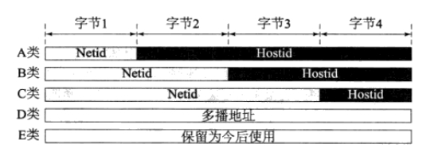

# 1 电路交换与分组交换的区别？ 优劣对比。

电路交换：以电路联接为目的的交换方式是电路交换方式。（1）建立连接	（2）通信	（3）释放连接
分组交换：分组交换也称为包交换，数据划分等长数据段，每数据段前加上必要的控制信息作为数据段的首部，首部指明了该分组发送的地址，当交换机收到分组之后，将根据首部中的地址信息将分组转发到目的地，这个过程就是分组交换。能够进行分组交换的通信网被称为分组交换网。

|      | 电路交换                           | 分组交换                                   |
| ---- | ---------------------------------- | ------------------------------------------ |
| 优点 | 通信线路专用，数据直达，时延小     | 不需要为专用的通信线路                     |
|      | 一旦建立，实时性强                 | 存储转发方式， 提高了传输的可靠性          |
|      | 发送顺序传送数据                   | 提高了通信线路的利用率                     |
|      | 传输模拟信号，也适用于传输数字信号 | 流水线式传输方式减少了传输时间             |
|      | 交换设备及控制简单                 | 分组长度固定，简化了交换节点中存储器的管理 |
|      |                                    | 分组较短，出错几率减少                     |
| 缺点 | 建立时间长                         | 数据进入交换节点后存储转发需要等待         |
|      | 信道利用率低                       | 只适用于数字信号                           |
|      | 不同速率的终端难通信               | 可能出现失序，丢失或重复分组               |

# 2 OSI主要几层作用。


## 2.1 数据交换设备

（交换机、路由器、网关）

1. 集线器(HUB) 是一种工作在**物理层**的设备, 仅相当于一根线缆,把各个网络节点连接起来。
2. 交换机(Switch)是工作在第二层**数据链路层**的一种设备,它根据MAC地址对数据帧进行转发。 能够为任意两个网络节点之间提供一条数据通道,防止了冲突的产生,能够满足目前用户对数据高速交换的需求
3. 网桥工作在**数据链路层**，将两个LAN连起来，根据MAC地址来转发帧，可以看作一个"低层的路由器"（路由器工作在网络层，根据网络地址如IP地址进行转发）。网桥并不了解其转发帧中高层协议的信息，这使它可以同时以同种凡是处理IP、IPX等协议，它还提供了将无路由协议的网络（如NetBEUI）分段的功能。
4. 路由器router处理**网络层**的数据，因此它们更容易互连不同的数据链路层，如令牌环网段和以太网段。网桥通常比路由器难控制。像IP等协议有复杂的路由协议，使网管易于管理路由；IP等协议还提供了较多的网络如何分段的信息（即使其地址也提供了此类信息）。而网桥则只用MAC地址和物理拓扑进行工作。因此网桥一般适于小型较简单的网络。

路由器同网桥相比：路由器具有更强网络互联能力，可用于异种网络互联与多个子网互联，并且路由器具有广播包抑制和子网隔离的功能。 路由器有较高的网络适应性，性价比高，现在广泛应用于局域网间，局域网与广域网的连接上，如：园区网接入Internet。  缺点 ·它不支持非路由协议..执行多种协议TCP/IP，IPX/SPX及X.25

# 3 TCP/IP层次模型 


## 2.2 ARP协议

#### 2.2.1 硬件(MAC)地址

MAC地址（英语：Media Access Control Address），直译为媒体访问控制地址，也称为局域网地址（LAN Address），以太网地址（Ethernet Address）或物理地址（Physical Address），

它是一个用来确认网络设备位置的地址。

第二层数据链接层则负责MAC地址。MAC地址用于在网络中唯一标示一个网卡,  用来标识同一个链路中不同计算机的一种识别码。

#### 2.2.2 ARP 即地址解析协议

数据链路层的主要作用是在互连同一种数据链路的节点之间进行包传递。而一旦跨越多种数据链路，就需要借助网络层。网络层可以跨越不同的数据链路，即使是在不同的数据链路上也能实现两端节点之间的数据包传输。

**ARP，即地址解析协议**，实现通过IP地址得知其物理地址。在TCP/IP网络环境下，每个主机都分配了一个32位的IP地址，这种互联网地址是在网际范围标识主机的一种逻辑地址。为了让报文在物理网路上传送，必须知道对方目的主机的物理地址。

1. 应用程序构造数据包，该步骤是产生ICMP包，然后把它提交给内核（网卡驱动程序）；
2. 在本地的ARP缓存中查看IP-MAC对应表；存在该IP-MAC对应关系，那么跳到步骤7；
3. 内核进行ARP广播，即发送 ARP Request，向整个网络中大喊，这个IP是谁的，这个ARP Request中包含有我们计算机的MAC地址；
4. 当192.168.1.2主机接收到该ARP请求后，就发送一个ARP 回应，即ARP REPLY命令，说道：这个IP是我的，你看这是我的MAC地址（ARP Request中包含自己的MAC地址）；
5. 我们的计算机获得192.168.1.2主机的IP-MAC地址对应关系，就保存到自己的ARP缓存中；
6. 内核将把目标主机IP转化为MAC地址，然后封装在以太网头结构中，再把数据发送出去；
7. 这样主机B看到发送过来的数据包包头里有自己的MAC地址，才会识别它，噢，这个数据是发送给我的（当数据包包头里只有B的IP地址时，主机B会不认识它，不去接收这个数据包）

## 2.3 IP

- IP（IPv4、IPv6）相当于 OSI 参考模型中的第3层——网络层。
- 网络层的主要作用是“实现终端节点之间的通信”。这种终端节点之间的通信也叫“点对点通信”。
- IP 地址用于在“连接到网络中的所有主机中识别出进行通信的目标地址 

 ### 2.3.1 IP 地址的构成

> 来源 掘金   
>
> 作者：  涤生_Woo  
>
> 网址： https://juejin.im/post/5a069b6d51882509e5432656

 IP 地址由网络和主机两部分标识组成

网络标识在数据链路的每个段配置不同的值。网络标识必须保证相互连接的每个段的地址不相重复。

而相同段内相连的主机必须有相同的网络地址。

IP 地址的“主机标识”则不允许在同一个网段内重复出现。

由此，可以通过设置网络地址和主机地址，在相互连接的整个网络中保证每台主机的 IP 地址都不会相互重叠。即 IP 地址具有了唯一性


- 如下图，IP 包被转发到途中某个路由器时，正是利用目标 IP 地址的网络标识进行路由。因为即使不看主机标识，只要一见到网络标识就能判断出是否为该网段内的主机。


### 2.3.2 IP 的分类

对于A、B、C类IP地址，都可以划分为网络标识和主机标识两部分。其中网络标识和主机标识的长度随地址类别的不同变化。网络标识和主机标识其实很好理解就相当于我们使用的电信的座机号码。如广州的一个座机电话号码020-66650157 其中网络标识就对应区号020,主机标识就对应号码66650157。下图就很清楚的说明了A、B、C类地址的网络标识和主机标识的长度



 **A 类 IP 地址是首位以 “0” 开头的地址。**从第 1 位到第 8 位是它的网络标识。用十进制表示的话，0.0.0.0~127.0.0.0 是 A 类的网络地址。A 类地址的后 24 位相当于主机标识。因此，一个网段内可容纳的主机地址上限为16,777,214个。2^24-2

**B 类 IP 地址是前两位 “10” 的地址。**从第 1 位到第 16 位是它的网络标识。用十进制表示的话，128.0.0.0~191.255.0.0 是 B 类的网络地址。B 类地址的后 16 位相当于主机标识。因此，一个网段内可容纳的主机地址上限为65,534个。 2^16-2

**C 类 IP 地址是前三位为 “110” 的地址。**从第 1 位到第 24 位是它的网络标识。用十进制表示的话，192.0.0.0~223.255.255.0 是 C 类的网络地址。C 类地址的后 8 位相当于主机标识。因此，一个网段内可容纳的主机地址上限为254个。

**D 类 IP 地址是前四位为 “1110” 的地址。**从第 1 位到第 32 位是它的网络标识。用十进制表示的话，224.0.0.0~239.255.255.255 是 D 类的网络地址。D 类地址没有主机标识，常用于多播。

在分配 IP 地址时关于主机标识有一点需要注意。即要用比特位表示主机地址时，不可以全部为 0 或全部为 1。因为全部为 0 只有在表示对应的网络地址或 IP 地址不可以获知的情况下才使用。而全部为 1 的主机通常作为广播地址。因此，在分配过程中，应该去掉这两种情况。这也是为什么 C 类地址每个网段最多只能有 254（ 28 - 2 = 254）个主机地址的原因。

### 2.3.3 广播地址

- 广播地址用于在同一个链路中相互连接的主机之间发送数据包。将 IP 地址中的**主机地址**部分全部设置为 1，就成了广播地址。
- 广播分为本地广播和直接广播两种。在本网络内的广播叫做本地广播；在不同网络之间的广播叫做直接广播。

 ### 2.3.4 多播


 

 

### TCP/IP TIME_WAIT状态原理

http://elf8848.iteye.com/blog/1739571

通信双方建立TCP连接后，主动关闭连接的一方就会进入TIME_WAIT状态。

客户端主动关闭连接时，会发送最后一个ack后，然后会进入TIME_WAIT状态，再停留2个MSL时间(后有MSL的解释)，进入CLOSED状态。

下图是以客户端主动关闭连接为例，说明这一过程的。


1）可靠地实现TCP全双工连接的终止

TCP协议在关闭连接的四次握手过程中，最终的ACK是由主动关闭连接的一端（后面统称A端）发出的，如果这个ACK丢失，对方（后面统称B端）将重发出最终的FIN，因此A端必须维护状态信息（TIME_WAIT）允许它重发最终的ACK。如果A端不维持TIME_WAIT状态，而是处于CLOSED 状态，那么A端将响应RST分节，B端收到后将此分节解释成一个错误（在java中会抛出connection reset的SocketException)。

因而，要实现TCP全双工连接的正常终止，必须处理终止过程中四个分节任何一个分节的丢失情况，主动关闭连接的A端必须维持TIME_WAIT状态 。

2）允许老的重复分节在网络中消逝 

TCP分节可能由于路由器异常而“迷途”，在迷途期间，TCP发送端可能因确认超时而重发这个分节，迷途的分节在路由器修复后也会被送到最终目的地，这个迟到的迷途分节到达时可能会引起问题。在关闭“前一个连接”之后，马上又重新建立起一个相同的IP和端口之间的“新连接”，“前一个连接”的迷途重复分组在“前一个连接”终止后到达，而被“新连接”收到了。为了避免这个情况，TCP协议不允许处于TIME_WAIT状态的连接启动一个新的可用连接，因为TIME_WAIT状态持续2MSL，就可以保证当成功建立一个新TCP连接的时候，来自旧连接重复分组已经在网络中消逝。

3) MSL时间

MSL就是maximum segment lifetime(最大分节生命期），这是一个IP数据包能在互联网上生存的最长时间，超过这个时间IP数据包将在网络中消失 。MSL在RFC 1122上建议是2分钟，而源自berkeley的TCP实现传统上使用30秒。

4) TIME_WAIT状态维持时间

TIME_WAIT状态维持时间是两个MSL时间长度，也就是在1-4分钟。Windows操作系统就是4分钟。

## 2.5 RIP协议的概念及算法。

OSI层次：应用层协议，基于UDP端口520  

算法特征：距离矢量协议  

有类无类：v1为有类、v2为无类  

运行范围：IGP  

最佳路径：管理距离120、度量值：跳数（路由器的个数）


ICMP协议的主要功能。

组播和多播的概念，IGMP的用途。

TCP与UDP的概念，相互的区别及优劣。

TCP总结：

Server端：create -- bind -- listen--  accept--  recv/send-- close

Client端：create------- conncet------send/recv------close.

UDP总结:

Server端：create----bind ----recvfrom/sendto----close

Client端：create----  sendto/recvfrom----close.

 

TCP通过哪些措施，保证传输可靠？


#4 检验算法

### 3.1  checksum

checksum生成：将发送数据累加，再把累加和取反，该值就是checksum的校验码。可使用按位取反"~"来实现，即~X；或使用与0xFF按位异或“^”，即X ^ 0xFF。

```
unsigned short checksum(unsigned short *buf, int nword)
{
    unsigned long sum;
 
    for(sum = 0; nword > 0; nword--)
        sum += *buf++;              /*获取buf的累加和*/
 
    sum  = (sum>>16) + (sum&0xffff);/*获取sum高16位与低16位的和*/
    sum += (sum>>16);
 
    return ~sum;
}
```

### 3.2 校验算法

#### 3.2.1 奇偶校验

奇校验：就是让原有数据序列中（包括你要加上的一位）1的个数为奇数  

偶校验：就是让原有数据序列中（包括你要加上的一位）1的个数为偶数  

```

```

####  3.2.2 CRC冗余校验算法

  循环冗余校验CRC（Cyclical Redundancy Check）字段位于尾部，有32位，被检查的消息首先要追加n位0形成一个扩展消息（使用模2除法）除以一个n+1位生成多项式（常用5种）。放置在消息的CRC字段的值是计算中的余数的二进制码（商被丢弃）。

e.g. 1，假设信息码字为`11100011`，生成多项式G(X)=X^5+X^4+X+1，计算CRC码字。

1. G(X) = X^5+X^4+X+1,也就是`110011`，因为最高次是5，所以，在信息码字后补5个0，变为1110001100000。
2. 用1110001100000模二除法除以110011，余数为`11010`，即为所求的冗余位。 因此发送出去的CRC码字为原始码字11100011末尾加上冗余位11010，即 `1110001111010`。
3. 接收端收到码字后，采用同样的方法验证，即将收到的码字用模二除法除以110011（是G(X)对应的二进制生成码），发现余数是0，则认为码字在传输过程中没有出错。 

e.g 2 模2除法练习


类似于除法，但是不借位，只看第一位，是1，商置1，否则为0， 其他为算异或

```cpp
#define POLY        0x1021
/**
 * Calculating CRC-16 in 'C'
 * @para addr, start of data
 * @para num, length of data
 * @para crc, incoming CRC
 */
uint16_t crc16(unsigned char *addr, int num, uint16_t crc)
{
    int i;
    for (; num > 0; num--)              /* Step through bytes in memory */
    {
        crc = crc ^ (*addr++ << 8);     /* Fetch byte from memory, XOR into CRC top byte*/
        for (i = 0; i < 8; i++)             /* Prepare to rotate 8 bits */
        {
            if (crc & 0x8000)            /* b15 is set... */
                crc = (crc << 1) ^ POLY;    /* rotate and XOR with polynomic */
            else                          /* b15 is clear... */
                crc <<= 1;                  /* just rotate */
        }                             /* Loop for 8 bits */
        crc &= 0xFFFF;                  /* Ensure CRC remains 16-bit value */
    }                               /* Loop until num=0 */
    return(crc);                    /* Return updated CRC */
```

#### 3.2.3 海明检验

海明校验关键的一个前提是,数据位中只能有一位出错.这也是海明码产生的依据所在. 

将有效信息按某种规律分成若干组，每组安排一个校验位，做奇偶测试，就能提供多位检错信息，以指出最大可能是哪位出错，从而将其纠正。实质上，海明校验是一种多重校验。 

* 对于原始数据信息位m，计算得出需要的k位校验码 
* 海明校验码是放在2的幂次位上的，如 1，2，3，4，8，16….等 
* 计算机校验码 偶校验。


1. 如何实现透明传输。
2. 路由表的内容。
3. 分组转发算法。
4. IP报文的格式，格式的各个字段的含义要理解。
5. MTU的概念，啥叫路径MTU？ MTU发现机制，TraceRoute(了解)。
6. Ping协议的实现原理，ping 命令格式。
7. 子网划分的概念，子网掩码。
8. IP地址的分类，如何划分的，及会计算各类地址支持的主机数。
9. DNS的概念，用途，DNS查询的实现算法。
10. 三次握手，四次断开过程。

为了保证服务端能收接受到客户端的信息并能做出正确的应答而进行前两次(第一次和第二次)握手，为了保证客户端能够接收到服务端的信息并能做出正确的应答而进行后两次(第二次和第三次)握手。


TIME_WAIT状态的概念及意义。

MSL就是maximum segment lifetime(最大分节生命期），这是一个IP数据包能在互联网上生存的最长时间，超过这个时间IP数据包将在网络中消失 。MSL在RFC 1122上建议是2分钟，而源自berkeley的TCP实现传统上使用30秒。

TIME_WAIT状态维持时间是两个MSL时间长度，也就是在1-4分钟。Windows操作系统就是4分钟。

1. 滑动窗口协议 与 停止等待协议的区别。

2. TCP的流量控制和拥塞控制实现原理(会画拥塞控制的典型图)。

3. TCP的快速重传与快速恢复算法。

4. TFTP 与 FTP的区别。

5. 阻塞方式和非阻塞方式，阻塞connect与非阻塞connect。(比较难，有兴趣可以了解)

   可以考虑采用异步传输机制，同步传输与异步传输的主要区别在于同步传输中，如果调用recvfrom后会一致阻塞运行，从而导致调用线程暂停运行；异步传输机制则不然，会立即返回。

6. HTTP基本格式。（java程序员必须掌握）