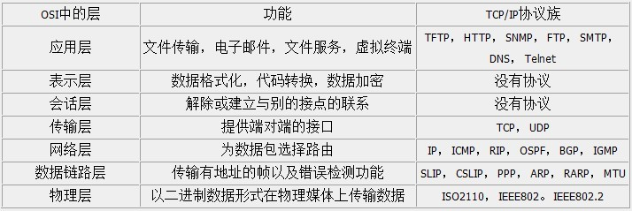

### 1 电路交换与分组交换的区别？ 优劣对比。

电路交换：以电路联接为目的的交换方式是电路交换方式。（1）建立连接	（2）通信	（3）释放连接
分组交换：分组交换也称为包交换，数据划分等长数据段，每数据段前加上必要的控制信息作为数据段的首部，首部指明了该分组发送的地址，当交换机收到分组之后，将根据首部中的地址信息将分组转发到目的地，这个过程就是分组交换。能够进行分组交换的通信网被称为分组交换网。

|      | 电路交换                           | 分组交换                                   |
| ---- | ---------------------------------- | ------------------------------------------ |
| 优点 | 通信线路专用，数据直达，时延小     | 不需要为专用的通信线路                     |
|      | 一旦建立，实时性强                 | 存储转发方式， 提高了传输的可靠性          |
|      | 发送顺序传送数据                   | 提高了通信线路的利用率                     |
|      | 传输模拟信号，也适用于传输数字信号 | 流水线式传输方式减少了传输时间             |
|      | 交换设备及控制简单                 | 分组长度固定，简化了交换节点中存储器的管理 |
|      |                                    | 分组较短，出错几率减少                     |
| 缺点 | 建立时间长                         | 数据进入交换节点后存储转发需要等待         |
|      | 信道利用率低                       | 只适用于数字信号                           |
|      | 不同速率的终端难通信               | 可能出现失序，丢失或重复分组               |

### 2 OSI有哪几层，会画出来，知道主要几层的各自作用。

   TCP/IP层次模型共分为四层：应用层、传输层、网络层、数据链路层。原始的OSI有7层

1. ARP协议的用途 及算法、在哪一层上会使用arp ？

   ARP，即地址解析协议，实现通过IP地址得知其物理地址。在TCP/IP网络环境下，每个主机都分配了一个32位的IP地址，这种互联网地址是在网际范围标识主机的一种逻辑地址。为了让报文在物理网路上传送，必须知道对方目的主机的物理地址。

2. 知道各个层使用的是哪个数据交换设备。（交换机、路由器、网关）

   交换机(Switch)是工作在第二层即数据链路层的一种设备,它根据MAC地址对数据帧进行转发。 

   集线器(HUB)是一种工作在物理层的设备,它并不提供数据交换的功能。它相当于一根线缆,把各个网络节点连接起来,而交换机却能够为任意两个网络节点之间提供一条数据通道,防止了冲突的产生,能够满足目前用户对数据高速交换的需求

   

   网桥工作在数据链路层，将两个LAN连起来，根据MAC地址来转发帧，可以看作一个"低层的路由器"（路由器工作在网络层，根据网络地址如IP地址进行转发）。网桥并不了解其转发帧中高层协议的信息，这使它可以同时以同种凡是处理IP、IPX等协议，它还提供了将无路由协议的网络（如NetBEUI）分段的功能。

   

   路由器router处理网络层的数据，因此它们更容易互连不同的数据链路层，如令牌环网段和以太网段。网桥通常比路由器难控制。象IP等协议有复杂的路由协议，使网管易于管理路由；IP等协议还提供了较多的网络如何分段的信息（即使其地址也提供了此类信息）。而网桥则只用MAC地址和物理拓扑进行工作。因此网桥一般适于小型较简单的网络。

   路由器同网桥相比：路由器具有更强网络互联能力，可用于异种网络互联与多个子网互联，并且路由器具有广播包抑制和子网隔离的功能。 路由器有较高的网络适应性，性价比高，现在广泛应用于局域网间，局域网与广域网的连接上，如：园区网接入Internet。  缺点 ·它不支持非路由协议..执行多种协议TCP/IP，IPX/SPX及X.25

RIP协议的概念 及算法。

ICMP协议的主要功能。

组播和多播的概念，IGMP的用途。

TCP与UDP的概念，相互的区别及优劣。

UDP报文的格式，字段的意义。

TCP 报文的格式，字段的意义。

TCP通过哪些措施，保证传输可靠？

###  TCP/IP协议就是这样设计的，是不可避免的。主要有两个原因:

1）可靠地实现TCP全双工连接的终止

TCP协议在关闭连接的四次握手过程中，最终的ACK是由主动关闭连接的一端（后面统称A端）发出的，如果这个ACK丢失，对方（后面统称B端）将重发出最终的FIN，因此A端必须维护状态信息（TIME_WAIT）允许它重发最终的ACK。如果A端不维持TIME_WAIT状态，而是处于CLOSED 状态，那么A端将响应RST分节，B端收到后将此分节解释成一个错误（在java中会抛出connection reset的SocketException)。

因而，要实现TCP全双工连接的正常终止，必须处理终止过程中四个分节任何一个分节的丢失情况，主动关闭连接的A端必须维持TIME_WAIT状态 。

 

2）允许老的重复分节在网络中消逝 

TCP分节可能由于路由器异常而“迷途”，在迷途期间，TCP发送端可能因确认超时而重发这个分节，迷途的分节在路由器修复后也会被送到最终目的地，这个迟到的迷途分节到达时可能会引起问题。在关闭“前一个连接”之后，马上又重新建立起一个相同的IP和端口之间的“新连接”，“前一个连接”的迷途重复分组在“前一个连接”终止后到达，而被“新连接”收到了。为了避免这个情况，TCP协议不允许处于TIME_WAIT状态的连接启动一个新的可用连接，因为TIME_WAIT状态持续2MSL，就可以保证当成功建立一个新TCP连接的时候，来自旧连接重复分组已经在网络中消逝。

### 3. 硬件(MAC)地址的概念及作用。

1. CRC冗余校验算法，反码和检验算法。
2. 如何实现透明传输。
3. 路由表的内容。
4. 分组转发算法。
5. IP报文的格式，格式的各个字段的含义要理解。
6. MTU的概念，啥叫路径MTU？ MTU发现机制，TraceRoute(了解)。
7. Ping协议的实现原理，ping 命令格式。
8. 子网划分的概念，子网掩码。
9. IP地址的分类，如何划分的，及会计算各类地址支持的主机数。
10. DNS的概念，用途，DNS查询的实现算法。
11. 三次握手，四次断开过程。

为了保证服务端能收接受到客户端的信息并能做出正确的应答而进行前两次(第一次和第二次)握手，为了保证客户端能够接收到服务端的信息并能做出正确的应答而进行后两次(第二次和第三次)握手。

TIME_WAIT状态的概念及意义。

MSL就是maximum segment lifetime(最大分节生命期），这是一个IP数据包能在互联网上生存的最长时间，超过这个时间IP数据包将在网络中消失 。MSL在RFC 1122上建议是2分钟，而源自berkeley的TCP实现传统上使用30秒。

TIME_WAIT状态维持时间是两个MSL时间长度，也就是在1-4分钟。Windows操作系统就是4分钟。

1. 滑动窗口协议 与 停止等待协议的区别。
2. TCP的流量控制和拥塞控制实现原理(会画拥塞控制的典型图)。
3. TCP的快速重传与快速恢复算法。
4. TFTP 与 FTP的区别。
5. 阻塞方式和非阻塞方式，阻塞connect与非阻塞connect。(比较难，有兴趣可以了解)
6. HTTP基本格式。（java程序员必须掌握）