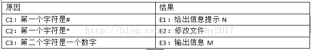
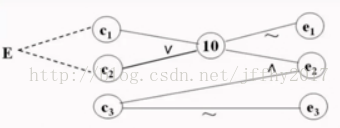
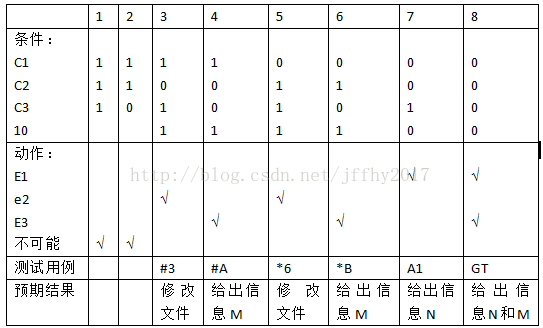
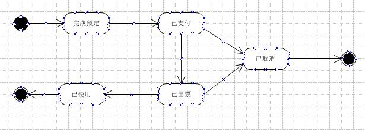
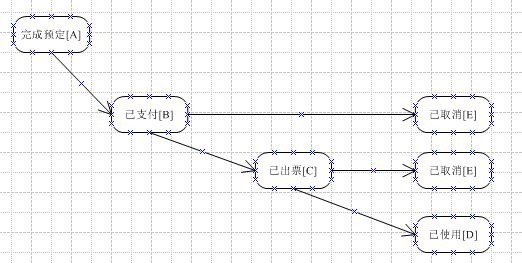
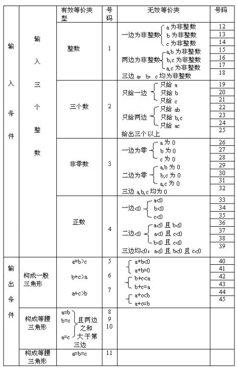
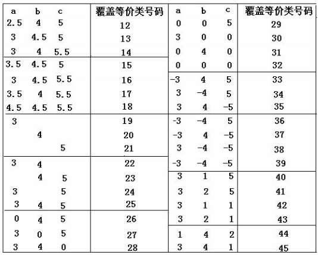

## 完备测试三要素

1. 基于对产品用户群体的理解：独立对产品使用场景、使用过程以及用户心理的判断，这是测试用例对产品人员、技术人员最有力的补充。
2. 基于对产品人员 设计产品的理解：交互、功能流程、边界等等。
3. 基于对技术实现原理的理解：实现的逻辑原理、架构（对其他系统的依赖、接口等）。

## 测试用例设计方法

### 等价类划分法（黑）

然后又根据某方面输入值之间等价性进行划分，再而从每个等价域中选取少量具有代表性的数据做为测试用例的输入数据。每个等价类值又根据是否对程序有无作用，而分为有效等价类和无效等价类。 

* 按区间划分
* 数据集合划分
* 布尔值划分
* 数值划分

### 边界值分析法（黑）

内点：域内的任意点都是内点

上点：指边界上的点，无论此时域是开区间还是闭区间，上点就是域的上限与下限值

离点：指的就是离上点最近的点，这里就跟闭区间还是开区间就有关系了，如果是开区间，那么离点就在域内，如果闭区间，那么离点就在域外（开内闭外）

### 因果图和决策表（黑）

必须考虑输入条件的各种组合，则可能的组合数目将是天文数字，因此必须考虑采用一种适合于描述多种条件的组合、相应产生多个动作的形式来进行测试用例的设计，这就需要利用因果图（逻辑模型） 

恒等，与，或，非

1）分析需求，列出原因和结果

2）找出因果关系、原因与原因之间的约束关系，画出因果图

 

10：表示中间状态，可以作为一种结果，存在c1和c2的关系或，要么c1出现要么c2出现，表示中间出现了一个，要么是#要么是*，表示其中一个。

3）将因果图转换成决策表

 

不可能表示：c1和c2同事出现，就是不可能的

### 正交试验

所有可能

### 场景法

场景分析法设计测试用例

\1. 事件流，同一事件不同的触发顺序和处理结果形成事件流，事件流分为基本流和备选流

·1）基本流：程序从开始执行直到成功结束所经过的最短路径。

·2）备选流：一个备选流可能从基本流开始，在特定条件下执行，然后重新加入基本流中；也可起源于另一个备选流，执行后加入基本流或终止用例。

\2. 使用场景：一般在分析业务流程或流程化处理功能的时候用。

3.场景分析法设计测试用例的步骤：

·1）分析软件规格说明描述，整理出基本流和备选流

·2）根据基本流和备选流组合关系生成场景

·3）分析所有场景，合并测试内容重复的场景

·4）根据场景逐一设计测试用例

### 状态迁移

测试设计方法分析（状态迁移法）：

​        a).状态迁移图：

 

​        b).测试路径（状态迁移树）：

### 错误推测法

**测试用例的组成元素**

用例编号 用例标题 功能模块名称 前置条件 输入数据 操作步骤 预期结果 优先级 执行结果 编写人 执行人

## 三角形三边用例设计

## 一个app启动

### 概况

1 首次启动

是否出现欢迎界面，停留时间是否合理，是否进入正常应用

拉去信息是否正确

桌面图标是否富案件正确

2 二次启动

启动时间是否正常

初始化信息是否正确

进程服务是否正常工作

3 程序异常退出后启动

操作crash后再启动，

手动停止服务，进程

管理软件一键清理进程后重启

### 细节

输入框，正常，输入越界，特殊字符，非法字符

事件触发，每个按钮是否完成需求规定的功能

尝试点击非法区域，验证测试后门是否关闭

### 权限安全

用户是否授权

联网权限是否受限

明感权限谨慎获取

### 文件存储

APP 临时文件存储路径，命名方式

下载文件位置

存储文件被锁，被占用

内置，外置SD卡是否可用

### 网络与流量

弱网络环境下应用表现 ，不同运营商的网络

上网方式，有线，无线wifi，4G

网络中断和恢复

流量使用是否合理

流量统计，异常上报

### 接口容错

网络返回非200的状态

请求业务层错误，接口返回内容为空，超长，字段不匹配

### 中断测试

锁屏中断

前后台切换

加载中断

系统中断

### 分辨率

UI结构，屏幕大小

### 系统适配

API 兼用

### 升级

直接覆盖，跳级，降级，省流量升级

